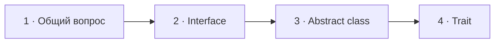

# Визуальный план — «Интерфейс, абстрактный класс, trait — что для чего?»

Статус: `DONE`  
Сложность: `L`  
Бюджет реализации после принятия: `до 60 минут`  
Shorts: `да — один самостоятельный фрагмент примерно на 55 секунд`

## Источники и границы

- Учебный индекс: `questions.txt`, пункты 2–4. Он помогает найти темы, но не
  задаёт монтажные границы.
- Источник структуры: `transcription.txt`.
- Фрагмент: `15:45–16:40` исходного интервью.
- Реальный вопрос интервьюера: «Интерфейс, абстрактный класс, trait — что для
  чего?»
- Говорящие:
  - `15:45–15:50` — интервьюер;
  - `15:50–16:40` — Михаил;
  - `16:40` — короткое «Окей, хорошо» интервьюера и переход дальше.
- Технические источники:
  - [PHP Manual — Object Interfaces](https://www.php.net/manual/en/language.oop5.interfaces.php);
  - [PHP Manual — Class Abstraction](https://www.php.net/manual/en/language.oop5.abstract.php);
  - [PHP Manual — Traits](https://www.php.net/manual/en/language.oop5.traits.php).

## Редакционная единица

Это один вопрос интервью и один непрерывный ответ. Три пункта в
`questions.txt` появились из-за разбиения для тренировки и не должны
превращаться в три искусственных вопроса в видео.

Внутри одного вопроса меняется только центральный смысловой слой:
`interface` → `abstract class` → `trait`. Формулировка вопроса и общий счётчик
остаются неизменными.

## Аудит содержания

| Факт или тезис | Где прозвучал | Оценка | Действие на экране |
|---|---|---|---|
| Интерфейс — контракт публичного API | 15:50–16:07 | корректно | показать сигнатуру и реализации контракта |
| Интерфейс закрепляет контракт | 16:01–16:07 | корректно, но абстрактно | показать классы, реализующие один интерфейс |
| Абстрактный класс полезен для однотипных объектов | 16:07–16:22 | слишком общо, но не ошибочно | показать общую реализацию и обязательную абстрактную часть |
| Примеры: логеры, `BinaryResponse`, `JsonResponse` | 16:13–16:22 | допустимые примеры | использовать `Response`, чтобы остаться рядом с речью |
| Trait — «альтернатива множественному наследованию» | 16:22–16:28 | распространённое, но неточное упрощение | визуально показать горизонтальное переиспользование, не дерево наследования |
| Trait удобен для `SoftDeletable` и `Timestampable` | 16:28–16:40 | корректный практический пример | показать один `Timestampable` в двух несвязанных классах |

### Что добавляем

- Разные классы могут реализовать один интерфейс и использоваться там, где
  ожидается этот интерфейс.
- Абстрактный класс может содержать общую готовую реализацию и одновременно
  требовать реализацию абстрактных членов в наследниках.
- Trait — механизм повторного использования кода и горизонтальной композиции
  поведения; это не множественное наследование классов.

Эти дополнения подтверждены официальным PHP Manual. Отдельную
«исправляющую» перебивку не делаем: уточнения выражаются самой схемой и не
объявляют весь ответ неправильным.

### Намеренно не показываем

- Три независимых экрана вопроса и три независимых счётчика — это исказило бы
  реальную структуру интервью.
- Свойства интерфейсов и абстрактные свойства PHP 8.4 — актуально, но не нужно
  для ответа «что для чего».
- Конфликты trait, `insteadof`, `as`, precedence и изменение visibility — это
  отдельная тема.
- Полную сравнительную таблицу interface / abstract class / trait — она
  заставит читать мелкий текст и будет дублировать три последовательные схемы.
- Оценочное «не очень часто нужен» — это опыт кандидата, а не техническое
  свойство конструкции.
- Мета-подписи «Главная мысль», «Дополнение редакции» и «Вопрос собеседования».

## Задача визуализации

За один непрерывный ответ показать три разные роли: interface задаёт контракт,
abstract class даёт общую базу наследникам, trait добавляет переиспользуемое
поведение без построения ещё одной иерархии.

## Состояния и тайминг

| Состояние | Таймкод | Что звучит | Функция экрана | Паттерн |
|---|---|---|---|---|
| 1. Составной вопрос | 15:45–15:50 | интервьюер перечисляет три конструкции | удержать реальную формулировку | Question |
| 2. Interface | 15:50–16:07 | контракт публичного API | показать один контракт и разные реализации | Contract diagram |
| 3. Abstract class | 16:07–16:22 | однотипные логеры и responses | показать общую реализацию и обязательную часть | Inheritance diagram + code |
| 4. Trait | 16:22–16:40 | переиспользование, `SoftDeletable`, `Timestampable` | показать горизонтальную композицию | Composition diagram + code |



Mermaid показывает только временную последовательность.

## Состояние 1 — составной вопрос

Польза: зритель заранее понимает, что ответ будет состоять из трёх частей.  
Экранный текст: `Интерфейс, абстрактный класс, trait — что для чего?`  
Дополняет речь: удерживает все три термина на экране.  
Не дублируем: никаких определений до начала ответа.

### Wireframe 16:9

```text
┌──────────────────────────────────────────────────────────────┐
│                           02/32                              │
│                                                              │
│        Интерфейс, абстрактный класс, trait —                 │
│                     что для чего?                            │
│                                                              │
├──────────────────────────────┬───────────────────────────────┤
│ Михаил · слушает             │ Интервьюер · говорит          │
└──────────────────────────────┴───────────────────────────────┘
```

### Wireframe 9:16

```text
┌──────────────────────────────┐
│            02/32             │
│                              │
│ Интерфейс,                   │
│ абстрактный класс,           │
│ trait — что для чего?        │
│                              │
├──────────────────────────────┤
│ Михаил        Интервьюер     │
│ слушает       говорит        │
└──────────────────────────────┘
```

## Состояние 2 — interface: контракт

Польза: слово «контракт» становится связью между API и несколькими
реализациями.  
Экранный текст: код и имена типов, без определения предложением.  
Дополняет речь: разные реализации совместимы с одним типом.  
Не дублируем: «интерфейс — это контракт» отдельной карточкой.

### Wireframe 16:9

```text
┌──────────────────────────────────────────────────────────────┐
│ 02/32  Интерфейс, abstract class, trait — что для чего?      │
├──────────────────────────────────────────────────────────────┤
│                     interface Notifier                       │
│              send(Message $message): void                    │
│                         /       \                            │
│              implements       implements                     │
│                      /           \                           │
│          EmailNotifier        TelegramNotifier               │
│                      \           /                           │
│                OrderService(Notifier $notifier)              │
├──────────────────────────────┬───────────────────────────────┤
│ Михаил · говорит             │ Интервьюер · слушает          │
└──────────────────────────────┴───────────────────────────────┘
```

### Wireframe 9:16

```text
┌──────────────────────────────┐
│ 02/32 · три конструкции      │
├──────────────────────────────┤
│ interface Notifier           │
│ send(Message $message): void │
│              ↓               │
│ EmailNotifier                │
│ implements Notifier          │
│              ↓               │
│ TelegramNotifier             │
│ implements Notifier          │
│              ↓               │
│ OrderService                 │
│ (Notifier $notifier)         │
├──────────────────────────────┤
│ Михаил        Интервьюер     │
└──────────────────────────────┘
```

## Состояние 3 — abstract class: общая база

Польза: зритель видит, чем «однотипные объекты» связаны технически.  
Экранный текст: общая готовая часть и обязательный абстрактный метод.  
Дополняет речь: abstract class полезен не просто сходством объектов, а общей
реализацией и требованиями к наследникам.  
Не дублируем: перечисление всех видов логеров и responses.

### Wireframe 16:9

```text
┌──────────────────────────────────────────────────────────────┐
│ 02/32  Интерфейс, abstract class, trait — что для чего?      │
├──────────────────────────────────────────────────────────────┤
│                 abstract class Response                      │
│  ✓ sendHeaders(): void       общая готовая реализация        │
│  ◇ render(): string          реализует наследник             │
│                         /       \                            │
│                      extends   extends                        │
│                       /           \                          │
│              BinaryResponse    JsonResponse                  │
├──────────────────────────────┬───────────────────────────────┤
│ Михаил · говорит             │ Интервьюер · слушает          │
└──────────────────────────────┴───────────────────────────────┘
```

### Wireframe 9:16

```text
┌──────────────────────────────┐
│ 02/32 · три конструкции      │
├──────────────────────────────┤
│ abstract class Response      │
│                              │
│ ✓ sendHeaders(): void        │
│   общая реализация           │
│                              │
│ ◇ render(): string           │
│   реализует наследник        │
│              ↓               │
│ BinaryResponse               │
│ JsonResponse                 │
├──────────────────────────────┤
│ Михаил        Интервьюер     │
└──────────────────────────────┘
```

## Состояние 4 — trait: горизонтальная композиция

Польза: trait не выглядит вторым родителем класса; зритель видит добавление
одного поведения в несвязанные классы.  
Экранный текст: `trait Timestampable`, `use Timestampable`, два класса.  
Дополняет речь: горизонтальная композиция поведения вместо множественного
наследования.  
Не дублируем: отдельное текстовое определение trait.

### Wireframe 16:9

```text
┌──────────────────────────────────────────────────────────────┐
│ 02/32  Интерфейс, abstract class, trait — что для чего?      │
├──────────────────────────────────────────────────────────────┤
│                    trait Timestampable                       │
│          $createdAt · $updatedAt · touch(): void             │
│                         /       \                            │
│                        use       use                          │
│                       /           \                          │
│                    Order         Article                      │
│             use Timestampable   use Timestampable            │
│                                                              │
│               Поведение без общей иерархии                  │
├──────────────────────────────┬───────────────────────────────┤
│ Михаил · говорит             │ Интервьюер · слушает          │
└──────────────────────────────┴───────────────────────────────┘
```

### Wireframe 9:16

```text
┌──────────────────────────────┐
│ 02/32 · три конструкции      │
├──────────────────────────────┤
│ trait Timestampable          │
│ $createdAt                   │
│ $updatedAt                   │
│ touch(): void                │
│              ↓               │
│ Order                        │
│ use Timestampable            │
│              ↓               │
│ Article                      │
│ use Timestampable            │
│                              │
│ Поведение без общей иерархии │
├──────────────────────────────┤
│ Михаил        Интервьюер     │
└──────────────────────────────┘
```

## Финальный экранный текст

| Состояние | Основные элементы |
|---|---|
| Вопрос | `Интерфейс, абстрактный класс, trait — что для чего?` |
| Interface | `interface Notifier`, `send(...)`, `EmailNotifier`, `TelegramNotifier`, `OrderService(Notifier $notifier)` |
| Abstract class | `abstract class Response`, `sendHeaders()`, `abstract render()`, `BinaryResponse`, `JsonResponse` |
| Trait | `trait Timestampable`, `$createdAt`, `$updatedAt`, `touch()`, `Order`, `Article`, `use Timestampable` |

## Анимация

- `15:45` — появляется составной вопрос; говорит интервьюер.
- `15:50` — появляется `interface Notifier`; затем сигнатура и реализации по
  мере объяснения публичного API.
- `16:01` — схема interface собирается целиком; появляется потребитель с типом
  `Notifier`.
- `16:07` — один переход к `abstract class Response`.
- `16:13` — показываются общая и абстрактная части.
- `16:18` — появляются `BinaryResponse` и `JsonResponse`.
- `16:22` — один переход к `trait Timestampable`.
- `16:28` — trait подключается к `Order` и `Article`.
- `16:36` — остаётся собранная схема без новой информации до завершения ответа.

Постоянных декоративных перестроений нет: движение следует смене конструкции
в речи.

## Shorts

- Хук: исходный вопрос интервьюера уже формулирует сравнение трёх конструкций.
- Фрагмент `15:45–16:40` укладывается в один Short без искусственного деления.
- Вертикальная последовательность экранов: вопрос → interface → abstract class
  → trait.
- В каждом состоянии показывается только одна схема; предыдущая исчезает.
- Заголовок можно сократить в шапке до `Interface · abstract class · trait`, но
  на первом экране вопрос остаётся дословным.
- Не добавлять CTA и дополнительный итоговый слайд: исходный ответ уже занимает
  почти всю минуту.

## Материалы и производство

- Общая оболочка, шапка, аватары и говорящий переиспользуются.
- Нужен один переиспользуемый компонент `TypeRelationshipDiagram`, который
  раскладывает верхний тип, связи и нижние типы; он используется во всех трёх
  состояниях с разным содержимым.
- Код и подписи остаются отдельными слоями Remotion.
- Внешние изображения и лицензии не требуются.
- Досъёмка и озвучка не требуются.

## Решение по счётчику

Сохраняем формат `02/32`, несмотря на объединение трёх учебных пунктов в один
реальный вопрос интервью. Финальное количество монтажных единиц — 32.

## Ревью

- [x] Монтажная граница взята из транскрипта, а не из учебного разбиения.
- [x] Технические дополнения проверены по PHP Manual.
- [x] Экран не пересказывает речь абзацем.
- [x] Не добавлены ненужные мета-подписи.
- [x] Каждый момент содержит один смысловой слой.
- [x] Есть отдельные wireframe 16:9 и 9:16.
- [x] Фрагмент понятен как самостоятельный Short.
- [x] Принято решение по счётчику.
- [x] План принят пользователем до начала кода.
