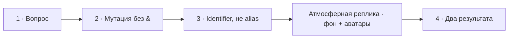

# Визуальный план — «Что происходит при передаче объекта в метод?»

Статус: `DONE`
Сложность: `M`
Бюджет реализации после принятия: `20–40 минут`
Shorts: `да — исходный фрагмент целиком`

## Источники и границы

- Учебный индекс: `questions.txt`, пункт 5.
- Источник структуры: `transcription.txt`.
- Исходный фрагмент: `16:42–17:49`.
- Рекомендуемый монтаж: оставить исходный фрагмент `16:42–17:49` целиком.
  Реплика `17:19–17:42` не добавляет технического содержания, но сохраняет
  живую атмосферу собеседования. На это время убираем учебную инфографику и
  оставляем фиолетовый фон с аватарами.
- Говорящие:
  - `16:42–16:48` — интервьюер;
  - `16:48–16:53` — Михаил;
  - `16:53–17:03` — интервьюер;
  - `17:04–17:19` — Михаил;
  - `17:19–17:49` — интервьюер сохраняет живую реплику и затем завершает
    техническую мысль.
- Технический источник:
  [PHP Manual — Objects and references](https://www.php.net/manual/en/language.oop5.references.php).

## Редакционная единица

Это один вопрос. Реплики про «передаются по ссылке» и про копирование
идентификатора относятся к одной и той же проверке понимания мутации объекта.
Счётчик выпуска: `03/58`; `58` остаётся временным общим количеством.

## Аудит содержания

| Факт или тезис | Где прозвучал | Оценка | Действие на экране |
|---|---|---|---|
| «Объекты передаются по ссылке» | 16:48–16:56 | удобное, но технически неточное упрощение | не закреплять эту фразу как определение |
| Изменение свойства внутри метода видно снаружи | 16:56–17:03, 17:43–17:49 | корректно | показать код и итоговое значение |
| Передаётся копия object identifier/handle | 17:04–17:19 | корректная суть | показать две `zval` с одним object handle и подтвердить это через `spl_object_id()` |
| Это не PHP-reference в смысле `&` | 17:04–17:19 | корректное уточнение | коротко противопоставить identifier и alias |
| Переприсваивание параметра не заменяет объект у вызывающего кода | не звучит | важное следствие | добавить вторым коротким примером |

### Что добавляем

- Аргумент получает копию идентификатора, указывающего на тот же объект.
- Поэтому изменение состояния объекта видно вызывающему коду.
- Переприсваивание локального параметра новым объектом не меняет переменную
  вызывающего кода без `&`.

### Намеренно не показываем

- Реальные адреса памяти и подробное устройство Zend Engine. Одного компактного
  слоя `zval → object handle` достаточно, чтобы точно объяснить механизм.
- Reference counting и garbage collector — другая тема.
- Полный синтаксис передачи по ссылке — нужен только знак `&` для контраста.
- Учебную инфографику поверх реплики `17:19–17:42`: этот кусок работает на
  атмосферу, поэтому зрителю оставляем только фон и реакцию аватаров.

## Задача визуализации

Показать, почему мутация объекта видна снаружи, хотя аргумент не становится
PHP-reference/alias автоматически.

## Состояния и тайминг

| Состояние | Таймкод | Что звучит | Функция экрана | Паттерн |
|---|---|---|---|---|
| 1. Вопрос | 16:42–16:48 | интервьюер задаёт вопрос | удержать формулировку | Question |
| 2. Мутация без `&` | 16:48–17:04 | обсуждается видимая снаружи мутация | показать минимальный вызов и результат без схемы внутреннего устройства | Code + result |
| 3. Identifier, не alias | 17:04–17:19 | Михаил уточняет механизм | показать две `zval`, содержащие один object handle | Internals diagram |
| Пауза в инфографике | 17:19–17:42 | живая нетехническая реплика | сохранить атмосферу: только фон и аватары | Base scene |
| 4. Мутация и переприсваивание | 17:43–17:49 | интервьюер повторяет практический смысл | показать две функции и результат каждой после вызова | Two code outcomes |

После состояния 3 центральная карточка растворяется. С `17:19` по `17:42`
остаются фиолетовый фон и говорящие аватары; в `17:43` появляется состояние 4.



## Состояние 1 — вопрос

Экранный текст: `Что происходит при передаче объекта в метод?`
Дополняет речь: удерживает точную формулировку вместо ошибочного ASR-слова
«мета».
Не дублируем: определение и ответ до реплики Михаила.

### Wireframe 16:9

```text
┌──────────────────────────────────────────────────────────────┐
│                           03/58                              │
│                                                              │
│       Что происходит при передаче объекта в метод?           │
│                                                              │
├──────────────────────────────┬───────────────────────────────┤
│ Михаил · слушает             │ Интервьюер · говорит          │
└──────────────────────────────┴───────────────────────────────┘
```

### Wireframe 9:16

```text
┌──────────────────────────────┐
│            03/58             │
│                              │
│ Что происходит при передаче  │
│ объекта в метод?             │
│                              │
├──────────────────────────────┤
│ Михаил        Интервьюер     │
└──────────────────────────────┘
```

## Состояние 2 — мутация без `&`

Экранный текст: минимальный пример `rename($user)` и результат `Alex`.
Дополняет речь: делает «изменение видно снаружи» наблюдаемым и подчёркивает,
что у параметра нет `&`.
Не дублируем: внутреннюю механику identifier — она раскрывается следующим
состоянием.

### Wireframe 16:9

```text
┌──────────────────────────────────────────────────────────────┐
│ 03/58  Что происходит при передаче объекта в метод?          │
├──────────────────────────────────────────────────────────────┤
│ function rename(User $user): void  // без &                   │
│ {                                                            │
│   $user->name = 'Alex';                                      │
│ }                                                            │
│                                                              │
│ $user = new User('Mikhail');                                 │
│ rename($user);                                               │
│                                                              │
│ РЕЗУЛЬТАТ   $user->name  // 'Alex'                           │
├──────────────────────────────────────────────────────────────┤
│ Михаил · говорит                         Интервьюер · слушает │
└──────────────────────────────────────────────────────────────┘
```

### Wireframe 9:16

```text
┌──────────────────────────────┐
│ 03/58 · передача объекта     │
├──────────────────────────────┤
│ function rename(User $user) │
│ {                            │
│   $user->name = 'Alex';      │
│ }                            │
│                              │
│ $user = new User('Mikhail'); │
│ rename($user);               │
├──────────────────────────────┤
│ echo $user->name; // Alex    │
├──────────────────────────────┤
│ Михаил        Интервьюер     │
└──────────────────────────────┘
```

## Состояние 3 — object identifier, не PHP-reference

Экранный текст: две переменные, две `zval`, один object handle `#1434`; рядом
одинаковый результат `spl_object_id()`. В PHP существует функция
`spl_object_id()`, а не `get_object_id()`.
Дополняет речь: объясняет точное различие между копированием значения `zval`,
которое содержит идентификатор объекта, и PHP-reference через `&`.
Не дублируем: глубокие детали структуры `zend_object`, refcount и адрес памяти.

### Wireframe 16:9

```text
┌──────────────────────────────────────────────────────────────┐
│ 03/58  Что происходит при передаче объекта в метод?          │
├──────────────────────────────────────────────────────────────┤
│ $user = new User();                                          │
│ spl_object_id($user);                         // 1434         │
│                                                              │
│ caller zval          копия значения          parameter zval  │
│ IS_OBJECT                                        IS_OBJECT    │
│ handle #1434  ─────────────────────────────→  handle #1434   │
│        └───────────────────┬────────────────────────┘          │
│                            ▼                                  │
│                    один объект User                          │
│                                                              │
│ function inspect(User $arg) {                                │
│   echo spl_object_id($arg);                   // 1434         │
│ }                                                            │
│             Две zval · один объект · это не alias &          │
├──────────────────────────────────────────────────────────────┤
│ Михаил · говорит                         Интервьюер · слушает │
└──────────────────────────────────────────────────────────────┘
```

### Wireframe 9:16

```text
┌──────────────────────────────┐
│ 03/58 · object identifier    │
├──────────────────────────────┤
│ $user zval                   │
│ IS_OBJECT · handle #1434     │
│          ↓ копия значения   │
│ $arg zval                    │
│ IS_OBJECT · handle #1434     │
│          ↓                   │
│ один объект User             │
│                              │
│ spl_object_id($user) // 1434 │
│ spl_object_id($arg)  // 1434 │
│                              │
│ Две zval · не alias через &  │
├──────────────────────────────┤
│ Михаил        Интервьюер     │
└──────────────────────────────┘
```

## Состояние 4 — мутация и переприсваивание

Экранный текст: две полноценные функции; под каждой — вызов и значение исходной
переменной после него.
Дополняет речь: показывает практическую границу модели identifier.
Не дублируем: повторное определение ссылки.

### Wireframe 16:9

```text
┌──────────────────────────────────────────────────────────────┐
│ 03/58  Что происходит при передаче объекта в метод?          │
├──────────────────────────────┬───────────────────────────────┤
│ МУТАЦИЯ ОБЪЕКТА              │ НОВЫЙ ОБЪЕКТ ВНУТРИ ФУНКЦИИ   │
│ function rename(User $arg) { │ function replace(User $arg) { │
│   $arg->name = 'Alex';       │   $arg = new User('Alex');    │
│ }                            │ }                             │
│                              │                               │
│ $user = new User('Mikhail'); │ $user = new User('Mikhail');  │
│ rename($user);               │ replace($user);               │
│ ───────────────────────────  │ ───────────────────────────── │
│ ПОСЛЕ ВЫЗОВА                 │ ПОСЛЕ ВЫЗОВА                  │
│ $user->name  // 'Alex'       │ $user->name  // 'Mikhail'     │
├──────────────────────────────┴───────────────────────────────┤
│ Михаил · слушает                         Интервьюер · говорит │
└──────────────────────────────────────────────────────────────┘
```

### Wireframe 9:16

```text
┌──────────────────────────────┐
│ 03/58 · два результата       │
├──────────────────────────────┤
│ function rename(User $arg)  │
│ { $arg->name = 'Alex'; }     │
│ rename($user);               │
│ ПОСЛЕ: $user->name // Alex   │
├──────────────────────────────┤
│ function replace(User $arg) │
│ { $arg = new User('Alex'); } │
│ replace($user);              │
│ ПОСЛЕ: $user->name // Mikhail│
├──────────────────────────────┤
│ Михаил        Интервьюер     │
└──────────────────────────────┘
```

## Анимация

- `16:42` — вопрос; активен интервьюер.
- `16:48` — появляется функция без `&`, затем вызов и итоговое значение `Alex`.
- `17:04` — код сменяется схемой двух `zval` с handle `#1434` и проверкой через
  `spl_object_id()`.
- `17:19` — учебная карточка исчезает, остаются фон и аватары.
- `17:43` — появляются две функции и их результаты после вызова.
- Движение только собирает причинно-следственную связь; постоянной анимации
  карточек нет.

## Shorts

- Полный фрагмент занимает около 67 секунд. Визуалы подготовлены для него
  целиком; пригодность и точные границы отдельного Short определяет монтажёр по
  оригиналу.
- Хук — исходный вопрос интервьюера.
- Вертикальная последовательность: вопрос → мутация без `&` → две `zval` и один
  object handle → атмосферная пауза → две функции и результаты.
- В заголовке после первого экрана допустимо сокращение `Объект как аргумент`.
- CTA и дополнительный итоговый экран не нужны.

## Материалы и производство

- Новый компонент: `ObjectIdentityDiagram`; поддерживает компактный слой `zval`
  и переиспользуется для следующих вопросов про ссылки, clone и identity.
- Код: отдельные слои Remotion, не растр.
- Внешние изображения: не нужны.
- Досъёмка или озвучка: не нужны.
- Монтаж: исходный диалог не режем; на `17:19–17:42` скрываем центральную
  инфографику.

## Ревью

- [x] Таймкоды сверены с транскриптом.
- [x] Технические дополнения проверены по PHP Manual.
- [x] Экран не закрепляет неточную формулу «объекты передаются по ссылке».
- [x] Атмосферный фрагмент сохранён и визуально отделён от учебных экранов.
- [x] Есть отдельные wireframe 16:9 и 9:16.
- [x] План принят пользователем до начала кода.
