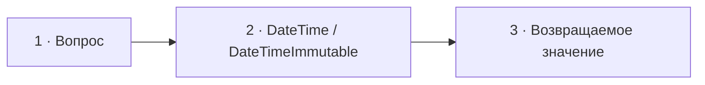

# Визуальный план — «DateTimeImmutable лучше или хуже DateTime?»

Статус: `DONE`
Сложность: `M`
Бюджет реализации после принятия: `20–30 минут`
Shorts: `да — самостоятельный фрагмент около 21 секунды`

## Источники и границы

- Учебный индекс: `questions.txt`, пункт 6.
- Источник структуры: `transcription.txt`.
- Фрагмент: `17:53–18:14`.
- Говорящие:
  - `17:53–18:02` — интервьюер;
  - `18:02–18:12` — Михаил;
  - `18:13–18:14` — короткое подтверждение и переход.
- Технические источники:
  - [PHP Manual — DateTime::modify](https://www.php.net/manual/en/datetime.modify.php);
  - [PHP Manual — DateTimeImmutable::modify](https://www.php.net/manual/en/datetimeimmutable.modify.php).

## Редакционная единица

Это один короткий вопрос с одним ответом. Счётчик выпуска: `04/30`.

## Аудит содержания

| Факт или тезис | Где прозвучал | Оценка | Действие на экране |
|---|---|---|---|
| `DateTimeImmutable` при модификации «клонирует себя» | 18:02–18:06 | по наблюдаемому поведению близко, но точнее: метод возвращает новый объект | показать новый instance без заявления о внутренней реализации через clone |
| Исходный immutable-объект не меняется | следует из ответа | корректно, но не сказано явно | показать две разные даты и identity |
| `DateTime` изменяет текущий объект | не сказано | необходимо для сравнения | показать симметричный пример |
| Результат immutable-операции нужно присвоить | не сказано | важный практический нюанс | показать короткий pitfall после ответа |
| Один из классов всегда «лучше» | не доказано | зависит от требуемой семантики | не делать оценочного победителя |

### Что добавляем

- `DateTime::modify()` изменяет текущий объект.
- `DateTimeImmutable::modify()` возвращает новый объект, исходный остаётся
  прежним.
- Если игнорировать возвращённый immutable-объект, изменение потеряется.

### Намеренно не показываем

- Сравнение производительности и аллокаций — в вопросе нет измерений, а вывод
  зависит от нагрузки.
- Нюансы календарной арифметики вроде `+1 month` — отдельная тема.
- Изменение поведения ошибок `modify()` между PHP 8.2 и 8.3 — не относится к
  различию mutable/immutable.
- Слово «clone» в итоговом экранном определении — PHP гарантирует новый
  объект, но не обязывает зрителя знать внутренний механизм.

## Задача визуализации

Одним симметричным примером показать разницу между изменением текущего объекта
и возвратом нового, а затем предупредить о потерянном return value.

## Состояния и тайминг

| Состояние | Таймкод | Что звучит | Функция экрана | Паттерн |
|---|---|---|---|---|
| 1. Вопрос | 17:53–18:02 | интервьюер формулирует сравнение | удержать оба типа | Question |
| 2. Два поведения | 18:02–18:08 | Михаил говорит про новый объект | показать одинаковую операцию и разные результаты | Two columns |
| 3. Потерянный результат | 18:08–18:14 | пауза и завершение ответа | дать один практический нюанс без конкуренции с речью | Code + warning |



## Состояние 1 — вопрос

Экранный текст: `DateTimeImmutable лучше или хуже DateTime? Какие нюансы?`
Дополняет речь: исправляет ошибку распознавания `Daytime`.
Не дублируем: ответ и оценку «лучше».

### Wireframe 16:9

```text
┌──────────────────────────────────────────────────────────────┐
│                           04/30                              │
│                                                              │
│         DateTimeImmutable лучше или хуже DateTime?           │
│                      Какие нюансы?                           │
│                                                              │
├──────────────────────────────┬───────────────────────────────┤
│ Михаил · слушает             │ Интервьюер · говорит          │
└──────────────────────────────┴───────────────────────────────┘
```

### Wireframe 9:16

```text
┌──────────────────────────────┐
│            04/30             │
│                              │
│ DateTimeImmutable            │
│ лучше или хуже DateTime?     │
│ Какие нюансы?                │
├──────────────────────────────┤
│ Михаил        Интервьюер     │
└──────────────────────────────┘
```

## Состояние 2 — одинаковый вызов, разные результаты

Экранный текст: две колонки с одинаковой исходной датой и `modify('+1 day')`.
Дополняет речь: показывает состояние исходного и возвращённого объектов.
Не дублируем: объяснение абзацем.

### Wireframe 16:9

```text
┌──────────────────────────────────────────────────────────────┐
│ 04/30  DateTimeImmutable и DateTime — в чём разница?         │
├──────────────────────────────┬───────────────────────────────┤
│ DateTime                     │ DateTimeImmutable             │
│                              │                               │
│ $date = 2026-01-01           │ $date = 2026-01-01            │
│ $next = $date->modify(       │ $next = $date->modify(        │
│   '+1 day');                 │   '+1 day');                  │
│                              │                               │
│ $date: 2026-01-02            │ $date: 2026-01-01             │
│ $date === $next  true        │ $date === $next  false        │
│ меняет текущий объект        │ возвращает новый объект       │
├──────────────────────────────┴───────────────────────────────┤
│ Михаил · говорит                         Интервьюер · слушает │
└──────────────────────────────────────────────────────────────┘
```

### Wireframe 9:16

```text
┌──────────────────────────────┐
│ 04/30 · одна операция        │
├──────────────────────────────┤
│ DateTime                     │
│ 01 Jan → 02 Jan              │
│ тот же объект                │
├──────────────────────────────┤
│ DateTimeImmutable            │
│ 01 Jan → новый 02 Jan        │
│ исходный: 01 Jan             │
├──────────────────────────────┤
│ Михаил        Интервьюер     │
└──────────────────────────────┘
```

## Состояние 3 — возвращаемое значение обязательно сохранить

Экранный текст: одна неправильная и одна правильная строка.
Дополняет речь: даёт практический нюанс, пока ответ уже завершён.
Не дублируем: предыдущую двухколоночную схему.

### Wireframe 16:9

```text
┌──────────────────────────────────────────────────────────────┐
│ 04/30  DateTimeImmutable возвращает новый объект             │
├──────────────────────────────┬───────────────────────────────┤
│ $date->modify('+1 day');     │ $date = $date->modify(        │
│                              │   '+1 day');                  │
│ дата осталась прежней        │ новая дата сохранена          │
│ 2026-01-01                   │ 2026-01-02                    │
│          ПОТЕРЯНО            │          СОХРАНЕНО            │
├──────────────────────────────┴───────────────────────────────┤
│ Михаил · говорит                         Интервьюер · слушает │
└──────────────────────────────────────────────────────────────┘
```

### Wireframe 9:16

```text
┌──────────────────────────────┐
│ 04/30 · сохрани результат    │
├──────────────────────────────┤
│ $date->modify('+1 day');     │
│ 2026-01-01 · потеряно        │
├──────────────────────────────┤
│ $date = $date->modify(...);  │
│ 2026-01-02 · сохранено       │
├──────────────────────────────┤
│ Михаил        Интервьюер     │
└──────────────────────────────┘
```

## Анимация

- `17:53` — вопрос; активен интервьюер.
- `18:02` — одновременно появляются две исходные даты.
- `18:04` — стрелка DateTime остаётся в той же карточке; справа создаётся
  вторая карточка DateTimeImmutable.
- `18:08` — сравнение сменяется двумя строками про сохранение результата.
- `18:13` — активный говорящий на коротком подтверждении меняется на
  интервьюера.
- Анимация идентичности объектов одноразовая и останавливается после сборки.

## Shorts

- Исходные 21 секунда подходят без сокращения.
- Хук — вопрос «лучше или хуже».
- Вертикальная последовательность: вопрос → mutable → immutable → pitfall.
- В UI-safe зоне остаются названия классов, даты и итог; сигнатуры можно
  сократить до `modify('+1 day')`.
- CTA не нужен.

## Материалы и производство

- Новый компонент не обязателен: использовать существующие парные карточки и
  `ObjectIdentityDiagram` из предыдущего вопроса в упрощённом виде.
- Внешние изображения: не нужны.
- Уточнение выполняется на экране поверх исходного фрагмента; досъёмка,
  переозвучка и синтетическая замена ответа не планируются.

## Ревью

- [x] Таймкоды сверены с транскриптом.
- [x] Поведение обоих классов проверено по PHP Manual.
- [x] Не делается неподтверждённый вывод о производительности.
- [x] Новый объект показан как контракт API, а не как обязательный `clone`.
- [x] Есть отдельные wireframe 16:9 и 9:16.
- [x] План принят пользователем до начала кода.
