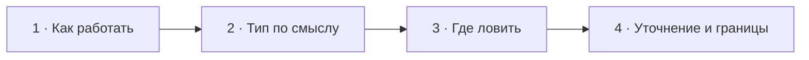

# Визуальный план — «Как работать с исключениями и где их ловить?»

Статус: `DONE`
Сложность: `L`
Бюджет реализации после принятия: `до 60 минут`
Shorts: `кандидат — финальную нарезку определяет монтажёр`

## Источники и границы

- Учебный индекс: `questions.txt`, пункты 7–8.
- Источник структуры: `transcription.txt`.
- Реальная редакционная единица: основной вопрос и его follow-up «где ловить».
- Непрерывный исходный фрагмент: `18:15–20:52`.
- После завершения реплики финальный экран удерживается до `20:59`, чтобы не
  обрывать схему перед следующим вопросом.
- `18:15–18:45` — вводная интервьюера про уровень вопроса, книги и слои. Она
  остаётся в исходном разговоре; центральную учебную графику на этом участке
  не показываем.
- `19:29–20:28` — ответ и обсуждение после follow-up. Транскрипт здесь
  ненадёжен, поэтому он используется только для приблизительной синхронизации,
  но фрагмент не вырезается и не заменяется.
- Досъёмка, переозвучка и синтетическая замена реплик не планируются.
- Говорящие в оригинале:
  - `18:45–18:59` — интервьюер;
  - `18:59–19:21` — Михаил;
  - `19:21–19:29` — интервьюер;
  - `19:29–20:28` — говорящие уточняются по исходному видео при реализации;
  - `20:29–20:52` — интервьюер формулирует рекомендуемый подход.
- Технические источники:
  - [PHP Manual — Extending Exceptions](https://www.php.net/manual/en/language.exceptions.extending.php);
  - [PHP Manual — Exception::getPrevious](https://www.php.net/manual/en/exception.getprevious.php);
  - [Symfony HttpKernel — kernel.exception](https://symfony.com/doc/current/components/http_kernel.html#kernel-exception-event).

## Редакционная единица

Пункты 7 и 8 учебного индекса — один вопрос с уточняющей репликой интервьюера,
а не два самостоятельных вопроса. Счётчик выпуска: `05/30`.

## Аудит содержания

| Факт или тезис | Где прозвучал | Оценка | Действие на экране |
|---|---|---|---|
| Не бросать везде голый `new Exception` | 18:59–19:06 | разумно, но слишком категорично | показать generic exception как потерю семантики |
| Создавать типизированные исключения | 19:06–19:21 | корректно | показать типы по смыслу ошибки |
| Тип нужен, чтобы понять, «откуда пришёл exception» | 19:12–19:21 | неполная мотивация | уточнить: тип сообщает смысл сбоя и позволяет обработать его отдельно |
| Где ловить исключение | 19:23–20:28 | Михаил не дал ясного ответа | сохранить реплики и показать проверенный критерий без служебного бейджа |
| Делить доменные и инфраструктурные исключения, ловить на границах | 20:29–20:52 | полезная практика, но не универсальный закон PHP/DDD | выразить как схема перевода между слоями, не как догму |
| Любое исключение нужно ловить сразу | не звучит | неверно | явно показать: если обработать нечего — пропустить выше |

### Что исправляем и добавляем

- Тип исключения описывает смысл сбоя, а не только место, откуда он пришёл.
- Ловим там, где можем сделать осмысленное действие: восстановиться,
  перевести ошибку на язык следующего слоя, добавить контекст или сформировать
  внешний ответ.
- Техническое исключение допустимо перевести на границе адаптера/модуля,
  сохранив исходное через `previous`.
- Необработанное исключение доходит до внешней границы приложения, где может
  быть залогировано и превращено в response; это не место бизнес-восстановления.
- Архитектурная раскладка не является правилом самого PHP и зависит от границ
  конкретного приложения.

### Экранное уточнение ответа

Исходный ответ продолжает звучать без замены. На экране появляется проверенная
формулировка без отдельной мета-подписи:

> Ловим там, где можем осмысленно что-то сделать: восстановиться, перевести
> ошибку на язык другого слоя или сформировать внешний ответ. Если обработать
> нечего — пропускаем выше.

Следом схема показывает конкретный пример: исключение клиента платёжного шлюза
переводится на границе адаптера в понятную приложению ошибку, а исходное
исключение сохраняется в `previous`.

### Намеренно не показываем

- Большую иерархию из `PaymentException` и множества наследников — она может
  создать ложное правило «отдельный класс на каждую строку».
- Конкретные HTTP-коды — их выбор зависит от контракта приложения.
- Stack trace, Sentry и retry-политику — это соседние темы.
- Утверждение «ловить всегда на границе модуля» как абсолютное правило.
- Учебную графику поверх вводной `18:15–18:45` — здесь достаточно фона и
  аватаров.
- Полную текстовую расшифровку неясного участка `19:29–20:28`: исходный звук
  сохраняется, а экран показывает только короткое уточнение смысла.

## Задача визуализации

Показать исключение как типизированный сигнал, который переводится и
обрабатывается только в месте, способном принять решение.

## Состояния и тайминг

| Состояние | Таймкод | Что звучит | Функция экрана | Паттерн |
|---|---|---|---|---|
| Базовый экран | 18:15–18:52 | вводная про уровень вопроса, книги и слои | сохранить атмосферу без лишнего учебного слоя | Base scene |
| 1. Вопрос | 18:52–18:59 | открытый вопрос про DDD и слои | удержать обе части темы | Question |
| 2. Тип по смыслу | 18:59–19:21 | Михаил говорит о custom exceptions | показать полезную семантику типа | Comparison |
| 3. Где ловить | 19:21–19:29 | интервьюер задаёт follow-up | сменить фокус внутри того же вопроса | Question follow-up |
| 4. Уточнение и границы | 19:29–20:59 | исходное обсуждение, объяснение интервьюера и короткая пауза | сначала дать короткий критерий перехвата, затем раскрыть catch/translate/response flow и удержать итог | Correction + layer flow |



## Состояние 1 — составной вопрос

Экранный текст: `Как работать с исключениями в слоях и DDD?`
Дополняет речь: фиксирует техническую постановку после живой вводной.
Не дублируем: перечисление книг и уровня кандидата; оно остаётся в звуке, а до
начала вопроса на экране видны только фон и аватары.

### Wireframe 16:9

```text
┌──────────────────────────────────────────────────────────────┐
│                           05/30                              │
│                                                              │
│       Как работать с исключениями в слоях и DDD?             │
│                                                              │
├──────────────────────────────┬───────────────────────────────┤
│ Михаил · слушает             │ Интервьюер · говорит          │
└──────────────────────────────┴───────────────────────────────┘
```

### Wireframe 9:16

```text
┌──────────────────────────────┐
│            05/30             │
│                              │
│ Как работать с исключениями  │
│ в слоях и DDD?               │
│                              │
├──────────────────────────────┤
│ Михаил        Интервьюер     │
└──────────────────────────────┘
```

## Состояние 2 — generic против семантического типа

Экранный текст: один generic-вариант и два типа с понятным смыслом.
Дополняет речь: объясняет, зачем нужен тип, а не только откуда пришла ошибка.
Не дублируем: длинную иерархию классов.

### Wireframe 16:9

```text
┌──────────────────────────────────────────────────────────────┐
│ 05/30  Исключение должно сообщать смысл сбоя                 │
├──────────────────────────────┬───────────────────────────────┤
│ new Exception(              │ PaymentDeclined               │
│   'Payment failed'           │ бизнес-решение можно обработать│
│ );                           │                               │
│                              │ PaymentGatewayUnavailable     │
│ один общий тип               │ технический сбой зависимости  │
│ обработка по message         │ обработка по типу             │
├──────────────────────────────┴───────────────────────────────┤
│ Михаил · говорит                         Интервьюер · слушает │
└──────────────────────────────────────────────────────────────┘
```

### Wireframe 9:16

```text
┌──────────────────────────────┐
│ 05/30 · тип сообщает смысл   │
├──────────────────────────────┤
│ Exception                    │
│ Payment failed               │
│ смысл только в строке        │
├──────────────────────────────┤
│ PaymentDeclined              │
│ бизнес-ошибка                │
├──────────────────────────────┤
│ PaymentGatewayUnavailable   │
│ технический сбой             │
├──────────────────────────────┤
│ Михаил        Интервьюер     │
└──────────────────────────────┘
```

## Состояние 3 — follow-up

Экранный текст: `А где лучше ловить исключение?`
Дополняет речь: явно переключает смысл с типа на место обработки.
Не дублируем: предыдущие классы исключений.

### Wireframe 16:9

```text
┌──────────────────────────────────────────────────────────────┐
│ 05/30                                                       │
│                                                              │
│              А где лучше ловить исключение?                 │
│                                                              │
├──────────────────────────────┬───────────────────────────────┤
│ Михаил · слушает             │ Интервьюер · говорит          │
└──────────────────────────────┴───────────────────────────────┘
```

### Wireframe 9:16

```text
┌──────────────────────────────┐
│ 05/30                        │
│                              │
│ Где лучше ловить             │
│ исключение?                  │
│                              │
├──────────────────────────────┤
│ Михаил        Интервьюер     │
└──────────────────────────────┘
```

## Состояние 4 — ловим там, где принимаем решение

Экранный текст: помеченное уточнение, затем последовательность через три слоя и
короткое правило.
Дополняет речь: исправляет недосказанность ответа без замены исходной реплики и
превращает объяснение интервьюера в конкретный flow.
Не дублируем: полный разговор и детали логирования.

Активный аватар на `19:29–20:28` синхронизируется по оригиналу при реализации;
с `20:29` активен интервьюер.

### Wireframe 16:9

```text
┌──────────────────────────────────────────────────────────────┐
│ 05/30  Ловим там, где можем принять решение                  │
├──────────────────────────────────────────────────────────────┤
│ Payment provider                                             │
│ GatewayTimeout                                               │
│        ↓ catch + translate · previous: $e                    │
│ Payment adapter boundary                                     │
│ PaymentGatewayUnavailable                                    │
│        ↓ propagate                                           │
│ HTTP boundary                                                │
│ response + log                                               │
│                                                              │
│ восстановиться · перевести · ответить │ иначе — пропустить ↑ │
├──────────────────────────────────────────────────────────────┤
│ Михаил · говорит                         Интервьюер · слушает │
└──────────────────────────────────────────────────────────────┘
```

### Wireframe 9:16

```text
┌──────────────────────────────┐
│ 05/30 · Где ловить?          │
├──────────────────────────────┤
│ GatewayTimeout              │
│          ↓                   │
│ ADAPTER BOUNDARY             │
│ catch + translate            │
│ previous: $e                 │
│          ↓                   │
│ PaymentGatewayUnavailable   │
│          ↓                   │
│ HTTP BOUNDARY                │
│ response + log               │
├──────────────────────────────┤
│ Нечего делать? Не ловим.     │
├──────────────────────────────┤
│ Михаил        Интервьюер     │
└──────────────────────────────┘
```

## Анимация

- `18:52` — появляется основной вопрос; активен интервьюер.
- `18:59` — появляется generic exception слева.
- `19:05` — одновременно появляются `PaymentDeclined` и
  `PaymentGatewayUnavailable`.
- `19:23` — отдельный крупный follow-up «Где ловить?».
- `19:29` — поверх исходного разговора появляется короткий критерий: ловим
  там, где можем принять решение.
- По мере объяснения интервьюера схема строится сверху вниз: исходная ошибка →
  перевод → внешняя обработка.
- Финальной появляется строка `Нечего делать? Не ловим.`

## Shorts

- Визуалы покрывают разговор `18:15–20:52`, а финальный экран удерживается до
  `20:59`; состояния имеют отдельную
  вертикальную компоновку. Точные границы и сокращения Short определяет
  монтажёр после просмотра оригинала.
- Вертикальная последовательность: основной вопрос → типы → follow-up → flow.
- Служебный бейдж не используется; смысл уточнения выражен заголовком.
- CTA и финальный рекламный экран не добавлять.

## Материалы и производство

- Новый компонент: `ExceptionFlow`; три вертикальных узла, перевод ошибки и
  внешний handler. Его можно будет использовать в вопросах про слои и адаптеры.
- Код: только имена типов и `previous: $e`, без полного try/catch-блока.
- Внешние изображения: не нужны.
- Исправление выполняется экранным содержанием; досъёмка,
  переозвучка и синтетическая замена не планируются.
- До реализации просмотреть и прослушать исходник `19:29–20:52`, чтобы точно
  синхронизировать смену графики и активные аватары. STT в этой зоне ненадёжен
  и не используется для монтажных сокращений.

## Ревью

- [x] Пункты 7–8 объединены по реальной структуре интервью.
- [x] Исходный разговор сохранён непрерывно, без решений о вырезании по STT.
- [x] Недосказанный ответ исправляется экранным уточнением.
- [x] Архитектурная рекомендация не выдана за правило PHP.
- [x] Источник исходного исключения сохраняется через `previous`.
- [x] Есть отдельные wireframe 16:9 и 9:16.
- [x] План принят пользователем до начала кода.
