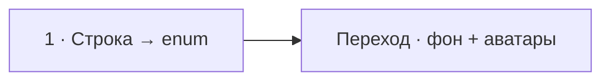

# Визуальный план вопроса 06 — «Для чего и когда использовать enum?»

Статус: `APPROVED`  
Сложность: `S`  
Бюджет реализации после принятия: `10–15 минут`  
Shorts: `кандидат — финальную нарезку определяет монтажёр`

## Источники и границы

- Учебный индекс: `questions.txt`, пункт 50. Положение пункта в выгрузке не
  соответствует хронологии интервью.
- Источник структуры: `transcription.txt`.
- Исходный фрагмент: `20:57–21:21`.
- Предварительные говорящие по STT:
  - `20:57–21:07` — интервьюер задаёт короткий вопрос про назначение `enum`;
  - `21:07–21:21` — короткое завершение PHP-блока и переход к Symfony.
- Технический источник:
  [PHP Manual — Enumerations overview](https://www.php.net/manual/en/language.enumerations.overview.php).
- Исходный разговор сохраняется непрерывно. Точные границы реплик необходимо
  проверить по аудио при реализации: STT на этом участке распознал `enum` как
  «намас» и, вероятно, неверно определил говорящих.

## Редакционная единица

Это один короткий вопрос, хотя в учебном индексе он оказался далеко от
соседних вопросов. Счётчик выпуска: `06/58`; `58` остаётся временным общим
количеством до финального пересчёта.

## Аудит содержания

| Факт или тезис | Где прозвучал | Оценка | Действие на экране |
|---|---|---|---|
| Когда и для чего использовать `enum` | 20:59–21:07 | вопрос различим, ответ в STT не восстановлен надёжно | удержать вопрос и показать один самодостаточный пример |
| Enum задаёт закрытое множество допустимых значений | в STT не зафиксировано | важная суть | показать через тип `OrderStatus` и три case |
| Enum помогает не представить недопустимое состояние строкой | в STT не зафиксировано | полезное следствие | показать отдельно scalar coercion и строковую опечатку |
| PHP enum является специальным видом объекта | не требуется для ответа | корректно, но вторично | не показывать |

### Что добавляем

- `enum` уместен, когда набор вариантов конечен и известен в домене.
- Тип исключает scalar coercion вроде `0 → '0'` из допустимых состояний
  параметра.
- Backed enum централизует точное написание значения: несовпадающая строка
  вроде `'canceled'` не пройдёт, если доменный case задан как `'cancelled'`.

### Намеренно не показываем

- Pure enum против backed enum, методы, интерфейсы и сериализацию — для
  короткого вопроса это лишний учебный слой.
- Мета-подпись «дополнение редакции»: пример сам объясняет назначение и не
  выдаётся за исправление подтверждённой ошибки.
- Любые монтажные сокращения перехода к Symfony.

## Задача визуализации

За несколько секунд показать, что `enum` заменяет открытое множество строк
закрытым типизированным набором доменных значений.

## Состояния и тайминг

| Состояние | Таймкод | Что звучит | Функция экрана | Паттерн |
|---|---|---|---|---|
| 1. Вопрос и пример | 20:57–21:10 | вопрос про назначение `enum` | оставить вопрос в header и почти сразу раскрыть два кейса без отдельного мелькающего question-slide | Code comparison |
| Базовый экран | 21:10–21:21 | завершение PHP-блока и переход | не конкурировать с новой репликой | Base scene |



## Состояние 1 — открытая строка и закрытый тип

Польза: зритель видит не абстрактное «удобнее», а конкретное ограничение
множества значений.  
Экранный текст: вопрос, компактный enum и контраст допустимого/недопустимого.  
Дополняет речь: формулирует критерий применения — конечный набор доменных
вариантов.  
Не дублируем: развернутое определение enum предложением.

### Wireframe 16:9

```text
┌──────────────────────────────────────────────────────────────┐
│ 06/58  Для чего и когда использовать enum?                   │
├──────────────────────────────┬───────────────────────────────┤
│ changeStatus(string $status) │ enum OrderStatus: string      │
│                              │ {                             │
│ changeStatus(0);             │   case Paid = 'paid';         │
│ → $status === '0'            │   case Cancelled = 'cancelled';│
│                              │ }                             │
│ changeStatus('canceled');    │ changeStatus(0); → TypeError │
│ → строка принята             │ from('canceled'); → ValueError│
├──────────────────────────────┼───────────────────────────────┤
│ СТРОКИ ПРОПУСКАЮТ ЛИШНЕЕ     │ ТИПОБЕЗОПАСНЫЙ НАБОР          │
│ Coercion и опечатки          │ Параметр принимает только case│
├──────────────────────────────┴───────────────────────────────┤
│ Михаил · слушает/говорит             Интервьюер · говорит   │
└──────────────────────────────────────────────────────────────┘
```

### Wireframe 9:16

```text
┌──────────────────────────────┐
│ 06/58                        │
│ Когда использовать enum?    │
├──────────────────────────────┤
│ changeStatus(0)             │
│ → '0' в weak mode           │
│ changeStatus('canceled')    │
│ → строка принята            │
├─────────────── ↓ ────────────┤
│ enum OrderStatus: string    │
│ Paid · Cancelled            │
│ 0 → TypeError               │
│ 'canceled' → ValueError     │
├──────────────────────────────┤
│ Типобезопасный набор        │
│ доменных значений           │
├──────────────────────────────┤
│ Михаил        Интервьюер     │
└──────────────────────────────┘
```

## Финальный экранный текст

| Элемент | Текст |
|---|---|
| Заголовок | `Для чего и когда использовать enum?` |
| Левая подпись | `Строки пропускают лишнее` |
| Правая подпись | `Типобезопасный набор` |
| Вывод | `Параметр принимает только case из конечного набора` |

## Анимация

- Header с вопросом появляется первым, но основной материал входит почти
  сразу: отдельного короткого question-slide нет.
- Сначала раскрывается кейс `0 → '0'`, затем несовпадение
  `'canceled' / 'cancelled'`; справа одновременно появляются соответствующие
  `TypeError` и `ValueError`.
- Движение показывает две разные гарантии enum и не служит декором.

## Shorts

- Хук: `Строка или enum — где проходит граница?`
- Вертикальная последовательность: вопрос → строка → enum → короткий вывод.
- Можно убрать переход к Symfony и оставить сам вопрос с примером.
- Код и вывод располагаются в центральной безопасной зоне.

## Материалы и производство

- Новый компонент не нужен: достаточно существующих карточек и code-блоков.
- Код: `OrderStatus` с тремя case.
- SVG/изображения не нужны.
- Исправление на экране: нет до проверки оригинального ответа.
- Досъёмка, переозвучка и синтетическая замена ответа: не планируются.

## Ревью

- [x] Таймкоды предварительно сверены с транскриптом.
- [x] Технические дополнения проверены по PHP Manual.
- [x] Экран не пересказывает речь абзацем.
- [x] Один смысловой слой и одна простая трансформация.
- [x] 16:9 и 9:16 описаны отдельно.
- [ ] Говорящие и точная длительность вопроса сверены с исходным аудио при реализации.
- [ ] Принято пользователем до начала кода.
