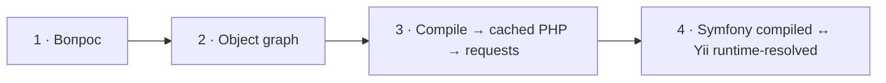

# Визуальный план вопроса 07 — «Как работает DI-контейнер Symfony и что он даёт?»

Статус: `APPROVED`  
Сложность: `L`  
Бюджет реализации после принятия: `40–60 минут`  
Shorts: `да — фрагмент можно понять отдельно`

## Источники и границы

- Учебный индекс: `questions.txt`, пункты 9 и 11. Это одна разговорная
  единица: вопрос об эффективности продолжает объяснение компиляции.
- Источник структуры: `transcription.txt`.
- Исходный фрагмент: `21:21–23:00`.
- Говорящие:
  - `21:21–21:42` — интервьюер вводит Symfony-блок и задаёт вопрос;
  - `21:42–22:37` — Михаил объясняет Reflection, конфигурацию, компиляцию и кэш;
  - `22:37–23:00` — Михаил оговаривает, что не уверен в эффективности, затем
    интервьюер переходит к следующему вопросу.
- Технические источники:
  - [Symfony Docs — Service Container](https://symfony.com/doc/current/service_container.html);
  - [Symfony Docs — Autowiring](https://symfony.com/doc/current/service_container/autowiring.html);
  - [Yii Dependency Injection](https://github.com/yiisoft/di);
  - [Yii 3 Guide — Dependency injection and container](https://yiisoft.github.io/docs/guide/concept/di-container.html).
- Исходный разговор сохраняется непрерывно; спорные границы синхронизируются
  по аудио при реализации.

## Редакционная единица

Вопрос «как работает» и уточнение «насколько это эффективно» не разделяем:
второе имеет смысл только после компиляции и кэширования контейнера. Счётчик:
`07/32`.

## Аудит содержания

| Факт или тезис | Где прозвучал | Оценка | Действие на экране |
|---|---|---|---|
| Контейнер анализирует конструктор и его аргументы | 21:42–22:14 | корректно для autowiring, но неполно | показать type-hints как вход сборки |
| «Контейнер работает через Reflection API» | 21:42–22:14 | корректная часть механизма, но без разделения build/runtime | показать Reflection в фазе построения; в `dev` отдельно отметить проверку свежести и пересборку при изменениях |
| Конфигурация и определения компилируются | 22:16–22:31 | корректная суть | показать этап `compile()` |
| Контейнер кэшируется, чтобы не собирать его на каждом запросе | 22:27–22:37 | корректно | показать generated PHP container в `var/cache` |
| Эффективность кэширования и подход Yii | 22:37–22:59 | полезная тема затронута, но вывод основан на воспоминании | сравнить compiled и runtime-resolved подходы без объявления победителя |
| Контейнер создаёт и связывает сервисы в нужном порядке | в ответе явно не сформулировано | центральная польза | добавить схему object graph |

### Что добавляем

- Контейнер хранит рецепты создания сервисов и связывает object graph.
- Autowiring использует type-hints при построении определений.
- Symfony компилирует определения, оптимизирует их и дампит PHP-класс
  контейнера; запросы переиспользуют этот код из кэша.
- В debug/dev проверяется свежесть ресурсов; контейнер пересобирается, когда
  отслеживаемая конфигурация или код изменились, а не безусловно на каждом
  запросе.
- Yii DI использует runtime container из PHP definitions без Symfony-подобного
  dump скомпилированного класса. Это другая стратегия затрат, а не достаточное
  основание объявить один контейнер быстрее другого.

### Что уточняем

- Reflection — реальная часть построения/autowiring. Уточнение лишь отделяет
  её от выполнения уже скомпилированного контейнера; исходная фраза не
  маркируется как ошибка.
- Кэширование не просто «складывает настройки»: результатом является
  скомпилированный PHP-контейнер.

### Намеренно не показываем

- Неподтверждённое утверждение, что команда Yii измерила бессмысленность
  компиляции. Вместо него показываем проверяемое различие архитектур и честный
  вывод о необходимости benchmark на конкретном приложении.
- Compiler Pass internals, inlining, removal private services и preload — это
  отдельные вопросы.
- Service locator и ручные вызовы `$container->get()` — они отвлекают от
  constructor injection.

## Задача визуализации

Разделить сборку контейнера и обработку запроса, чтобы зритель понял, где
используются type-hints/Reflection, когда `dev`-кэш становится stale и какой
код выполняется, пока кэш остаётся свежим.

## Состояния и тайминг

| Состояние | Таймкод | Что звучит | Функция экрана | Паттерн |
|---|---|---|---|---|
| 1. Вопрос | 21:21–21:42 | переход к Symfony и формулировка вопроса | удержать составной вопрос | Question |
| 2. Object graph | 21:42–22:16 | конструкторы, аргументы, Reflection | показать, что контейнер строит зависимости по type-hints и definitions | Dependency graph |
| 3. Compile and reuse | 22:16–22:37 | компиляция и кэш | разделить warmup, debug freshness check и runtime | Build/runtime flow |
| 4. Две стратегии затрат | 22:37–23:00 | сомнение в эффективности и упоминание Yii | полезно сравнить compiled и runtime-resolved контейнеры без универсального победителя | Trade-off comparison |



## Состояние 1 — вопрос

Польза: сохраняет обе части вопроса, пока интервьюер вводит Symfony-блок.  
Экранный текст: `Как работает DI-контейнер Symfony и что он даёт?`  
Дополняет речь: ничего; это чистая постановка вопроса.  
Не дублируем: вводную про уровень вопросов.

### Wireframe 16:9

```text
┌──────────────────────────────────────────────────────────────┐
│ 07/32                                                        │
│                                                              │
│     Как работает DI-контейнер Symfony и что он даёт?         │
│                                                              │
├──────────────────────────────┬───────────────────────────────┤
│ Михаил · слушает             │ Интервьюер · говорит          │
└──────────────────────────────┴───────────────────────────────┘
```

### Wireframe 9:16

```text
┌──────────────────────────────┐
│ 07/32                        │
│ Как работает DI-контейнер    │
│ Symfony?                     │
│                              │
│ Что он даёт?                 │
├──────────────────────────────┤
│ Михаил        Интервьюер     │
└──────────────────────────────┘
```

## Состояние 2 — контейнер строит object graph

Польза: превращает перечисление Reflection/конструкторов в наблюдаемую связь
трёх сервисов.  
Экранный текст: минимальный конструктор и граф зависимостей.  
Дополняет речь: контейнер не «даёт Reflection», а знает, как создать и связать
сервисы.  
Не дублируем: полный класс и конфигурацию каждого сервиса.

### Wireframe 16:9

```text
┌──────────────────────────────────────────────────────────────┐
│ 07/32  Как работает DI-контейнер Symfony?                    │
├──────────────────────────────┬───────────────────────────────┤
│ final class Checkout         │          Checkout            │
│ {                            │           /    \             │
│   __construct(              │ PaymentGateway  Logger       │
│     PaymentGatewayInterface  │   Interface      Interface   │
│       $gateway,              │       ↓              ↓      │
│     LoggerInterface $logger  │ StripeGateway  MonologLogger │
│   ) {}                       │                              │
│ }                            │ Контейнер создаёт и связывает │
│                              │ object graph                 │
├──────────────────────────────┴───────────────────────────────┤
│ Михаил · говорит                      Интервьюер · слушает   │
└──────────────────────────────────────────────────────────────┘
```

### Wireframe 9:16

```text
┌──────────────────────────────┐
│ 07/32 · DI-контейнер        │
├──────────────────────────────┤
│ Checkout::__construct(      │
│   PaymentGatewayInterface   │
│     $gateway,               │
│   LoggerInterface $logger   │
│ )                           │
├─────────────── ↓ ────────────┤
│ Checkout                    │
│ ├─ PaymentGatewayInterface  │
│ │  └─ StripeGateway         │
│ └─ LoggerInterface          │
│    └─ MonologLogger         │
├──────────────────────────────┤
│ создаёт · связывает · выдаёт │
├──────────────────────────────┤
│ Михаил        Интервьюер     │
└──────────────────────────────┘
```

## Состояние 3 — сборка, freshness check и использование в запросах

Польза: разделяет Reflection/разбор definitions, проверку свежести в `dev` и
исполнение контейнера при обычном запросе.  
Экранный текст: две фазы и короткая метка `Уточнение ответа`.  
Дополняет речь: показывает конкретный результат компиляции — PHP-класс в
кэше.  
Не дублируем: сравнение с Yii — оно раскрывается отдельным следующим
состоянием.

### Wireframe 16:9

```text
┌──────────────────────────────────────────────────────────────┐
│ 07/32  Как работает DI-контейнер Symfony?                    │
├──────────────────────────────────────────────────────────────┤
│ УТОЧНЕНИЕ ОТВЕТА                                            │
│                                                              │
│ СБОРКА / WARMUP                    RUNTIME                   │
│ definitions + type-hints           Request 1 ─┐             │
│           ↓                        Request 2 ─┼─→ cached PHP │
│ resolve + optimize + compile       Request N ─┘   container │
│           ↓                                                  │
│ var/cache/...Container.php                                   │
│                                                              │
│ dev/debug: freshness check                                    │
│ stale → пересобрать · fresh → использовать cached container  │
├──────────────────────────────────────────────────────────────┤
│ Михаил · говорит                      Интервьюер · слушает   │
└──────────────────────────────────────────────────────────────┘
```

### Wireframe 9:16

```text
┌──────────────────────────────┐
│ 07/32 · Уточнение ответа    │
├──────────────────────────────┤
│ СБОРКА                      │
│ definitions + type-hints    │
│          ↓                   │
│ resolve · optimize · compile│
│          ↓                   │
│ cached PHP container        │
│ dev: rebuild when stale     │
├─────────────── ↓ ────────────┤
│ RUNTIME                     │
│ request 1 ─┐                │
│ request 2 ─┼→ тот же код    │
│ request N ─┘                │
├──────────────────────────────┤
│ Михаил        Интервьюер     │
└──────────────────────────────┘
```

## Состояние 4 — compiled и runtime-resolved контейнеры

Польза: не обрывает поднятую Михаилом тему эффективности на «не знаю», а
показывает, какие затраты реально сравниваются.  
Экранный текст: две симметричные колонки Symfony/Yii и общий вывод.  
Дополняет речь: Yii DI действительно строит сервисы из definitions в runtime,
тогда как Symfony заранее дампит PHP-класс контейнера.  
Не дублируем: непроверенный пересказ чужого benchmark и абсолютные заявления
о производительности.

### Wireframe 16:9

```text
┌──────────────────────────────────────────────────────────────┐
│ 07/32  Компилировать заранее или разрешать в runtime?        │
├──────────────────────────────┬───────────────────────────────┤
│ SYMFONY                      │ YII DI                        │
│ compile + PHP dump           │ PHP definitions              │
│          ↓                   │          ↓                    │
│ warmup / rebuild cost        │ resolve objects in runtime    │
│          ↓                   │          ↓                    │
│ reuse generated container    │ no compiled-container artifact│
├──────────────────────────────┴───────────────────────────────┤
│ Что быстрее — проверяет benchmark конкретного приложения     │
├──────────────────────────────────────────────────────────────┤
│ Михаил · говорит                      Интервьюер · слушает   │
└──────────────────────────────────────────────────────────────┘
```

### Wireframe 9:16

```text
┌──────────────────────────────┐
│ 07/32 · две стратегии       │
├──────────────────────────────┤
│ SYMFONY                     │
│ compile → PHP dump → reuse  │
│ цена: warmup / rebuild      │
├──────────────────────────────┤
│ YII DI                      │
│ definitions → runtime resolve│
│ нет compiled artifact       │
├──────────────────────────────┤
│ Победителя определяет       │
│ benchmark приложения        │
├──────────────────────────────┤
│ Михаил        Интервьюер     │
└──────────────────────────────┘
```

## Финальный экранный текст

| Элемент | Текст |
|---|---|
| Заголовок | `Как работает DI-контейнер Symfony?` |
| Object graph | `Создаёт и связывает зависимости` |
| Левая фаза | `Сборка / warmup` |
| Правая фаза | `Runtime` |
| Dev-оговорка | `Проверка freshness; rebuild только когда cache stale` |
| Symfony/Yii | `Compile + reuse` / `Runtime resolve` |
| Вывод о скорости | `Проверяет benchmark конкретного приложения` |

## Анимация

- В object graph связи появляются по мере перечисления аргументов
  конструктора.
- В третьем состоянии сначала строится pipeline сборки, затем несколько
  запросов сходятся в cached container.
- В четвёртом состоянии обе стратегии появляются симметрично; никакая колонка
  не получает цвет «успеха».
- Анимация нужна, чтобы визуально разделить две фазы времени.

## Shorts

- Хук: `Зачем Symfony компилирует DI-контейнер, а Yii — нет?`
- Вертикальная последовательность: вопрос → constructor → object graph →
  build/runtime → сравнение стратегий.
- Можно сократить вводную `21:21–21:30` только по решению монтажёра после
  просмотра оригинала; визуальный план её не вырезает.
- Маркер уточнения, cached PHP и обе фазы остаются в безопасной зоне.

## Материалы и производство

- Нужны переиспользуемые dependency graph/flow и двухколоночное сравнение.
- Код: короткий constructor `Checkout`.
- SVG: простые линии графа, без внешних изображений.
- Уточнение на экране: да, формулировка приведена выше.
- Досъёмка, переозвучка и синтетическая замена ответа: не планируются.

## Ревью

- [x] Таймкоды предварительно сверены с транскриптом.
- [x] Технические дополнения проверены по Symfony Docs.
- [x] Существенное уточнение явно маркируется.
- [x] Экран не превращён в разбор compiler passes.
- [x] 16:9 и 9:16 описаны отдельно.
- [ ] Точные моменты смены состояний сверены с исходным аудио при реализации.
- [ ] Принято пользователем до начала кода.
