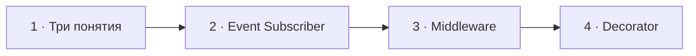

# Визуальный план вопроса 09 — «Event Subscriber, Middleware, Decorator — что можешь рассказать?»

Статус: `APPROVED`  
Сложность: `L`  
Бюджет реализации после принятия: `40–60 минут`  
Shorts: `да — как один сравнительный фрагмент; финальную нарезку определяет монтажёр`

## Источники и границы

- Учебный индекс: `questions.txt`, пункты 14–17. В интервью это один вопрос
  «три в одном», поэтому не дробим его на четыре учебные карточки.
- Источник структуры: `transcription.txt`.
- Исходный фрагмент: `26:26–28:23`.
- Предварительные смысловые границы:
  - `26:26–26:39` — интервьюер формулирует весь вопрос и уточняет первый термин;
  - `26:39–27:13` — Event Subscriber и kernel events;
  - `27:13–27:49` — middleware и начало перехода к следующему понятию;
  - `27:49–28:23` — Decorator и примеры сквозной логики.
- Технические источники:
  - [Symfony Docs — Events and Event Listeners](https://symfony.com/doc/current/event_dispatcher.html);
  - [PHP-FIG — PSR-15](https://www.php-fig.org/psr/psr-15/);
  - [Symfony Docs — Service Decoration](https://symfony.com/doc/current/service_container/decoration.html).
- Исходный разговор сохраняется непрерывно; говорящих и точные границы смен
  проверяем по оригинальному аудио при реализации.

## Редакционная единица

На экране остаётся исходная формулировка интервьюера с тремя понятиями. Каждый
термин получает собственное состояние, но счётчик общий: `09/30`.

## Аудит содержания

| Тезис | Где прозвучал | Оценка | Действие на экране |
|---|---|---|---|
| Event связывается с listener и вызывает его | 26:39–26:58 | по сути корректно, но subscriber не определён | показать `getSubscribedEvents()` и fan-out |
| Symfony имеет kernel lifecycle events | 26:58–27:01 | корректно | оставить одним коротким примером |
| Middleware — Chain of Responsibility | 27:13–27:20 | допустимое приближение | показать pipeline вокруг handler |
| Middleware встречается в основном в Laravel | 27:20–27:26 | слишком узко | пометить `Уточнение ответа`: PSR-15 и Symfony Messenger |
| Decorator добавляет логику вокруг вызова | 27:26–28:12 | корректно | показать обёртку с тем же интерфейсом |
| Логирование, кэширование, метрики | 28:12–28:20 | корректные примеры, но относятся к разным механизмам | использовать как примеры поведения декоратора |

### Что добавляем и исправляем

- Subscriber сам декларирует подписки через `getSubscribedEvents()`; dispatcher
  вызывает один или несколько зарегистрированных обработчиков события.
- Middleware — не Laravel-специфичная идея: PSR-15 стандартизует HTTP middleware,
  а Symfony Messenger использует собственный middleware pipeline.
- Decorator реализует тот же контракт, хранит исходный сервис и добавляет
  поведение до/после делегирования.

### Намеренно не показываем

- Теоретические диаграммы GoF и различия всех вариантов Observer/Chain/Proxy.
- Полный список kernel events и приоритетов subscriber.
- Реализацию кэширующего декоратора: для неё понадобятся отдельные ветки
  cache hit/miss, которые перегрузят этот общий вопрос.
- Монтажные сокращения и текстовый пересказ ответа.

## Задача визуализации

Развести три похожих по ощущению механизма через три разные формы связи:
событие расходится к подписчикам, запрос проходит цепочку, сервис оборачивается.

## Состояния и тайминг

| Состояние | Таймкод | Функция экрана | Паттерн |
|---|---|---|---|
| 1. Вопрос | 26:26–26:39 | удержать исходный вопрос «три в одном» | Question |
| 2. Event Subscriber | 26:39–27:13 | показать декларацию подписок и fan-out | Event flow |
| 3. Middleware | 27:13–27:49 | показать цепочку и исправить узкую привязку к Laravel | Pipeline |
| 4. Decorator | 27:49–28:23 | показать тот же контракт и обёртку вокруг вызова | Highlighted PHP code |



## Состояние 1 — вопрос

Экранный текст: `Event Subscriber, Middleware, Decorator — что можешь рассказать?`

### Wireframe 16:9

```text
┌──────────────────────────────────────────────────────────────┐
│ 09/30                                                        │
│ Event Subscriber · Middleware · Decorator                    │
│ Что можешь рассказать?                                       │
├──────────────────────────────┬───────────────────────────────┤
│ Михаил · слушает             │ Интервьюер · говорит          │
└──────────────────────────────┴───────────────────────────────┘
```

### Wireframe 9:16

```text
┌──────────────────────────────┐
│ 09/30                        │
│ Event Subscriber            │
│ Middleware                  │
│ Decorator                   │
│ Что можешь рассказать?      │
├──────────────────────────────┤
│ Михаил        Интервьюер     │
└──────────────────────────────┘
```

## Состояние 2 — Event Subscriber

Польза: отличает сам event flow от способа, которым subscriber объявляет свои
подписки.

### Wireframe 16:9

```text
┌──────────────────────────────────────────────────────────────┐
│ 09/30  Event Subscriber                                     │
├──────────────────────────────┬───────────────────────────────┤
│ OrderSubscriber             │ OrderPlaced                   │
│ getSubscribedEvents():      │       ↓ dispatch              │
│ OrderPlaced => onPlaced     │ EventDispatcher              │
│ KernelException => onError  │    ↙             ↘            │
│                              │ onPlaced()      MetricsListener│
├──────────────────────────────┴───────────────────────────────┤
│ Subscriber сам объявляет, какие события обрабатывает         │
├──────────────────────────────────────────────────────────────┤
│ Михаил · говорит                      Интервьюер · слушает   │
└──────────────────────────────────────────────────────────────┘
```

### Wireframe 9:16

```text
┌──────────────────────────────┐
│ 09/30 · Event Subscriber    │
├──────────────────────────────┤
│ getSubscribedEvents()       │
│ OrderPlaced => onPlaced     │
├────────────── ↓ ─────────────┤
│ OrderPlaced → Dispatcher    │
│             ↙       ↘       │
│        onPlaced   Metrics   │
├──────────────────────────────┤
│ Михаил        Интервьюер     │
└──────────────────────────────┘
```

## Состояние 3 — Middleware

Польза: показывает, что middleware оборачивают следующий handler и могут
продолжить либо остановить цепочку.

### Wireframe 16:9

```text
┌──────────────────────────────────────────────────────────────┐
│ 09/30  Middleware                         Уточнение ответа   │
├──────────────────────────────────────────────────────────────┤
│ Request → Auth → Logging → Handler                           │
│ Response ←      ←         ←                                 │
│             middleware вызывает next                         │
├──────────────────────────────────────────────────────────────┤
│ Не только Laravel: HTTP middleware стандартизован PSR-15     │
├──────────────────────────────────────────────────────────────┤
│ Михаил · говорит                      Интервьюер · слушает   │
└──────────────────────────────────────────────────────────────┘
```

### Wireframe 9:16

```text
┌──────────────────────────────┐
│ 09/30 · Уточнение ответа    │
│ Middleware                  │
├──────────────────────────────┤
│ Request                     │
│   ↓ Auth                    │
│   ↓ Logging                 │
│   ↓ Handler                 │
│   ↑ Response                │
├──────────────────────────────┤
│ PSR-15 · не только Laravel  │
├──────────────────────────────┤
│ Михаил        Интервьюер     │
└──────────────────────────────┘
```

## Состояние 4 — Decorator

Польза: реальным PHP-кодом показывает ключевую механику «тот же интерфейс,
внедрённый исходный сервис и дополнительное поведение вокруг делегирования».

### Wireframe 16:9

```text
┌──────────────────────────────────────────────────────────────┐
│ 09/30  Decorator                                            │
├──────────────────────────────┬───────────────────────────────┤
│ final class MetricsGateway implements PaymentGatewayInterface│
│ {                                                            │
│   __construct(PaymentGatewayInterface $inner, Metrics ...)   │
│   pay(Money $amount): Receipt {                              │
│     $this->metrics->start();             // до               │
│     $receipt = $this->inner->pay(...);   // делегирование     │
│     $this->metrics->success();           // после             │
│     return $receipt;                                         │
│   }                                                          │
│ }                                                            │
├──────────────────────────────────────────────────────────────┤
│ Тот же интерфейс · поведение до и после делегирования        │
├──────────────────────────────────────────────────────────────┤
│ Михаил · говорит                      Интервьюер · слушает   │
└──────────────────────────────────────────────────────────────┘
```

### Wireframe 9:16

```text
┌──────────────────────────────┐
│ 09/30 · Decorator           │
├──────────────────────────────┤
│ final class MetricsGateway │
│   implements Gateway       │
│ {                          │
│   __construct($inner, ...) │
│   pay($amount) {           │
│     metrics->start();      │
│     inner->pay($amount);   │
│     metrics->success();    │
│   }                        │
│ }                          │
├──────────────────────────────┤
│ Тот же контракт            │
├──────────────────────────────┤
│ Михаил        Интервьюер     │
└──────────────────────────────┘
```

## Финальный экранный текст

| Состояние | Ключевой текст |
|---|---|
| Вопрос | `Event Subscriber · Middleware · Decorator` |
| Subscriber | `Сам объявляет подписки` |
| Middleware | `Цепочка вокруг handler` |
| Decorator | `Тот же контракт · поведение вокруг сервиса` |

## Анимация

- В состоянии subscriber событие приходит в dispatcher и расходится по двум
  веткам ровно на реплике о вызове listener.
- В middleware подсветка проходит к handler и возвращается с response.
- В decorator показывается стабильный кодовый кадр; дополнительная анимация
  строк не нужна, чтобы не конкурировать с речью.
- Между состояниями используется смысловая смена, а не непрерывное мельтешение.

## Shorts

- Хук: `Три паттерна, которые часто смешивают на собеседовании`.
- Вертикальная версия последовательно показывает три механики; на каждом экране
  остаётся название текущего понятия.
- Нельзя выкидывать состояние вопроса так, чтобы фрагмент начинался без контекста.
- Код и ключевой вывод остаются в центральной безопасной зоне.

## Материалы и производство

- Новый компонент: полноэкранный блок PHP-кода для decorator.
- SVG: простые стрелки нужны только для fan-out и middleware pipeline.
- Изображения не нужны.
- Уточнение: `Не только Laravel: HTTP middleware стандартизован PSR-15`.
- Досъёмка, переозвучка и синтетическая замена ответа: не планируются.

## Ревью

- [x] Учебные пункты объединены по реальной формулировке интервьюера.
- [x] Технические дополнения проверены по первичным источникам.
- [x] Не больше четырёх смысловых состояний.
- [x] 16:9 и 9:16 спроектированы отдельно.
- [ ] Говорящие и точные переходы сверены с аудио при реализации.
- [ ] Принято пользователем до начала кода.
