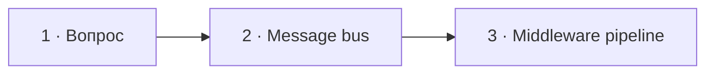

# Визуальный план вопроса 10 — «Чем полезен Symfony Messenger, кроме очередей?»

Статус: `APPROVED`  
Сложность: `M`  
Бюджет реализации после принятия: `20–40 минут`  
Shorts: `да — вопрос и реальный middleware-кейс`

## Источники и границы

- Учебный индекс: `questions.txt`, пункты 18–19. В разговоре «работал ли» —
  подводка к одному содержательному вопросу, поэтому счётчик общий `10/30`.
- Транскрипт: `transcription.txt`, фрагмент `28:26–29:57`.
- Говорящие по STT:
  - `28:26–28:51` — интервьюер уточняет, что Messenger даёт кроме очередей;
  - `28:51–29:20` — Михаил описывает message, handler и transport;
  - `29:20–29:57` — Михаил вспоминает middleware и кейс с DB connection.
- Технический источник:
  [Symfony Docs — Messenger: Sync & Queued Message Handling](https://symfony.com/doc/current/messenger.html).
- Исходный разговор сохраняется непрерывно; финальные границы синхронизируются
  с аудио при реализации.

## Аудит содержания

| Тезис | Где прозвучал | Оценка | Действие на экране |
|---|---|---|---|
| Messenger использовался только для очередей | 28:31–28:43 | честный опыт, но не ответ о возможностях компонента | оставить в речи, затем показать sync/async |
| Message — DTO, handler выбирается по типу | 28:51–29:14 | по сути корректно | показать общую модель dispatch → handler |
| Topic указывается в message | 29:02 | зависит от конфигурации routing/transport | не закреплять на экране |
| Можно настроить несколько transports | 29:14–29:20 | корректно | показать optional async branch |
| Middleware образуют pipeline | 29:20–29:28 | корректно | раскрыть отдельным состоянием |
| Middleware пингует DB до обработки и закрывает после | 29:35–29:55 | реальный и понятный кейс | визуализировать before/after вокруг handler |

### Что добавляем и уточняем

- Message bus полезен и без очереди: сообщение может быть обработано синхронно
  текущим process через handler.
- Transport — опциональная async-ветка, а не определение Messenger целиком.
- Middleware решает сквозные задачи до и после следующего элемента pipeline;
  рядом коротко показать logging, validation и transaction как категории.

### Намеренно не показываем

- Полную архитектуру Envelope/Stamps, retry и failure transport.
- YAML-конфигурацию routing и названия конкретных Kubernetes ресурсов.
- Утверждение, что transport/topic задаётся непосредственно в DTO.
- Монтажные сокращения исходной реплики.

## Задача визуализации

Показать, что Messenger — сначала message bus и middleware pipeline, а очередь
является лишь одним из способов доставки сообщения к handler.

## Состояния и тайминг

| Состояние | Таймкод | Функция экрана | Паттерн |
|---|---|---|---|
| 1. Вопрос | 28:26–28:51 | удержать уточнение «кроме очередей» | Question |
| 2. Bus: sync и async | 28:51–29:20 | развести message bus и transport | Branching flow |
| 3. Middleware pipeline | 29:20–29:57 | показать реальный before/after кейс | Pipeline |



## Состояние 1 — вопрос

### Wireframe 16:9

```text
┌──────────────────────────────────────────────────────────────┐
│ 10/30                                                        │
│ Чем полезен Symfony Messenger, кроме очередей?               │
├──────────────────────────────┬───────────────────────────────┤
│ Михаил · слушает             │ Интервьюер · говорит          │
└──────────────────────────────┴───────────────────────────────┘
```

### Wireframe 9:16

```text
┌──────────────────────────────┐
│ 10/30                        │
│ Чем полезен Messenger,      │
│ кроме очередей?             │
├──────────────────────────────┤
│ Михаил        Интервьюер     │
└──────────────────────────────┘
```

## Состояние 2 — message bus не равен очереди

Польза: исправляет ложную визуальную модель «Messenger = RabbitMQ».

### Wireframe 16:9

```text
┌──────────────────────────────────────────────────────────────┐
│ 10/30  Messenger: bus сначала, transport опционально         │
├──────────────────────────────────────────────────────────────┤
│                    dispatch(new CreateOrder)                 │
│                                ↓                             │
│                         Message Bus                          │
│                     ↙                  ↘                     │
│ SYNC                                  ASYNC                  │
│ CreateOrderHandler()          Transport → Worker → Handler   │
├──────────────────────────────────────────────────────────────┤
│ Один API dispatch · разные способы доставки                  │
├──────────────────────────────────────────────────────────────┤
│ Михаил · говорит                      Интервьюер · слушает   │
└──────────────────────────────────────────────────────────────┘
```

### Wireframe 9:16

```text
┌──────────────────────────────┐
│ 10/30 · Message Bus         │
├──────────────────────────────┤
│ dispatch(CreateOrder)       │
│           ↓                 │
│       Message Bus           │
├──────────────────────────────┤
│ SYNC                        │
│ → Handler                   │
├──────────────────────────────┤
│ ASYNC                       │
│ → Transport → Worker       │
│ → Handler                   │
├──────────────────────────────┤
│ Михаил        Интервьюер     │
└──────────────────────────────┘
```

## Состояние 3 — middleware вокруг handler

Польза: связывает абстрактную возможность Messenger с опытом кандидата.

### Wireframe 16:9

```text
┌──────────────────────────────────────────────────────────────┐
│ 10/30  Middleware pipeline                                  │
├──────────────────────────────────────────────────────────────┤
│ dispatch → [ Ping DB ] → [ Handle message ] → return         │
│                                           → [ Close DB ]      │
│                 BEFORE              HANDLER        AFTER     │
├───────────────────┬───────────────────┬──────────────────────┤
│ logging           │ validation        │ transaction           │
│ другие сквозные задачи без изменения handler                 │
├──────────────────────────────────────────────────────────────┤
│ Михаил · говорит                      Интервьюер · слушает   │
└──────────────────────────────────────────────────────────────┘
```

### Wireframe 9:16

```text
┌──────────────────────────────┐
│ 10/30 · Middleware pipeline │
├──────────────────────────────┤
│ BEFORE · Ping DB            │
│            ↓                │
│ HANDLER · Handle message    │
│            ↓                │
│ AFTER · Close DB            │
├──────────────────────────────┤
│ logging · validation       │
│ transaction                │
├──────────────────────────────┤
│ Михаил        Интервьюер     │
└──────────────────────────────┘
```

## Финальный экранный текст

| Элемент | Текст |
|---|---|
| Заголовок | `Чем полезен Messenger, кроме очередей?` |
| Модель | `Message bus: sync или async` |
| Pipeline | `Ping DB → Handle message → Close DB` |
| Вывод | `Сквозная логика без изменения handler` |

## Анимация

- В состоянии 2 после `dispatch` сначала раскрывается sync-ветка, затем
  optional transport и worker.
- В состоянии 3 подсветка проходит по middleware внутрь handler и обратно к
  закрытию соединения.
- Анимация синхронизируется со словами «middlewares» и «сначала/в конце».

## Shorts

- Хук: `Symfony Messenger — это не только очередь`.
- Вертикальная последовательность: вопрос → sync/async → реальный pipeline.
- Можно убрать вторичные примеры middleware, сохранив DB-кейс.
- Header и pipeline не попадают под верхний/нижний UI Shorts.

## Материалы и производство

- Новый компонент не нужен: branching flow и pipeline собираются из общих узлов.
- Код не обязателен; важнее крупная схема.
- Изображения не нужны.
- Уточнение на экране: `Message bus: sync или async`; без мета-бейджа, потому
  что это расширяет ответ, а не исправляет опасную ошибку.
- Досъёмка, переозвучка и синтетическая замена ответа: не планируются.

## Ревью

- [x] Два пункта выгрузки объединены по разговору.
- [x] Техническая модель проверена по Symfony Docs.
- [x] Экран не повторяет ответ предложениями.
- [x] 16:9 и 9:16 имеют отдельную компоновку.
- [ ] Тайминг и говорящие сверены с оригинальным аудио при реализации.
- [ ] Принято пользователем до начала кода.
