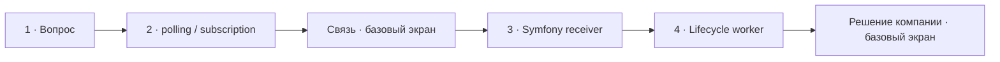

# Визуальный план вопроса 11 — «Когда нужен свой consumer и как RabbitMQ доставляет сообщения?»

Статус: `APPROVED`  
Сложность: `L`  
Бюджет реализации после принятия: `40–60 минут`  
Shorts: `да — при сохранении исправлений о push и lifecycle worker`

## Источники и границы

- Учебный индекс: `questions.txt`, пункты 20–21. В интервью второй вопрос —
  объяснение конкретного основания для первого, поэтому это одна единица.
- Транскрипт: `transcription.txt`, фрагмент `29:57–34:53`.
- Предварительные границы:
  - `29:57–30:11` — интервьюер подводит к вопросу, остаётся базовый экран;
  - `30:11–31:17` — постановка вопроса и осторожная гипотеза Михаила про
    гарантии доставки; на экране остаётся вопрос без отдельного разбора;
  - `31:17–31:28` — переход к polling и subscription/push;
  - `31:28–31:55` — проблема связи и отключение камер; до нового экрана
    остаётся базовая сцена;
  - `31:55–32:27` — Михаил после подсказки корректно связывает RabbitMQ UI
    с polling стандартного Symfony AMQP transport;
  - `32:27–33:38` — неточная связь между polling, lifecycle и памятью worker;
  - `33:38–34:45` — альтернативные библиотеки и собственное решение компании;
    остаётся базовая сцена до следующего вопроса.
- Технические источники:
  - [Symfony Docs — Messenger](https://symfony.com/doc/current/messenger.html);
  - [RabbitMQ Docs — Consumers](https://www.rabbitmq.com/docs/consumers);
  - [RabbitMQ Docs — Consumer Acknowledgements](https://www.rabbitmq.com/docs/confirms).
- Исходный разговор сохраняется целиком. Участок со связью получает базовый
  экран, а не предлагается к удалению.

## Редакционная единица

Смысл разговора — не два вопроса из учебного индекса, а один разбор границы
абстракции Symfony Messenger на примере RabbitMQ. Счётчик: `11/32`.

## Аудит содержания

| Тезис | Где прозвучал | Оценка | Действие на экране |
|---|---|---|---|
| Свой consumer может понадобиться ради особых гарантий доставки | 30:36–31:02 | осторожная первая гипотеза; способ подтверждения и способ получения — разные оси | не выводить отдельный экран: оставить вопрос и не перегружать короткий участок уточнением |
| RabbitMQ поддерживает polling и другой режим | 31:11–31:27 | интервьюер напоминает ключевое различие | с `31:17` назвать `get()`/polling и `basic.consume`/subscription |
| Symfony consumer не виден в RabbitMQ admin | 31:53–32:12 | после подсказки Михаил рассуждает в корректном направлении | с `31:55` объяснить причиной: неблокирующий `get()` не регистрирует subscription |
| Symfony «ходит раз в секунду» | 32:12–32:20 | зависит от receiver/настроек; частота не универсальна | не фиксировать число |
| RabbitMQ будит worker и снова усыпляет его | 32:27–32:58 | опасная модель | исправить: broker доставляет уже зарегистрированному живому consumer |
| Лимиты памяти/времени — костыли из-за polling | 32:48–33:31 | неверная причинность | показать lifecycle отдельно от способа доставки |
| Custom consumer и автоматическая topology | 33:55–34:53 | кейс конкретной компании, а не универсальная рекомендация | не визуализировать отдельным учебным экраном |

### Что добавляем и исправляем

- `basic.get` получает отдельное сообщение запросом; `basic.consume` регистрирует
  долгоживущую подписку, после чего RabbitMQ отправляет deliveries consumer.
- В обоих режимах возможны manual acknowledgements, поэтому гарантии доставки
  определяются не только выбором pull/push.
- RabbitMQ не запускает OS process или pod: работающий consumer заранее
  регистрируется, а Supervisor/systemd/Kubernetes отвечает за процесс и restart.
- Symfony сознательно не использует blocking `AmqpQueue::consume()` в этом
  transport, чтобы worker мог регулярно проверять stop/time/memory conditions.
- Формулировка относится к стандартному `symfony/amqp-messenger`, а не к
  Messenger вообще: для streaming/subscription существуют другие transports.

### Намеренно не показываем

- Название стороннего messenger, плохо распознанное STT, и рекомендации по его
  выбору без точной идентификации.
- Полную RabbitMQ topology, prefetch, publisher confirms и retry semantics.
- Спор о том, какой transport «быстрее», без измерений конкретной нагрузки.
- Автоматическое создание topology в компании интервьюера — оно относится к
  следующему вопросу про Compiler Pass.
- Монтажные сокращения паузы со связью.

## Задача визуализации

Сначала ответить на конкретный вопрос интервьюера: стандартный Symfony AMQP
transport использует polling, а собственный RabbitMQ consumer может работать
через broker-driven subscription. Только после этого отдельно уточнить
  lifecycle уже запущенного worker. Разговор о внутреннем решении компании не
  превращать в универсальную архитектурную рекомендацию.

## Состояния и тайминг

| Состояние | Таймкод | Функция экрана | Паттерн |
|---|---|---|---|
| Базовый экран | 29:57–30:11 | не выводить учебную графику раньше пользовательского таймкода `16:25` | Base scene |
| 1. Вопрос | 30:11–31:17 | удержать точную формулировку интервьюера и не перегружать гипотезу отдельным экраном | Question |
| 2. Polling и subscription | 31:17–31:28 | показать конкретный ответ, к которому подводит интервьюер | Comparison |
| Базовый экран | 31:28–31:55 | сохранить атмосферу проблемы связи и не выводить следующий экран раньше `18:09` | Base scene |
| 3. Symfony AMQP receiver | 31:55–32:27 | поддержать корректное объяснение Михаила после подсказки | Comparison |
| 4. Polling и ожидание delivery | 32:27–33:38 | уточнить связь между polling, lifecycle и утечками worker без отдельного бейджа | Comparison |
| Базовый экран | 33:38–34:45 | не превращать рассказ о решении компании в общую рекомендацию | Base scene |



## Состояние 1 — вопрос

### Wireframe 16:9

```text
┌──────────────────────────────────────────────────────────────┐
│                         ВОПРОС 11 ИЗ 32                      │
│                                                              │
│       Когда писать свой consumer вместо Messenger?           │
├──────────────────────────────────────────────────────────────┤
│ Интервьюер · говорит                         Михаил · слушает │
└──────────────────────────────────────────────────────────────┘
```

### Wireframe 9:16

```text
┌──────────────────────────────┐
│ 11/32                        │
│ Когда писать свой consumer  │
│ вместо Messenger?           │
├──────────────────────────────┤
│ Михаил        Интервьюер ●   │
└──────────────────────────────┘
```

## Состояние 2 — Symfony polling и RabbitMQ subscription

### Wireframe 16:9

```text
┌──────────────────────────────────────────────────────────────┐
│ 11/32  Messenger polling или RabbitMQ subscription           │
├──────────────────────────────┬───────────────────────────────┤
│ SYMFONY AMQP · get()         │ RABBITMQ · basic.consume      │
│ POLLING                      │ PUSH / SUBSCRIPTION           │
│ worker спрашивает очередь    │ broker доставляет consumer    │
├──────────────────────────────┴───────────────────────────────┤
│ Критерий этого кейса — broker-driven push вместо polling     │
├──────────────────────────────────────────────────────────────┤
│ Михаил / интервьюер · состояние по аудио                     │
└──────────────────────────────────────────────────────────────┘
```

### Wireframe 9:16

```text
┌──────────────────────────────┐
│ 11/32 · Polling или push    │
├──────────────────────────────┤
│ Symfony AMQP · get()        │
│ POLLING                     │
├──────────────────────────────┤
│ RabbitMQ · basic.consume    │
│ PUSH / SUBSCRIPTION         │
├──────────────────────────────┤
│ broker доставляет           │
│ зарегистрированному consumer│
├──────────────────────────────┤
│ Михаил        Интервьюер     │
└──────────────────────────────┘
```

## Базовый экран — проблема связи

- `31:28–31:55`: брендовый фон и оба аватара с состояниями говорящих.
- Учебная графика исчезает; разговор про отключение камер остаётся в исходнике.
- В Shorts этот участок может быть решён монтажёром, но план не предписывает
  его вырезать.

## Состояние 3 — почему consumer не виден в RabbitMQ UI

### Wireframe 16:9

```text
┌──────────────────────────────────────────────────────────────┐
│ 11/32  Почему consumer не виден в RabbitMQ UI?               │
├──────────────────────────────┬───────────────────────────────┤
│ Symfony AMQP transport       │ RabbitMQ                      │
│ получает через get()         │ нет basic.consume             │
│ неблокирующий fetch:         │ нет зарегистрированной        │
│ message или empty            │ subscription                   │
├──────────────────────────────┴───────────────────────────────┤
│ get() не регистрирует subscription в RabbitMQ                │
├──────────────────────────────────────────────────────────────┤
│ Михаил / интервьюер · состояние по аудио                     │
└──────────────────────────────────────────────────────────────┘
```

### Wireframe 9:16

```text
┌──────────────────────────────┐
│ 11/32 · RabbitMQ UI         │
├──────────────────────────────┤
│ Symfony AMQP               │
│ get() · polling            │
├──────────────────────────────┤
│ нет basic.consume          │
│ → нет subscription в UI    │
├──────────────────────────────┤
│ Михаил ●      Интервьюер     │
└──────────────────────────────┘
```

## Состояние 4 — polling и ожидание delivery

### Wireframe 16:9

```text
┌──────────────────────────────────────────────────────────────┐
│ 11/32  get() и consume() меняют способ ожидания              │
├──────────────────────────────┬───────────────────────────────┤
│ POLLING · basic.get          │ SUBSCRIPTION · basic.consume  │
│ worker спрашивает очередь    │ worker ждёт delivery          │
│ empty → пауза → новый get()  │ подписка по открытому         │
│ периодические пустые запросы │ соединению, без polling       │
├──────────────────────────────┴───────────────────────────────┤
│ consume снижает холостую нагрузку, но не устраняет утечки    │
├──────────────────────────────────────────────────────────────┤
│ Интервьюер · говорит                         Михаил · слушает │
└──────────────────────────────────────────────────────────────┘
```

### Wireframe 9:16

```text
┌──────────────────────────────┐
│ 11/32 · Способ ожидания     │
├──────────────────────────────┤
│ POLLING · basic.get        │
│ empty → pause → get()      │
├──────────────────────────────┤
│ SUBSCRIPTION               │
│ basic.consume → delivery   │
├──────────────────────────────┤
│ Михаил        Интервьюер ●   │
└──────────────────────────────┘
```

## Финальный экранный текст

| Элемент | Текст |
|---|---|
| Вопрос | `Когда писать свой consumer вместо Messenger?` |
| Контраст | `Symfony AMQP · get() · polling` / `RabbitMQ · basic.consume · subscription` |
| Михаил после подсказки | `get() не регистрирует subscription в RabbitMQ UI` |
| Исправление | `basic.consume снижает холостую нагрузку, но не устраняет утечки PHP-worker` |

## Анимация

- Вопрос показывается отдельно, без преждевременного ответа на экране.
- На первой гипотезе вопрос остаётся на экране; отдельное уточнение про
  acknowledgements не показывается. Дальнейшее объяснение Михаила не
  маркируется ошибочным.
- Polling показывает повторяющийся request/response; subscription — один
  `basic.consume` и последующие deliveries.
- В сравнении способов ожидания сначала раскрывается цикл `get()`, затем
  долгоживущая subscription и общий вывод про lifecycle PHP-worker.

## Shorts

- Хук: `RabbitMQ правда “будит” worker?`.
- Вертикальный порядок: вопрос → polling/subscription → объяснение Михаила →
  lifecycle. Участки связи и рассказа о решении компании остаются
  исходным, но решение о длине принимает монтажёр.
- Для самостоятельности обязательно сохранить поправку о долгоживущем worker.
- Мелкие protocol details можно убрать, не уменьшая шрифт.

## Материалы и производство

- Нужны отдельный вопрос и два сравнения; всё можно собрать на существующих
  карточках.
- SVG: стрелки request/response и delivery.
- Изображения не нужны.
- Исправления на экране: да — про запуск worker.
- Досъёмка, переозвучка и синтетическая замена ответа: не планируются.

## Ревью

- [x] Два учебных пункта объединены по реальному разговору.
- [x] Проверены RabbitMQ push/pull и Symfony AMQP behavior.
- [x] Проблема связи сохранена базовым экраном.
- [x] Существенные неточности явно маркированы.
- [x] 16:9 и 9:16 спроектированы отдельно.
- [x] Говорящие и границы сверены с транскриптом и замечанием автора при реализации.
- [x] Переработанная последовательность принята пользователем до изменения кода.
