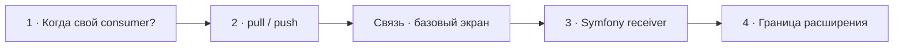

# Визуальный план вопроса 11 — «Когда нужен свой consumer и как RabbitMQ доставляет сообщения?»

Статус: `APPROVED`  
Сложность: `L`  
Бюджет реализации после принятия: `40–60 минут`  
Shorts: `да — при сохранении исправлений о push и lifecycle worker`

## Источники и границы

- Учебный индекс: `questions.txt`, пункты 20–21. В интервью второй вопрос —
  объяснение конкретного основания для первого, поэтому это одна единица.
- Транскрипт: `transcription.txt`, фрагмент `29:57–34:53`.
- Предварительные границы:
  - `29:57–31:10` — когда стандартного consumer может не хватить и гипотеза
    кандидата про гарантии доставки;
  - `31:11–31:28` — переход к polling и subscription/push;
  - `31:28–31:48` — проблема связи и отключение камер;
  - `31:48–33:31` — RabbitMQ UI, polling, lifecycle и память worker;
  - `33:31–34:53` — альтернативные библиотеки и собственное решение компании.
- Технические источники:
  - [Symfony Docs — Messenger](https://symfony.com/doc/current/messenger.html);
  - [RabbitMQ Docs — Consumers](https://www.rabbitmq.com/docs/consumers);
  - [RabbitMQ Docs — Consumer Acknowledgements](https://www.rabbitmq.com/docs/confirms).
- Исходный разговор сохраняется целиком. Участок со связью получает базовый
  экран, а не предлагается к удалению.

## Редакционная единица

Смысл разговора — не два вопроса из учебного индекса, а один разбор границы
абстракции Symfony Messenger на примере RabbitMQ. Счётчик: `11/58`.

## Аудит содержания

| Тезис | Где прозвучал | Оценка | Действие на экране |
|---|---|---|---|
| Свой consumer может понадобиться ради особых гарантий доставки | 30:36–31:02 | само по себе неверно: ack доступен и при pull, и при subscription | коротко исправить |
| RabbitMQ поддерживает polling и другой режим | 31:11–31:27 | корректное направление | назвать `basic.get` и `basic.consume` |
| Symfony consumer не виден в RabbitMQ admin | 31:53–32:12 | соответствует документации Symfony AMQP transport | объяснить причиной: не используется blocking `consume()` |
| Symfony «ходит раз в секунду» | 32:12–32:20 | зависит от receiver/настроек; частота не универсальна | не фиксировать число |
| RabbitMQ будит worker и снова усыпляет его | 32:27–32:58 | опасная модель | исправить: broker доставляет уже зарегистрированному живому consumer |
| Лимиты памяти/времени — костыли из-за polling | 32:48–33:31 | неверная причинность | показать lifecycle отдельно от способа доставки |
| Custom consumer и автоматическая topology | 33:55–34:53 | кейс конкретной компании | показать как осознанное расширение, не универсальную рекомендацию |

### Что добавляем и исправляем

- `basic.get` получает отдельное сообщение запросом; `basic.consume` регистрирует
  долгоживущую подписку, после чего RabbitMQ отправляет deliveries consumer.
- В обоих режимах возможны manual acknowledgements, поэтому гарантии доставки
  определяются не только выбором pull/push.
- RabbitMQ не запускает OS process или pod: работающий consumer заранее
  регистрируется, а Supervisor/systemd/Kubernetes отвечает за процесс и restart.
- Symfony сознательно не использует blocking `AmqpQueue::consume()` в этом
  transport, чтобы worker мог регулярно проверять stop/time/memory conditions.
- Если нужна иная broker-native модель, первым расширением может быть custom
  receiver/transport при сохранении bus/handlers; отдельный runtime consumer
  оправдан, когда требуется собственный lifecycle или protocol semantics.

### Намеренно не показываем

- Название стороннего messenger, плохо распознанное STT, и рекомендации по его
  выбору без точной идентификации.
- Полную RabbitMQ topology, prefetch, publisher confirms и retry semantics.
- Спор о том, какой transport «быстрее», без измерений конкретной нагрузки.
- Автоматическое создание topology в компании интервьюера — оно относится к
  следующему вопросу про Compiler Pass.
- Монтажные сокращения паузы со связью.

## Задача визуализации

Дать точную модель pull/push и отделить три разные ответственности: RabbitMQ
доставляет сообщения, consumer process уже запущен, framework управляет своим
lifecycle.

## Состояния и тайминг

| Состояние | Таймкод | Функция экрана | Паттерн |
|---|---|---|---|
| 1. Вопрос и гипотеза | 29:57–31:10 | удержать вопрос и снять ложную связь с delivery guarantees | Question + correction |
| 2. Pull и push | 31:11–31:28 | показать реальную разницу протокольных режимов | Comparison |
| Базовый экран | 31:28–31:48 | сохранить атмосферу проблемы связи, не конкурировать инфографикой | Base scene |
| 3. Symfony AMQP receiver | 31:48–33:31 | объяснить RabbitMQ admin и lifecycle worker | Responsibility flow |
| 4. Когда расширять | 33:31–34:53 | дать практическую границу custom transport/consumer | Decision ladder |



## Состояние 1 — вопрос и гарантии доставки

### Wireframe 16:9

```text
┌──────────────────────────────────────────────────────────────┐
│ 11/58  Когда может понадобиться свой consumer?               │
├──────────────────────────────────────────────────────────────┤
│ Гипотеза: «особые гарантии доставки?»                        │
│                             ↓                                │
│ ИСПРАВЛЕНИЕ                                                  │
│ Manual ack доступен и для pull, и для subscription           │
│ Гарантии ≠ причина переписывать consumer сама по себе        │
├──────────────────────────────────────────────────────────────┤
│ Михаил / интервьюер · состояние по оригинальному аудио       │
└──────────────────────────────────────────────────────────────┘
```

### Wireframe 9:16

```text
┌──────────────────────────────┐
│ 11/58                        │
│ Когда нужен свой consumer?  │
├──────────────────────────────┤
│ ИСПРАВЛЕНИЕ                 │
│ delivery guarantees         │
│ не зависят только           │
│ от pull или push            │
├──────────────────────────────┤
│ manual ack есть в обоих     │
├──────────────────────────────┤
│ Михаил        Интервьюер     │
└──────────────────────────────┘
```

## Состояние 2 — `basic.get` и `basic.consume`

### Wireframe 16:9

```text
┌──────────────────────────────────────────────────────────────┐
│ 11/58  RabbitMQ: pull и subscription                         │
├──────────────────────────────┬───────────────────────────────┤
│ basic.get · PULL             │ basic.consume · PUSH          │
│ worker ── «есть сообщение?» →│ worker ── subscribe ──→ queue │
│ worker ←── message / empty ──│ worker ←── deliveries ─ queue │
│ каждый fetch — отдельный call│ consumer уже запущен          │
├──────────────────────────────┴───────────────────────────────┤
│ RabbitMQ рекомендует долгоживущую subscription               │
├──────────────────────────────────────────────────────────────┤
│ Михаил / интервьюер · состояние по аудио                     │
└──────────────────────────────────────────────────────────────┘
```

### Wireframe 9:16

```text
┌──────────────────────────────┐
│ 11/58 · RabbitMQ            │
├──────────────────────────────┤
│ PULL · basic.get            │
│ worker спрашивает очередь   │
├──────────────────────────────┤
│ PUSH · basic.consume        │
│ worker подписан             │
│ broker шлёт deliveries      │
├──────────────────────────────┤
│ consumer уже должен работать│
├──────────────────────────────┤
│ Михаил        Интервьюер     │
└──────────────────────────────┘
```

## Базовый экран — проблема связи

- `31:28–31:48`: брендовый фон и оба аватара с состояниями говорящих.
- Учебная графика исчезает; разговор про отключение камер остаётся в исходнике.
- В Shorts этот участок может быть решён монтажёром, но план не предписывает
  его вырезать.

## Состояние 3 — transport, broker и process manager

### Wireframe 16:9

```text
┌──────────────────────────────────────────────────────────────┐
│ 11/58  Кто за что отвечает?               Уточнение ответа   │
├────────────────────┬────────────────────┬────────────────────┤
│ RabbitMQ           │ Symfony worker     │ Process manager    │
│ доставляет         │ receive + handle   │ запускает/restart  │
│ зарегистрированному│ проверяет stop,    │ Supervisor/systemd │
│ consumer           │ time, memory limits│ Kubernetes         │
├────────────────────┴────────────────────┴────────────────────┤
│ Symfony AMQP receiver не вызывает blocking consume()         │
│ поэтому consumer не отображается в RabbitMQ admin            │
├──────────────────────────────────────────────────────────────┤
│ Михаил / интервьюер · состояние по аудио                     │
└──────────────────────────────────────────────────────────────┘
```

### Wireframe 9:16

```text
┌──────────────────────────────┐
│ 11/58 · Уточнение ответа    │
├──────────────────────────────┤
│ RabbitMQ                   │
│ → доставляет сообщения     │
├──────────────────────────────┤
│ Symfony worker             │
│ → receive / handle / limits│
├──────────────────────────────┤
│ Supervisor / Kubernetes    │
│ → process / restart        │
├──────────────────────────────┤
│ no blocking consume()      │
│ → не виден в RabbitMQ UI   │
├──────────────────────────────┤
│ Михаил        Интервьюер     │
└──────────────────────────────┘
```

## Состояние 4 — граница расширения

### Wireframe 16:9

```text
┌──────────────────────────────────────────────────────────────┐
│ 11/58  Расширять от меньшего к большему                      │
├──────────────────────────────────────────────────────────────┤
│ 1  Handler / middleware                                     │
│    бизнес-обработка и сквозная логика                        │
│                         ↓ если не хватает transport semantics│
│ 2  Custom receiver / transport                              │
│    broker-native subscription, protocol, serialization      │
│                         ↓ если нужен свой lifecycle/runtime  │
│ 3  Отдельный consumer process                               │
│    reconnect, flow control, shutdown, observability         │
├──────────────────────────────────────────────────────────────┤
│ Не переписывать весь стек ради одной настройки               │
├──────────────────────────────────────────────────────────────┤
│ Интервьюер · говорит                    Михаил · слушает     │
└──────────────────────────────────────────────────────────────┘
```

### Wireframe 9:16

```text
┌──────────────────────────────┐
│ 11/58 · Когда расширять     │
├──────────────────────────────┤
│ 1 Handler / middleware      │
│         ↓                   │
│ 2 Receiver / transport      │
│         ↓                   │
│ 3 Свой consumer runtime     │
├──────────────────────────────┤
│ Только если нижнего уровня  │
│ действительно недостаточно │
├──────────────────────────────┤
│ Михаил        Интервьюер     │
└──────────────────────────────┘
```

## Финальный экранный текст

| Элемент | Текст |
|---|---|
| Контраст | `basic.get · pull` / `basic.consume · push` |
| Исправление 1 | `Manual ack доступен в обоих режимах` |
| Исправление 2 | `RabbitMQ доставляет уже запущенному consumer` |
| Symfony | `Не использует blocking consume()` |
| Решение | `Handler → transport → собственный runtime` |

## Анимация

- Pull показывает повторяющийся request/response; push — один subscribe и
  последующие deliveries.
- В ответственности подсвечивается ровно один столбец на соответствующей
  реплике: broker, worker, process manager.
- Decision ladder раскрывается снизу только при переходе к собственному решению.

## Shorts

- Хук: `RabbitMQ правда “будит” worker?`.
- Вертикальный порядок: вопрос → pull/push → три ответственности → граница
  расширения. Участок связи остаётся исходным, но решение о длине принимает
  монтажёр.
- Для самостоятельности обязательно сохранить обе маркированные поправки.
- Мелкие protocol details можно убрать, не уменьшая шрифт.

## Материалы и производство

- Нужны сравнение, трёхколоночная ответственность и decision ladder; всё можно
  собрать на существующих карточках/flow-узлах.
- SVG: стрелки request/response и delivery.
- Изображения не нужны.
- Исправления на экране: да — про acknowledgements и запуск worker.
- Досъёмка, переозвучка и синтетическая замена ответа: не планируются.

## Ревью

- [x] Два учебных пункта объединены по реальному разговору.
- [x] Проверены RabbitMQ push/pull и Symfony AMQP behavior.
- [x] Проблема связи сохранена базовым экраном.
- [x] Существенные неточности явно маркированы.
- [x] 16:9 и 9:16 спроектированы отдельно.
- [ ] Говорящие и границы сверены с оригинальным аудио при реализации.
- [ ] Принято пользователем до начала кода.
