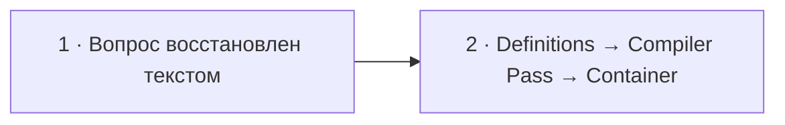

# Визуальный план вопроса 12 — «Что такое Compiler Pass в Symfony?»

Статус: `APPROVED`  
Сложность: `M`  
Бюджет реализации после принятия: `20–40 минут`  
Shorts: `кандидат — вопрос придётся восстанавливать текстом`

## Источники и границы

- Учебный индекс: `questions.txt`, пункт 53. Позиция в выгрузке не совпадает с
  хронологией интервью.
- Транскрипт: `transcription.txt`, ориентировочный фрагмент `34:45–35:08`.
- Контекст:
  - `33:55–34:19` — интервьюер рассказывает про автоматическую сборку messaging
    topology «компайлер-пассом»;
  - вопрос в STT не сохранился;
  - `34:53–35:06` — Михаил отвечает: точка расширения сборки контейнера,
    вызываемая при bootstrap/сборке.
- На этом участке начинается известный дефект звука интервьюера. Точный вход
  вопроса проверяем по исходному видео при реализации.
- Технические источники:
  - [Symfony Docs — Compiler Passes](https://symfony.com/doc/current/service_container/compiler_passes.html);
  - [Symfony Docs — Service Tags](https://symfony.com/doc/current/service_container/tags.html).
- Исходная речь сохраняется; вопрос восстанавливается только видимым текстом,
  без синтетического голоса.

## Аудит содержания

| Тезис | Где прозвучал | Оценка | Действие на экране |
|---|---|---|---|
| Compiler Pass — точка расширения сборки контейнера | 34:53 | корректно | оставить главным определением |
| Он вызывается «когда всё bootstrap-ится» | 34:53–35:06 | слишком размыто | уточнить: во время compilation контейнера |
| В нём можно «написать свои вещи» | 34:53–35:06 | не раскрывает API и результат | показать `process(ContainerBuilder)` и modification definitions |
| Pass автоматически собирает topology по правилам | 33:55–34:19 | кейс интервьюера | использовать как конкретный пример tagged services → registry |

### Что добавляем и уточняем

- Compiler Pass получает `ContainerBuilder` во время compilation и может
  анализировать/изменять service definitions до получения готового контейнера.
- Частый паттерн: найти сервисы с определённым tag и зарегистрировать их в
  registry/manager definition.
- Результат работы — изменённые definitions в скомпилированном container, а не
  логика, которая заново исполняется на каждом сообщении.

### Намеренно не показываем

- Все compiler pass phases и их priority/order.
- Полный PHP-класс pass с imports и boilerplate bundle registration.
- Устройство конкретной topology компании: в исходнике нет достаточных деталей.
- Досъёмку или озвученное восстановление потерянного вопроса.

## Задача визуализации

Привязать короткое определение к наблюдаемому преобразованию контейнера:
найти tagged definitions и собрать из них готовый registry при compilation.

## Состояния и тайминг

| Состояние | Таймкод | Функция экрана | Паттерн |
|---|---|---|---|
| 1. Восстановленный вопрос | ориентир `34:45–34:53` | вернуть потерянный аудиоконтекст | Question + audio notice |
| 2. Compilation pipeline | `34:53–35:08` | конкретизировать ответ на примере topology | Build-time flow |



## Состояние 1 — восстановленный вопрос

### Wireframe 16:9

```text
┌──────────────────────────────────────────────────────────────┐
│ 12/32                                                        │
│ Что такое Compiler Pass в Symfony?                           │
│                                                              │
│ Звук вопроса повреждён · формулировка восстановлена текстом  │
├──────────────────────────────┬───────────────────────────────┤
│ Михаил · слушает             │ Интервьюер · говорит          │
└──────────────────────────────┴───────────────────────────────┘
```

### Wireframe 9:16

```text
┌──────────────────────────────┐
│ 12/32                        │
│ Что такое Compiler Pass     │
│ в Symfony?                  │
├──────────────────────────────┤
│ Звук вопроса повреждён      │
│ Вопрос восстановлен текстом │
├──────────────────────────────┤
│ Михаил        Интервьюер     │
└──────────────────────────────┘
```

## Состояние 2 — преобразование definitions при compilation

Польза: превращает «там можно что-то написать» в конкретную точку и результат.

### Wireframe 16:9

```text
┌──────────────────────────────────────────────────────────────┐
│ 12/32  Compiler Pass работает при сборке контейнера          │
├────────────────────┬─────────────────────┬───────────────────┤
│ SERVICE DEFINITIONS│ process(            │ COMPILED CONTAINER│
│ SendEmailMessage   │  ContainerBuilder   │ MessageRegistry   │
│ tag: app.message   │ )                   │ email → handler   │
│                    │ findTaggedServiceIds│ order → handler   │
│ CreateOrderMessage │ addMethodCall(...)  │ готовая topology  │
│ tag: app.message   │                     │                   │
├────────────────────┴─────────────────────┴───────────────────┤
│ definitions → Compiler Pass → изменённые definitions         │
├──────────────────────────────────────────────────────────────┤
│ Михаил · говорит                      Интервьюер · без звука │
└──────────────────────────────────────────────────────────────┘
```

### Wireframe 9:16

```text
┌──────────────────────────────┐
│ 12/32 · Compiler Pass       │
├──────────────────────────────┤
│ TAGGED DEFINITIONS          │
│ SendEmail · app.message     │
│ CreateOrder · app.message   │
├────────────── ↓ ─────────────┤
│ process(ContainerBuilder)   │
│ find tags · modify defs     │
├────────────── ↓ ─────────────┤
│ COMPILED CONTAINER         │
│ готовый MessageRegistry     │
├──────────────────────────────┤
│ Михаил        Интервьюер     │
└──────────────────────────────┘
```

## Финальный экранный текст

| Элемент | Текст |
|---|---|
| Вопрос | `Что такое Compiler Pass в Symfony?` |
| Дефект | `Звук вопроса повреждён · восстановлено текстом` |
| Определение | `Точка расширения compilation контейнера` |
| Метод | `process(ContainerBuilder)` |
| Результат | `Проанализировать и изменить service definitions` |

## Анимация

- Вопрос появляется целиком без эффекта печати: зрителю нужно быстро вернуть
  потерянный контекст.
- Во втором состоянии tagged definitions входят в Compiler Pass, после чего
  заполняется registry в compiled container.
- Не анимируем мелкие строки кода по отдельности.

## Shorts

- Хук: `Compiler Pass — это не runtime hook`.
- Последовательность: восстановленный вопрос → три стадии compilation.
- В вертикальной версии сохраняется сообщение о повреждённом звуке, иначе
  пауза перед ответом будет выглядеть ошибкой ролика.
- Можно убрать второй пример tagged service, но не стадии pipeline.

## Материалы и производство

- Новый компонент не нужен: трёхступенчатый build flow собирается из общих карточек.
- Код: только сигнатура `process(ContainerBuilder)` и два коротких действия.
- Изображения не нужны.
- Маркировка происхождения: `Звук вопроса повреждён · восстановлено текстом`.
- Досъёмка, переозвучка и синтетическая замена ответа: не планируются.

## Ревью

- [x] Вопрос найден по контексту и учебному индексу, а не выдуман из STT.
- [x] Механика проверена по Symfony Docs.
- [x] Корпоративный пример не выдан за универсальную topology.
- [x] 16:9 и 9:16 спроектированы отдельно.
- [ ] Точная граница отсутствующего вопроса сверена с исходным видео.
- [ ] Принято пользователем до начала кода.
