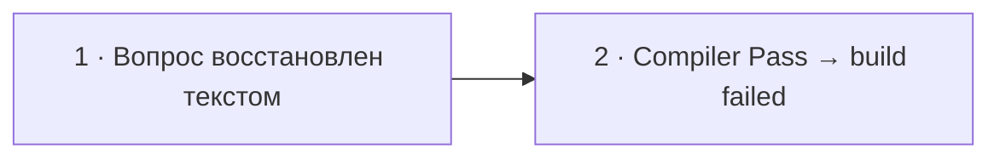

# Визуальный план вопроса 12 — «Что такое Compiler Pass в Symfony?»

Статус: `REVIEW`  
Сложность: `M`  
Бюджет реализации после принятия: `20–40 минут`  
Shorts: `кандидат — вопрос придётся восстанавливать текстом`

## Источники и границы

- Учебный индекс: `questions.txt`, пункт 53. Позиция в выгрузке не совпадает с
  хронологией интервью.
- Транскрипт: `transcription.txt`, ориентировочный фрагмент `34:45–35:08`.
- Контекст:
  - `33:55–34:19` — интервьюер рассказывает про автоматическую сборку messaging
    topology «компайлер-пассом»;
  - вопрос в STT не сохранился;
  - `34:53–35:06` — Михаил отвечает: точка расширения сборки контейнера,
    вызываемая при bootstrap/сборке.
- На этом участке начинается известный дефект звука интервьюера. Точный вход
  вопроса проверяем по исходному видео при реализации.
- Технические источники:
  - [Symfony Docs — Compiler Passes](https://symfony.com/doc/current/service_container/compiler_passes.html);
  - [Symfony Docs — Service Tags](https://symfony.com/doc/current/service_container/tags.html).
- Исходная речь сохраняется; вопрос восстанавливается только видимым текстом,
  без синтетического голоса.

## Аудит содержания

| Тезис | Где прозвучал | Оценка | Действие на экране |
|---|---|---|---|
| Compiler Pass — точка расширения сборки контейнера | 34:53 | корректно | оставить главным определением |
| Он вызывается «когда всё bootstrap-ится» | 34:53–35:06 | слишком размыто | уточнить: во время compilation контейнера |
| В нём можно «написать свои вещи» | 34:53–35:06 | не раскрывает API и результат | показать компактный класс с `process(ContainerBuilder)` |
| Pass автоматически собирает topology по правилам | 33:55–34:19 | кейс интервьюера | не раскрывать корпоративную topology; показать нейтральную compile-time проверку |

### Что добавляем и уточняем

- Compiler Pass получает `ContainerBuilder` во время compilation и может
  анализировать/изменять service definitions до получения готового контейнера.
- Наблюдаемый пример: найти tagged consumers и остановить compilation, если
  два сервиса объявили одну очередь.
- Pass видит definitions всего контейнера и применяет пользовательское правило
  до запуска приложения.

### Намеренно не показываем

- Все compiler pass phases и их priority/order.
- Imports, namespace и boilerplate регистрации pass в Kernel/Bundle.
- Сравнение с `AutowireIterator`: оно уводит от ответа на текущий вопрос.
- Устройство конкретной topology компании: в исходнике нет достаточных деталей.
- Досъёмку или озвученное восстановление потерянного вопроса.

## Задача визуализации

Привязать короткое определение к наблюдаемому compile-time правилу: найти
tagged definitions и обнаружить конфликт имён очередей до запуска приложения.

## Состояния и тайминг

| Состояние | Таймкод | Функция экрана | Паттерн |
|---|---|---|---|
| 1. Восстановленный вопрос | ориентир `34:45–34:53` | вернуть потерянный аудиоконтекст | Question + audio notice |
| 2. Compile-time validation | `34:53–35:08` | показать минимальный Compiler Pass и наблюдаемый результат | Code + error |



## Состояние 1 — восстановленный вопрос

### Wireframe 16:9

```text
┌──────────────────────────────────────────────────────────────┐
│ 12/32                                                        │
│ Что такое Compiler Pass в Symfony?                           │
│                                                              │
│ Звук вопроса повреждён · формулировка восстановлена текстом  │
├──────────────────────────────┬───────────────────────────────┤
│ Михаил · слушает             │ Интервьюер · говорит          │
└──────────────────────────────┴───────────────────────────────┘
```

### Wireframe 9:16

```text
┌──────────────────────────────┐
│ 12/32                        │
│ Что такое Compiler Pass     │
│ в Symfony?                  │
├──────────────────────────────┤
│ Звук вопроса повреждён      │
│ Вопрос восстановлен текстом │
├──────────────────────────────┤
│ Михаил        Интервьюер     │
└──────────────────────────────┘
```

## Состояние 2 — проверка definitions при compilation

Польза: превращает «там можно что-то написать» в короткий PHP-класс и понятную
ошибку конфигурации.

### Wireframe 16:9

```text
┌──────────────────────────────────────────────────────────────┐
│ 12/32  Compiler Pass проверяет контейнер при сборке          │
├──────────────────────────────────────┬───────────────────────┤
│ final class UniqueQueuePass          │ КОНФЛИКТ КОНФИГУРАЦИИ │
│   implements CompilerPassInterface   │ EmailConsumer         │
│ {                                    │ queue: emails         │
│   process(ContainerBuilder $c)       │                       │
│   findTaggedServiceIds(...)          │ RetryConsumer         │
│   if duplicate → LogicException      │ queue: emails         │
│ }                                    │                       │
│                                      │ BUILD FAILED           │
│                                      │ Duplicate queue: emails│
├──────────────────────────────────────┴───────────────────────┤
│ Ошибка конфигурации обнаружена до запуска приложения         │
├──────────────────────────────────────────────────────────────┤
│ Михаил · говорит                      Интервьюер · без звука │
└──────────────────────────────────────────────────────────────┘
```

### Wireframe 9:16

```text
┌──────────────────────────────┐
│ 12/32 · Compiler Pass       │
├──────────────────────────────┤
│ final class UniqueQueuePass │
│ implements CompilerPass…    │
│ process(ContainerBuilder)   │
│ find tags · validate queue  │
├──────────────────────────────┤
│ EmailConsumer · emails      │
│ RetryConsumer · emails      │
│ BUILD FAILED                │
│ Duplicate queue: emails     │
├──────────────────────────────┤
│ Михаил        Интервьюер     │
└──────────────────────────────┘
```

## Финальный экранный текст

| Элемент | Текст |
|---|---|
| Вопрос | `Что такое Compiler Pass в Symfony?` |
| Дефект | `Звук вопроса повреждён · восстановлено текстом` |
| Заголовок | `Compiler Pass проверяет контейнер при сборке` |
| Класс | `UniqueQueuePass implements CompilerPassInterface` |
| Метод | `process(ContainerBuilder $container): void` |
| Результат | `Duplicate queue: emails` |
| Вывод | `Ошибка конфигурации обнаружена до запуска приложения` |

## Анимация

- Вопрос появляется целиком без эффекта печати: зрителю нужно быстро вернуть
  потерянный контекст.
- Состояние показывается целиком и остаётся статичным.
- Код не подсвечивается и не раскрывается по строкам во время речи: это
  иллюстрация к разговору, а не самостоятельный туториал.

## Shorts

- Хук: `Compiler Pass ловит ошибку ещё при сборке контейнера`.
- Последовательность: восстановленный вопрос → код pass и build-time ошибка.
- В вертикальной версии сохраняется сообщение о повреждённом звуке, иначе
  пауза перед ответом будет выглядеть ошибкой ролика.
- В вертикальной версии код и карточки consumer располагаются друг под другом.

## Материалы и производство

- Нужен отдельный статичный компонент `CompilerPassCode`: код слева, конфликт
  конфигурации справа; в 9:16 блоки перестраиваются вертикально.
- Показывается компактный класс без imports, namespace и регистрации.
- Изображения не нужны.
- Маркировка происхождения: `Звук вопроса повреждён · восстановлено текстом`.
- Досъёмка, переозвучка и синтетическая замена ответа: не планируются.

## Ревью

- [x] Вопрос найден по контексту и учебному индексу, а не выдуман из STT.
- [x] Механика проверена по Symfony Docs.
- [x] Корпоративный пример не выдан за универсальную topology.
- [x] 16:9 и 9:16 спроектированы отдельно.
- [ ] Точная граница отсутствующего вопроса сверена с исходным видео.
- [ ] Принято пользователем до начала кода.
