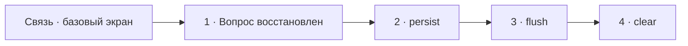

# Визуальный план вопроса 13 — «Как работают Unit of Work, persist, flush и clear?»

Статус: `APPROVED`  
Сложность: `L`  
Бюджет реализации после принятия: `40–60 минут`  
Shorts: `да — полноценный самостоятельный технический фрагмент`

## Источники и границы

- Учебный индекс: `questions.txt`, пункт 22.
- Транскрипт: `transcription.txt`, фрагмент `35:08–37:41`.
- Предварительные границы:
  - `35:08–35:16` — продолжается проблема связи;
  - `35:16–36:04` — вопрос интервьюера не сохранился в аудио/STT полностью;
  - `36:04–36:33` — Unit of Work и `persist()`;
  - `36:33–36:58` — `flush()` и change sets;
  - `36:58–37:41` — `clear()`, identity map и long-running batches.
- Технические источники:
  - [Doctrine ORM — Architecture](https://www.doctrine-project.org/projects/doctrine-orm/en/current/reference/architecture.html);
  - [Doctrine ORM — Working with Objects](https://www.doctrine-project.org/projects/doctrine-orm/en/current/reference/working-with-objects.html);
  - [Doctrine ORM — Batch Processing](https://www.doctrine-project.org/projects/doctrine-orm/en/current/reference/batch-processing.html);
  - [Doctrine ORM — UnitOfWork Internals](https://www.doctrine-project.org/projects/doctrine-orm/en/current/reference/unitofwork.html).
- Участок с пропавшим голосом интервьюера сохраняется. Формулировка вопроса
  восстанавливается видимым текстом без синтетического звука.

## Аудит содержания

| Тезис | Где прозвучал | Оценка | Действие на экране |
|---|---|---|---|
| Doctrine отслеживает состояние entities | 36:04–36:14 | корректно | показать Unit of Work и entity states |
| `persist()` добавляет новую entity в Unit of Work | 36:14–36:19 | корректно в общих чертах | показать NEW → MANAGED/scheduled |
| При `persist()` Doctrine может сходить за sequence ID | 36:19–36:33 | зависит от generator strategy; на ID нельзя полагаться до successful flush | уточнить без глубокого разбора генераторов |
| `flush()` считает изменения и пишет их одной транзакцией | 36:33–36:58 | корректное ядро, порядок/число SQL не гарантированы | показать change sets → SQL → transaction |
| `flush()` очищает Unit of Work | 36:44–36:58 | вводит в заблуждение: entities остаются managed и в identity map | явно исправить `flush() ≠ clear()` |
| `clear()` очищает identity map | 36:58–37:07 | корректно; точнее — detaches all entities | показать переход MANAGED → DETACHED |
| `clear()` полезен в long-running обработке для памяти | 37:07–37:41 | корректно | показать batch loop `flush(); clear();` |

### Что добавляем и исправляем

- `persist()` не выполняет немедленный `INSERT`; новая entity становится
  managed и будет синхронизирована при `flush()`.
- Generated ID гарантирован после успешного `flush()`; момент его появления до
  этого зависит от стратегии, поэтому на него нельзя рассчитывать после одного
  `persist()`.
- `flush()` вычисляет изменения и синхронизирует managed/new/removed entities с
  БД, но identity map остаётся; это не эквивалент `clear()`.
- `clear()` отсоединяет все entities от EntityManager, поэтому последующие
  изменения этих объектов уже не попадут в БД автоматически.

### Намеренно не показываем

- Внутренние массивы UnitOfWork, commit order и все entity states.
- Различия sequence/identity/custom ID generators — оставляем только безопасное
  правило о generated ID.
- Cascade persist, orphanRemoval и partial clear.
- Следующий вопрос о частоте `flush()` — это отдельная редакционная единица.
- Монтажные сокращения повреждённого участка.

## Задача визуализации

Показать жизненный цикл одной entity и убрать ключевое смешение: `flush()`
пишет изменения, `clear()` отсоединяет объекты и освобождает identity map.

## Состояния и тайминг

| Состояние | Таймкод | Функция экрана | Паттерн |
|---|---|---|---|
| Базовый экран | `35:08–35:16` | не иллюстрировать технически разговор о связи | Base scene |
| 1. Восстановленный вопрос | ориентир `35:16–36:04` | вернуть потерянную реплику интервьюера | Question + audio notice |
| 2. Unit of Work и persist | `36:04–36:33` | показать state transition без SQL | State flow |
| 3. flush | `36:33–36:58` | показать synchronization и исправить `flush = clear` | Pipeline + correction |
| 4. clear и batch | `36:58–37:41` | показать detach и практическую пользу | Before/after + code |



## Состояние 1 — восстановленный вопрос

### Wireframe 16:9

```text
┌──────────────────────────────────────────────────────────────┐
│ 13/58                                                        │
│ Как в Doctrine работают                                     │
│ Unit of Work, persist, flush и clear?                        │
│                                                              │
│ Звук интервьюера повреждён · вопрос восстановлен текстом     │
├──────────────────────────────┬───────────────────────────────┤
│ Михаил · слушает             │ Интервьюер · без звука        │
└──────────────────────────────┴───────────────────────────────┘
```

### Wireframe 9:16

```text
┌──────────────────────────────┐
│ 13/58                        │
│ Unit of Work                │
│ persist · flush · clear     │
│ Как это работает?           │
├──────────────────────────────┤
│ Звук вопроса повреждён      │
│ Восстановлено текстом       │
├──────────────────────────────┤
│ Михаил        Интервьюер     │
└──────────────────────────────┘
```

## Состояние 2 — `persist()` регистрирует, но не пишет

### Wireframe 16:9

```text
┌──────────────────────────────────────────────────────────────┐
│ 13/58  Unit of Work · persist()                              │
├───────────────────────┬──────────────────────────────────────┤
│ $user = new User();    │ ENTITY STATE                        │
│                        │ NEW ── persist($user) ──→ MANAGED   │
│ $em->persist($user);   │                         scheduled    │
│                        │                                      │
│ SQL: —                 │ Unit of Work отслеживает объект      │
├───────────────────────┴──────────────────────────────────────┤
│ Generated ID гарантирован после successful flush             │
├──────────────────────────────────────────────────────────────┤
│ Михаил · говорит                      Интервьюер · без звука │
└──────────────────────────────────────────────────────────────┘
```

### Wireframe 9:16

```text
┌──────────────────────────────┐
│ 13/58 · persist()           │
├──────────────────────────────┤
│ $user = new User();         │
│ $em->persist($user);        │
├──────────────────────────────┤
│ NEW                        │
│  ↓ persist                 │
│ MANAGED · scheduled        │
├──────────────────────────────┤
│ SQL: —                     │
│ ID: гарантирован после flush│
├──────────────────────────────┤
│ Михаил        Интервьюер     │
└──────────────────────────────┘
```

## Состояние 3 — `flush()` синхронизирует

### Wireframe 16:9

```text
┌──────────────────────────────────────────────────────────────┐
│ 13/58  flush()                                  ИСПРАВЛЕНИЕ │
├──────────────────────────────────────────────────────────────┤
│ MANAGED ENTITIES → compute change sets → SQL                 │
│                                      ┌ BEGIN                 │
│ new User      → INSERT               │ INSERT / UPDATE       │
│ changed Order → UPDATE               │ COMMIT                │
│                                      └ transaction           │
├──────────────────────────────┬───────────────────────────────┤
│ Синхронизация завершена      │ entities остаются MANAGED    │
│ pending operations обработаны│ identity map НЕ очищена      │
├──────────────────────────────┴───────────────────────────────┤
│ flush() ≠ clear()                                           │
├──────────────────────────────────────────────────────────────┤
│ Михаил · говорит                      Интервьюер · без звука │
└──────────────────────────────────────────────────────────────┘
```

### Wireframe 9:16

```text
┌──────────────────────────────┐
│ 13/58 · ИСПРАВЛЕНИЕ        │
│ flush() ≠ clear()           │
├──────────────────────────────┤
│ compute change sets         │
│          ↓                  │
│ INSERT / UPDATE / DELETE    │
│          ↓                  │
│ transaction                │
├──────────────────────────────┤
│ entities: MANAGED          │
│ identity map: остаётся     │
├──────────────────────────────┤
│ Михаил        Интервьюер     │
└──────────────────────────────┘
```

## Состояние 4 — `clear()` отсоединяет

### Wireframe 16:9

```text
┌──────────────────────────────────────────────────────────────┐
│ 13/58  clear() и long-running batch                          │
├──────────────────────────────┬───────────────────────────────┤
│ ДО clear()                   │ ПОСЛЕ clear()                 │
│ Identity Map                 │ Identity Map                  │
│ #1 User · MANAGED            │ empty                         │
│ #2 User · MANAGED            │ #1 User · DETACHED            │
│ ... #1000                    │ ... можно собрать GC          │
├──────────────────────────────┴───────────────────────────────┤
│ foreach ($rows as $i => $row) {                              │
│   process($row);                                             │
│   if ($i % 100 === 0) { $em->flush(); $em->clear(); }        │
│ }                                                            │
├──────────────────────────────────────────────────────────────┤
│ Михаил · говорит                      Интервьюер · без звука │
└──────────────────────────────────────────────────────────────┘
```

### Wireframe 9:16

```text
┌──────────────────────────────┐
│ 13/58 · clear()             │
├──────────────────────────────┤
│ BEFORE                     │
│ #1 … #1000 · MANAGED       │
│ Identity Map заполнена     │
├──────────── clear() ─────────┤
│ AFTER                      │
│ entities · DETACHED        │
│ Identity Map · empty       │
├──────────────────────────────┤
│ batch: flush(); clear();   │
├──────────────────────────────┤
│ Михаил        Интервьюер     │
└──────────────────────────────┘
```

## Финальный экранный текст

| Элемент | Текст |
|---|---|
| persist | `NEW → MANAGED · SQL ещё нет` |
| flush | `Вычислить изменения → синхронизировать с БД` |
| Исправление | `flush() ≠ clear()` |
| clear | `Detach всех entities · очистить identity map` |
| Batch | `flush(); clear();` |

## Анимация

- В `persist()` entity перемещается из NEW в MANAGED, а SQL-индикатор остаётся
  пустым.
- В `flush()` change sets превращаются в SQL внутри одной transaction-панели;
  карточки entities визуально остаются в identity map.
- В `clear()` карточки выходят из identity map и меняют статус на DETACHED.

## Shorts

- Хук: `persist, flush и clear — три разных действия`.
- Вертикальный порядок: восстановленный вопрос → persist → flush → clear.
- Обязательно сохранить исправление `flush() ≠ clear()` и notice о повреждённом
  вопросе.
- Вторичный текст о generated ID можно убрать, если не помещается без уменьшения.

## Материалы и производство

- Нужны переиспользуемые state cards и identity-map container; уникальная
  иллюстрация не требуется.
- Код: четыре короткие строки `new/persist/flush/clear` и compact batch loop.
- SVG: стрелки переходов состояния.
- Исправление на экране: `flush() ≠ clear(); entities остаются managed`.
- Досъёмка, переозвучка и синтетическая замена ответа: не планируются.

## Ревью

- [x] Фрагмент с повреждённым звуком сохранён и явно обозначен.
- [x] `persist`, `flush`, `clear` проверены по Doctrine Docs.
- [x] Существенная ошибка ответа вынесена в крупное исправление.
- [x] Следующий вопрос про частоту flush не смешан с этим.
- [x] 16:9 и 9:16 спроектированы отдельно.
- [ ] Точная формулировка и вход вопроса проверены по исходному видео.
- [ ] Принято пользователем до начала кода.
