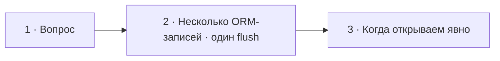

# Визуальный план вопроса 16 — «Когда в Doctrine нужны явные транзакции?»

Статус: `APPROVED`

Сложность: `M`

Бюджет реализации: `25–35 минут`

Shorts: `да`

## Источники и границы

- Вопрос: `questions.txt`, пункт 25.
- Транскрипт ответа: `transcription.txt`, `38:52–40:01` исходника.
- Вопрос звучит в `38:38–38:52` исходника, что соответствует
  `23:12.98–23:26.98` review-таймлайна.
- Говорящие: интервьюер задаёт вопрос; Михаил отвечает.
- Технические источники:
  - [Doctrine ORM — Transactions and Concurrency](https://www.doctrine-project.org/projects/doctrine-orm/en/current/reference/transactions-and-concurrency.html);
  - [Doctrine DBAL — Transactions](https://www.doctrine-project.org/projects/doctrine-dbal/en/current/reference/transactions.html);
  - [Doctrine ORM — DQL UPDATE/DELETE](https://www.doctrine-project.org/projects/doctrine-orm/en/current/reference/dql-doctrine-query-language.html#update-queries).
- Исходный разговор сохраняется непрерывно; визуальный план не предлагает
  монтажных сокращений.

## Аудит содержания

| Факт или тезис | Где прозвучал | Оценка | Действие на экране |
|---|---|---|---|
| Явная транзакция может понадобиться при raw SQL/DBAL | `38:52–39:13` | направление верное, но одного raw SQL недостаточно как критерия | показать два прямых SQL/DQL-запроса под общей явной границей |
| DQL или QueryBuilder сами определяют необходимость транзакции | `38:52–39:27` | неточно | уточнить: DQL UPDATE/DELETE и DBAL-записи выполняются напрямую и не собираются будущим `flush()` |
| Несколько изменений entities можно записать без `beginTransaction()` | в ответе явно не сформулировано | существенное дополнение | показать, что один `flush()` сам выполняет все изменения Unit of Work в одной транзакции |
| Два `flush()` можно объединить общей транзакцией | не прозвучало | полезный практический случай | оставить коротким дополнительным случаем без отдельного экрана |
| Pessimistic lock требует активной транзакции | не прозвучало | полезный практический случай | оставить коротким дополнительным случаем |
| Операции может требоваться собственный isolation level | не прозвучало | полезный практический случай | показать рядом с lock как настройку явной транзакции |

### Что добавлено

- Контраст между автоматической транзакцией одного `flush()` и прямыми
  SQL/DQL-записями, которые Unit of Work не накапливает.
- Три конкретных повода управлять транзакцией явно: два прямых write-запроса,
  несколько `flush()` под общим rollback, pessimistic lock или требуемый
  isolation level.

### Что исправлено

- Raw SQL или DQL сами по себе не означают, что обязательно нужен ручной
  `beginTransaction()`. Явная граница появляется, когда несколько действий
  должны выполняться в одной транзакции либо операция требует активной
  транзакции или конкретной изоляции.

### Намеренно не показываем

- Laravel/Eloquent — сравнение помогает обсуждению плана, но уводит экран от
  вопроса про Doctrine.
- Savepoints и вложенные транзакции — отдельная тема без пользы для ответа.
- Optimistic locking — в отличие от pessimistic locking он не является
  наглядным поводом вручную открыть транзакцию в этом вопросе.
- Полный `begin/commit/rollback` с `try/catch` — занимает много места;
  `transactional()` передаёт ту же явную границу и безопасный rollback.

## Задача визуализации

Показать, какие записи Doctrine уже объединяет транзакцией одного `flush()`,
и после каких выходов за эту границу транзакцию приходится задавать явно.

## Состояния и тайминг

| Состояние | Исходник | Review | Что звучит | Функция экрана | Паттерн |
|---|---|---|---|---|---|
| 1 · Вопрос | `38:38–38:52` | `23:12.98–23:26.98` | интервьюер проговаривает вопрос | удержать формулировку без преждевременного ответа | Question |
| 2 · Один `flush()` | `38:52–39:13` | `23:26.98–23:47.98` | Михаил начинает отвечать про raw SQL | дать отсутствующий базовый контраст: ORM-записи уже объединены | Code + transaction trace |
| 3 · Явная транзакция | `39:13–39:54` | `23:47.98–24:28.98` | ответ про SQL/DBAL до начала следующего вопроса | показать конкретные случаи ручной границы | Code + compact cases |



## Состояние 1 — вопрос

Польза: зритель успевает прочитать точную формулировку до начала ответа.

Экранный текст: `Когда транзакции приходится использовать вручную?`

Дополняет речь: ничего; это карточка вопроса.

Не дублируем: ответ и будущие случаи явной транзакции.

### Wireframe 16:9

```text
┌──────────────────────────────────────────────────────────────┐
│ 16/30                                                        │
│                                                              │
│       Когда транзакции приходится использовать вручную?      │
│                                                              │
├──────────────────────────────┬───────────────────────────────┤
│ ИНТЕРВЬЮЕР · говорит         │ МИХАИЛ · слушает             │
└──────────────────────────────┴───────────────────────────────┘
```

### Wireframe 9:16

```text
┌──────────────────────────────┐
│ 16/30                        │
│                              │
│ Когда транзакции приходится │
│ использовать вручную?       │
│                              │
├──────────────────────────────┤
│ Интервьюер       Михаил      │
└──────────────────────────────┘
```

## Состояние 2 — один `flush()` уже транзакция

Польза: показать отсутствующий в ответе факт — несколько ORM-записей Doctrine
уже выполняет атомарно без ручного transaction API.

Экранный текст: `Обычно beginTransaction() не нужен`.

Дополняет речь: `flush()` сам открывает и завершает транзакцию для изменений
текущего Unit of Work.

Не дублируем: определения Unit of Work и `persist()` из предыдущего вопроса.

### Wireframe 16:9

```text
┌──────────────────────────────────────────────────────────────┐
│ 16/30  Обычно beginTransaction() не нужен                    │
├─────────────────────────────┬────────────────────────────────┤
│ $em->persist($a);           │ Unit of Work: A + B           │
│ $em->persist($b);           │             ↓ flush()         │
│ $em->flush();               │ BEGIN → INSERT → INSERT → COMMIT│
├─────────────────────────────┴────────────────────────────────┤
│ Несколько ORM-записей · одна транзакция                      │
└──────────────────────────────────────────────────────────────┘
```

### Wireframe 9:16

```text
┌──────────────────────────────┐
│ 16/30 · БЕЗ begin()         │
├──────────────────────────────┤
│ persist($a)                 │
│ persist($b)                 │
│ flush()                     │
├──────────────────────────────┤
│ Unit of Work: A + B         │
│            ↓                │
│ BEGIN → INSERT → INSERT     │
│            → COMMIT         │
├──────────────────────────────┤
│ Одна транзакция             │
└──────────────────────────────┘
```

## Состояние 3 — когда открываем явно

Польза: дать прямой ответ через реальные ситуации, в которых автоматической
границы одного `flush()` недостаточно.

Экранный текст: `Когда открываем транзакцию явно?`

Дополняет речь: два direct write-запроса, несколько `flush()`, pessimistic lock
и требуемый isolation level.

Исправляет речь: raw SQL/DQL — не самостоятельный критерий.

### Wireframe 16:9

```text
┌──────────────────────────────────────────────────────────────┐
│ 16/30  Когда открываем транзакцию явно?                      │
├────────────────────────────────┬─────────────────────────────┤
│ $conn->transactional(          │ Ещё случаи                 │
│   function () use ($conn) {    │                             │
│     executeStatement($sql1);   │ 2 flush() → общий rollback │
│     executeStatement($sql2);   │ PESSIMISTIC_WRITE          │
│   }                            │ или нужный isolation level │
│ );                             │                             │
├────────────────────────────────┴─────────────────────────────┤
│ SQL/DQL-записи выполняются напрямую — flush() их не собирает │
└──────────────────────────────────────────────────────────────┘
```

### Wireframe 9:16

```text
┌──────────────────────────────┐
│ 16/30 · ЯВНАЯ TRANSACTION   │
├──────────────────────────────┤
│ transactional(function () { │
│   executeStatement($sql1);  │
│   executeStatement($sql2);  │
│ });                         │
├──────────────────────────────┤
│ Или:                        │
│ · 2 flush() — общий rollback│
│ · pessimistic lock         │
│ · нужный isolation level   │
├──────────────────────────────┤
│ Direct writes не копятся    │
│ в Unit of Work              │
└──────────────────────────────┘
```

## Финальный экранный текст

| Элемент | Текст | Ограничение |
|---|---|---|
| Вопрос | `Когда транзакции приходится использовать вручную?` | две строки максимум в 16:9 |
| Заголовок implicit | `Обычно beginTransaction() не нужен` | одна строка |
| Trace | `BEGIN → INSERT → INSERT → COMMIT` | единая последовательность вместо поясняющих абзацев |
| Вывод implicit | `Несколько ORM-записей · одна транзакция` | одна строка |
| Заголовок explicit | `Когда открываем транзакцию явно?` | одна строка |
| Основной случай | `Два SQL/DQL-запроса` | показывается кодом |
| Дополнительные случаи | `2 flush() · pessimistic lock · нужный isolation level` | без поясняющих предложений |
| Уточнение | `Direct writes не копятся в Unit of Work` | в 9:16 короче, чем в 16:9 |

## Анимация

- В состоянии 2 сначала появляются `persist($a)` и `persist($b)`, затем один
  `flush()` запускает trace `BEGIN → INSERT → INSERT → COMMIT`.
- В состоянии 3 общая рамка transaction появляется вокруг двух прямых
  write-запросов; дополнительные случаи возникают одной группой без отдельных
  декоративных переходов.
- Движение показывает различие механизмов: Unit of Work собирает ORM-записи,
  а явная граница собирает операции, которые один `flush()` не охватывает.

## Shorts

- Хук: `Doctrine сам открывает транзакцию — когда всё-таки нужен begin()?`
- Последовательность: вопрос → один `flush()` → два direct writes под явной
  транзакцией → дополнительные случаи.
- В вертикальной версии trace переносится под код, а дополнительные случаи
  остаются одной компактной группой.
- Без потери смысла можно убрать подпись про Laravel и полные методы
  `commit/rollback`; они в план не включены.
- Вопрос, trace и итог явной границы должны оставаться вне UI-зон Shorts.

## Материалы и производство

- Нужен новый компонент: `нет`; использовать существующие question, code и
  transaction-trace паттерны.
- Код: короткий Doctrine/PHP без полного `try/catch`.
- SVG/изображения: не нужны.
- Исправление или уточнение на экране: `да` — `Direct writes не копятся в Unit
  of Work`; источник — документация Doctrine ORM/DBAL.
- Досъёмка, переозвучка и синтетическая замена ответа: `не планируются`.

## Ревью

- [x] Карточка вопроса занимает `24:52–25:06` review-таймлайна.
- [x] Автоматическая транзакция показана результатом `flush()`, а не двумя
      дублирующими карточками.
- [x] Основной ручной случай — два SQL/DQL write-запроса.
- [x] Несколько `flush()`, pessimistic lock и isolation level остаются
      короткими дополнительными случаями.
- [x] Технические дополнения проверены по документации Doctrine.
- [x] Экран не пересказывает речь абзацем.
- [ ] Таймкоды сверены по оригинальному звуку при реализации.
- [x] 16:9 и 9:16 проверены контрольными кадрами после реализации.
- [x] Пользователь принял обновлённый план до изменения Remotion-кода.
