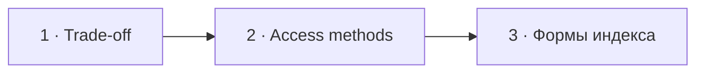

# Визуальный план вопроса 18 — «Для чего нужны индексы в PostgreSQL?»

Статус: `APPROVED`  
Сложность: `L`  
Бюджет реализации: `40–55 минут`  
Shorts: `да`

## Источники и границы

- `questions.txt`, пункт 27.
- `transcription.txt`, `42:47–44:05`.
- [PostgreSQL — Index Types](https://www.postgresql.org/docs/current/indexes-types.html).
- [PostgreSQL — Multicolumn Indexes](https://www.postgresql.org/docs/current/indexes-multicolumn.html).
- [PostgreSQL — Index-Only Scans and Covering Indexes](https://www.postgresql.org/docs/current/indexes-index-only-scans.html).

## Аудит содержания

Ответ корректно называет ускорение чтения и цену записи/диска. Добавляем
пропущенный `GIN`; разводим методы доступа (`B-tree`, `Hash`, `GiST`,
`SP-GiST`, `GIN`, `BRIN`) и свойства/формы индекса (`multicolumn`, `INCLUDE`,
expression, partial). `CLUSTER` не показываем как отдельный тип индекса.

### Намеренно не показываем

- Детальную математику selectivity, cost model и vacuum.
- Bloom extension и редкие operator classes.
- Совет создать конкретный индекс без реального query plan.

## Задача визуализации

Показать индекс как осознанный trade-off и дать зрителю компактную карту
методов доступа вместо плоского списка терминов.

## Состояния

| № | Таймкод | Функция |
|---|---|---|
| 1 | `42:47–43:31` | зачем индекс и какова цена |
| 2 | `43:31–43:54` | методы доступа по задаче |
| 3 | `43:54–44:05` | составной/covering и уточнение классификации |



## Состояние 1 — trade-off

```text
┌──────────────────────────────────────────────────────────────┐
│ 18/58  Индекс: быстрее читать, дороже писать                 │
├─────────────────────────────┬────────────────────────────────┤
│ SELECT ... WHERE email = ?  │ INSERT / UPDATE               │
│ Seq Scan  →  Index Scan     │ обновить table + index        │
│ меньше просмотренных строк  │ дополнительный диск           │
├─────────────────────────────┴────────────────────────────────┤
│ Индекс выбирают под реальные запросы, не «на всякий случай» │
└──────────────────────────────────────────────────────────────┘
```

В 9:16 сначала `SELECT`, затем цена записи; шрифт не уменьшается.

## Состояние 2 — методы доступа

```text
┌──────────────────────────────────────────────────────────────┐
│ 18/58  Метод доступа выбирают по оператору и данным          │
├────────────────────┬────────────────────┬────────────────────┤
│ B-tree             │ GIN                │ GiST / SP-GiST     │
│ = · range · sort   │ jsonb · arrays     │ geo · ranges       │
├────────────────────┼────────────────────┼────────────────────┤
│ Hash               │ BRIN               │                    │
│ equality           │ огромные           │                    │
│                    │ коррелированные    │                    │
└──────────────────────────────────────────────────────────────┘
```

В 9:16 — список из пяти крупных строк, без шестой пустой карточки.

## Состояние 3 — это не ещё три метода доступа

```text
┌──────────────────────────────────────────────────────────────┐
│ 18/58  УТОЧНЕНИЕ ОТВЕТА                                     │
├─────────────────────────────┬────────────────────────────────┤
│ CREATE INDEX ... (a, b)     │ CREATE INDEX ... (a)          │
│ multicolumn                 │ INCLUDE (b) · covering        │
├─────────────────────────────┴────────────────────────────────┤
│ partial · expression · multicolumn · INCLUDE — формы индекса│
│ CLUSTER — физически переупорядочить table по индексу         │
└──────────────────────────────────────────────────────────────┘
```

В 9:16 показываем только `multicolumn` и `INCLUDE`; строку про `CLUSTER`
оставляем крупным нижним выводом.

## Финальный экранный текст

| Элемент | Текст |
|---|---|
| Trade-off | `Чтение быстрее · запись и диск дороже` |
| Default | `B-tree · equality, range, sort` |
| JSON/array | `GIN` |
| Уточнение | `multicolumn / INCLUDE / partial — формы индекса` |

## Анимация

- В первом состоянии счётчик просмотренных строк резко уменьшается, а на
  стороне записи появляется дополнительная операция.

## Shorts

- Хук: `B-tree, GIN и BRIN решают разные задачи`.

## Материалы и производство

- Использовать query-plan и comparison-компоненты.
- Новые изображения и досъёмка не нужны.

## Ревью

- [ ] `GIN` не потерян в списке PostgreSQL access methods.
- [ ] `CLUSTER` не назван отдельным типом индекса.
- [ ] Карточки не превращаются в мелкую энциклопедию.
- [ ] Таймкоды сверены по исходнику.
- [ ] Пользователь принял план.
