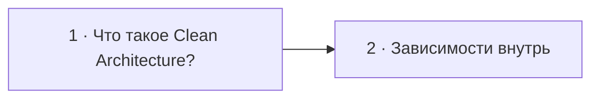

# Визуальный план вопроса 19 — «Что такое чистая архитектура?»

Статус: `APPROVED`  
Сложность: `M`  
Бюджет реализации: `25–35 минут`  
Shorts: `да`

## Источники и границы

- `questions.txt`, пункты 28–29 — в интервью это один вопрос с уточнением.
- `transcription.txt`, `44:05–45:42`.
- [Robert C. Martin — The Clean Architecture](https://blog.cleancoder.com/uncle-bob/2012/08/13/the-clean-architecture.html).

## Аудит содержания

Кандидат не вспоминает определение, но затем верно называет слои, инверсию
зависимостей и независимость бизнес-кода от фреймворка. Экран добавляет главное
правило: зависимости исходного кода направлены внутрь — к бизнес-правилам.
Конкретную «единственно верную» раскладку папок не показываем.

### Намеренно не показываем

- Каноническую круговую диаграмму целиком и названия всех её слоёв.
- Clean Architecture как обязательный framework или структуру каталогов.

## Задача визуализации

Свести расплывчатый термин к одному проверяемому правилу: бизнес-ядро не
зависит от внешних деталей.

## Состояния

| № | Таймкод | Функция |
|---|---|---|
| 1 | `44:05–44:30` | удержать вопрос до согласованного монтажного выреза |
| 2 | `45:03–45:42` | показать dependency rule и независимое ядро |



## Состояние 1 — вопрос

```text
┌──────────────────────────────────────────────────────────────┐
│ 19/32  Что такое чистая архитектура?                         │
├──────────────────────────────────────────────────────────────┤
│                                                              │
│           Бизнес-логика от чего должна зависеть?             │
│                                                              │
├──────────────────────────────────────────────────────────────┤
│ Михаил · думает                         Интервьюер · слушает │
└──────────────────────────────────────────────────────────────┘
```

В 9:16 вопрос остаётся в верхней половине, ниже только аватары; никаких
декоративных карточек во время паузы.

## Состояние 2 — dependency rule

### 16:9

```text
┌──────────────────────────────────────────────────────────────┐
│ 19/32  Зависимости направлены к бизнес-правилам              │
├──────────────────────────────────────────────────────────────┤
│ Framework ─┐                                                 │
│ Database  ─┼→ Adapters → Application → DOMAIN RULES         │
│ Web / CLI ─┘                         независимое ядро         │
├──────────────────────────────────────────────────────────────┤
│ UI, БД и framework можно заменить без переписывания правил   │
└──────────────────────────────────────────────────────────────┘
```

### 9:16

```text
┌──────────────────────────────┐
│ 19/32 · DEPENDENCY RULE     │
├──────────────────────────────┤
│ Framework · DB · Web        │
│            ↓                │
│ Adapters                   │
│            ↓                │
│ Application               │
│            ↓                │
│ DOMAIN RULES              │
├──────────────────────────────┤
│ Зависимости — внутрь        │
└──────────────────────────────┘
```

## Финальный экранный текст

| Элемент | Текст |
|---|---|
| Главное правило | `Source-code dependencies направлены внутрь` |
| Ядро | `Business rules` |
| Внешние детали | `Web · DB · Framework` |

## Анимация

- Внешние технологии появляются первыми; стрелки доходят до ядра, но не идут
  обратно.

## Shorts

- Хук: `Clean Architecture — не круги, а направление зависимостей`.

## Материалы и производство

- Достаточно существующего dependency-flow; копировать чужую диаграмму не надо.
- Изображения, досъёмка и переозвучка не нужны.

## Ревью

- [ ] Вопросы 28–29 обоснованно объединены.
- [ ] Паузы и сбивки не предложено вырезать.
- [ ] Стрелки зависимостей направлены к ядру.
- [ ] 9:16 сохраняет читаемую последовательность.
- [ ] Пользователь принял план.
