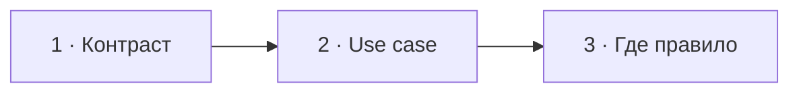

# Визуальный план вопроса 20 — «Domain Service и Application Service»

Статус: `APPROVED`  
Сложность: `M`  
Бюджет реализации: `30–40 минут`  
Shorts: `да`

## Источники и границы

- `questions.txt`, пункт 30.
- `transcription.txt`, `45:42–48:03`.
- [Martin Fowler — Service Layer](https://martinfowler.com/eaaCatalog/serviceLayer.html).
- [Microsoft — DDD application layer](https://learn.microsoft.com/en-us/dotnet/architecture/microservices/microservice-ddd-cqrs-patterns/ddd-oriented-microservice).

## Аудит содержания

Ответ по сути корректный: application service оркестрирует use case, domain
service содержит доменное правило, которое естественно не принадлежит одной
entity/value object. Не закрепляем спорную идею, что application service
обязательно вызывает «несколько доменов».

### Намеренно не показываем

- Service как микросервис или Symfony service: здесь речь о роли класса.
- Полную DDD-таксономию и спор о «анемичной модели».

## Задача визуализации

Дать простой критерий: application service задаёт ход use case, а domain
service принимает бизнес-решение, не принадлежащее одной entity.

## Состояния

| № | Таймкод | Функция |
|---|---|---|
| 1 | `45:42–46:54` | вопрос и короткий контраст |
| 2 | `46:54–47:28` | показать обязанности на одном use case |
| 3 | `47:28–48:03` | итоговая граница: orchestration vs rule |



## Состояние 1 — два уровня

```text
┌──────────────────────────────────────────────────────────────┐
│ 20/58  Domain Service или Application Service?               │
├─────────────────────────────┬────────────────────────────────┤
│ APPLICATION SERVICE         │ DOMAIN SERVICE                 │
│ сценарий приложения         │ бизнес-правило                 │
│ I/O и координация           │ язык домена                    │
├─────────────────────────────┴────────────────────────────────┤
│ Михаил · отвечает                       Интервьюер · слушает │
└──────────────────────────────────────────────────────────────┘
```

В 9:16 колонки превращаются в две равновесные карточки сверху вниз.

## Состояние 2 — один use case

```text
┌──────────────────────────────────────────────────────────────┐
│ 20/58  Application Service оркестрирует                     │
├──────────────────────────────────────────────────────────────┤
│ TransferMoneyHandler                                        │
│  1. load accounts          ← repository                     │
│  2. FeePolicy::calculate() ← domain service                 │
│  3. debit / credit         ← entities                       │
│  4. save + publish event   ← ports                          │
├──────────────────────────────────────────────────────────────┤
│ Application задаёт порядок · Domain принимает решение       │
└──────────────────────────────────────────────────────────────┘
```

В 9:16 четыре шага идут вертикально; справа от каждого только короткий тип
участника, без дополнительного текста.

## Состояние 3 — проверочный вопрос

```text
┌──────────────────────────────────────────────────────────────┐
│ 20/58  Куда положить код?                                    │
├─────────────────────────────┬────────────────────────────────┤
│ «В каком порядке выполнить?»│ «Как домен принимает решение?»│
│ → Application Service       │ → Entity / Domain Service     │
├─────────────────────────────┴────────────────────────────────┤
│ Не число вызываемых классов, а смысл ответственности        │
└──────────────────────────────────────────────────────────────┘
```

Вертикально вопросы показываются последовательно, затем общий вывод.

## Финальный экранный текст

| Элемент | Текст |
|---|---|
| Application | `Оркестрирует use case` |
| Domain | `Выражает бизнес-правило` |
| Критерий | `Порядок действий или решение домена?` |

## Анимация

- В use-case подсвечивается текущий шаг по мере ответа.

## Shorts

- Хук: `Application Service координирует, Domain Service решает`.

## Материалы и производство

- Использовать checklist/pipeline и две смысловые колонки.
- Новых изображений и досъёмки нет.

## Ревью

- [ ] Service не перепутан с network service или DI registration.
- [ ] Пример не требует знания предыдущих слайдов.
- [ ] В 9:16 четыре шага остаются крупными.
- [ ] Таймкоды сверены по оригиналу.
- [ ] Пользователь принял план.
