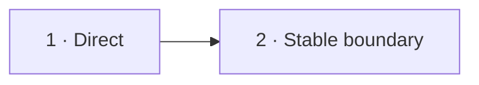

# Визуальный план вопроса 21 — «Можно ли контроллеру идти в репозиторий?»

Статус: `APPROVED`  
Сложность: `M`  
Бюджет реализации: `25–35 минут`  
Shorts: `да`

## Источники и границы

- `questions.txt`, пункт 31.
- `transcription.txt`, `48:10–48:47`.
- Переход `48:03–48:10` после предыдущей темы остаётся на базовой сцене.
- [Martin Fowler — Presentation/Domain/Data Layering](https://martinfowler.com/bliki/PresentationDomainDataLayering.html).

## Аудит содержания

Здесь нет универсального запрета языка или Symfony. Кандидат защищает простой
прямой вызов; интервьюер — единообразную командную границу ради будущих
изменений. Экран должен показать именно trade-off, не назначать победителя.

### Намеренно не показываем

- Прямой вызов как архитектурную «грязь» во всех системах.
- Application service как пустую обязательную обёртку без сформулированной
  границы.

## Задача визуализации

Сделать понятными обе позиции: локальная простота против стабильной командной
границы для развития use case.

## Состояния

| № | Таймкод | Функция |
|---|---|---|
| 1 | `48:10–48:38` | показать короткий прямой путь |
| 2 | `48:38–48:47` | показать цену обхода application boundary |



## Состояние 1 — можно технически

```text
┌──────────────────────────────────────────────────────────────┐
│ 21/32  Может ли Controller вызвать Repository напрямую?      │
├──────────────────────────────────────────────────────────────┤
│ GET /users/42 → Controller → UserRepository::get(42)        │
│                       коротко · понятно · мало кода          │
├──────────────────────────────────────────────────────────────┤
│ Для простого read-case это технически возможно              │
└──────────────────────────────────────────────────────────────┘
```

В 9:16 pipeline идёт вертикально; достоинства — одной строкой.

## Состояние 2 — зачем команде единая граница

```text
┌──────────────────────────────────────────────────────────────┐
│ 21/32  Trade-off: сегодня две строки, завтра use case        │
├─────────────────────────────┬────────────────────────────────┤
│ DIRECT                      │ APPLICATION BOUNDARY           │
│ Controller → Repository     │ Controller → GetUser → Port   │
│ меньше ceremony             │ auth · metric · transaction    │
│ легко разъезжается стиль    │ единое место расширения        │
├─────────────────────────────┴────────────────────────────────┤
│ Решение команды и архитектурная граница, а не запрет PHP     │
└──────────────────────────────────────────────────────────────┘
```

В 9:16 сравнение превращается в две карточки, вывод остаётся снизу.

## Финальный экранный текст

| Элемент | Текст |
|---|---|
| Direct | `Меньше ceremony сейчас` |
| Boundary | `Единое место для правил и изменений` |
| Вывод | `Командное решение, не запрет Symfony` |

## Анимация

- Прямой pipeline сначала короче; затем между controller и repository
  появляются новые обязанности и становится видна цена выбранной границы.

## Shorts

- Хук: `Сервис на одну строку — код ради кода или полезный seam?`

## Материалы и производство

- Использовать два pipeline на общей сетке.
- Новых изображений, досъёмки и исправления ответа нет.

## Ревью

- [ ] Обе позиции представлены честно.
- [ ] Не создаётся ложного универсального запрета.
- [ ] Парные колонки равны по высоте.
- [ ] Таймкоды сверены.
- [ ] Пользователь принял план.
