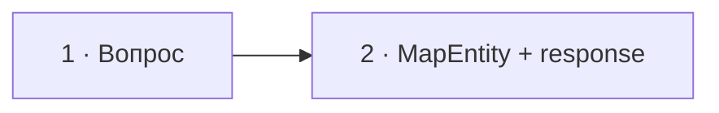

# Визуальный план вопроса 21 — «Можно ли контроллеру идти в репозиторий?»

Статус: `APPROVED`  
Сложность: `M`  
Бюджет реализации: `25–35 минут`  
Shorts: `да`

## Источники и границы

- `questions.txt`, пункт 31.
- `transcription.txt`, `48:10–48:47`.
- Переход `48:03–48:10` после предыдущей темы остаётся на базовой сцене.
- [Martin Fowler — Presentation/Domain/Data Layering](https://martinfowler.com/bliki/PresentationDomainDataLayering.html).

## Аудит содержания

Здесь нет универсального запрета языка или Symfony. Кандидат защищает простой
прямой вызов; интервьюер — единообразную командную границу ради будущих
изменений. Экран должен показать именно trade-off, не назначать победителя.

### Намеренно не показываем

- Прямой вызов как архитектурную «грязь» во всех системах.
- Application service как пустую обязательную обёртку без сформулированной
  границы.

## Задача визуализации

Показать воспроизводимый Symfony-кейс, где отдельный application service и
контракт не добавляют поведения: `MapEntity` получает entity по `id`, а
контроллер сразу формирует простой read-response.

## Состояния

| № | Таймкод | Функция |
|---|---|---|
| 1 | `48:12–48:19` (`32:41–32:48` review) | обычная карточка вопроса |
| 2 | `48:19–48:47` (`32:48–33:16` review) | простой Symfony read-case с `MapEntity` |



## Состояние 1 — вопрос

```text
┌──────────────────────────────────────────────────────────────┐
│                                                              │
│          Можно ли контроллеру идти в репозиторий?            │
│                                                              │
└──────────────────────────────────────────────────────────────┘
```

Обычная карточка вопроса без дополнительной схемы.

## Состояние 2 — простой read-case

```text
┌──────────────────────────────────────────────────────────────┐
│ 21/30  Для простого чтения отдельный сервис избыточен        │
├──────────────────────────────────────────────────────────────┤
│ #[Route('/users/{id}')]                                    │
│ public function show(                                      │
│   #[MapEntity(id: 'id')] User $user,                       │
│ ): JsonResponse {                                          │
│   return $this->json([...]);                               │
│ }                                                          │
└──────────────────────────────────────────────────────────────┘
```

В 9:16 код занимает единственную контентную карточку и не уменьшается до
нечитаемого размера.

## Финальный экранный текст

| Элемент | Текст |
|---|---|
| Код | `#[MapEntity(id: 'id')] User $user` |

## Анимация

- В вопросе движения нет, кроме штатного появления карточки.
- В ответе появляется только код без дублирующей схемы.

## Shorts

- Хук: `Сервис на одну строку — код ради кода или полезный seam?`

## Материалы и производство

- Использовать существующий code-паттерн и общую сетку code + result.
- Новых изображений, досъёмки и исправления ответа нет.

## Ревью

- [ ] `MapEntity` и поведение 404 соответствуют Symfony EntityValueResolver.
- [ ] Не создаётся ложного универсального правила для сложных use case.
- [ ] Код читается в 16:9 и 9:16.
- [ ] Таймкоды сверены.
- [ ] Пользователь принял план.
