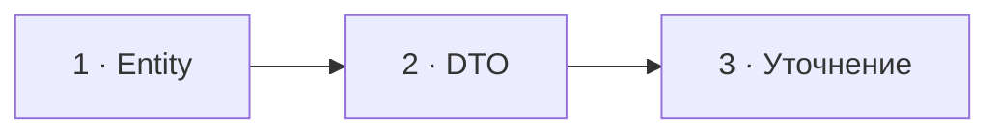

# Визуальный план вопроса 22 — «DTO против Entity»

Статус: `APPROVED`  
Сложность: `L`  
Бюджет реализации: `35–50 минут`  
Shorts: `да`

## Источники и границы

- `questions.txt`, пункт 32.
- `transcription.txt`, `48:47–49:37`.
- [Martin Fowler — Data Transfer Object](https://martinfowler.com/eaaCatalog/dataTransferObject.html).
- [Doctrine ORM — Architecture](https://www.doctrine-project.org/projects/doctrine-orm/en/current/reference/architecture.html).

## Аудит содержания

| Прозвучало | Оценка | Действие |
|---|---|---|
| Entity имеет identity и invariants | корректное ядро | показать жизненный цикл и поведение |
| Entity обязательно хранится в БД | не определяющее свойство | не связывать понятие с таблицей |
| Entity обязательно mutable | неверно как общее правило | маркировать уточнение |
| DTO переносит данные и не содержит бизнес-поведение | корректно | показать boundary |
| DTO обязательно readonly | полезный стиль, но не определение | маркировать уточнение |

### Намеренно не показываем

- Doctrine entity как определение любой domain entity.
- DTO как request-only объект: он может пересекать разные process boundaries.
- Полную дискуссию rich/anemic model.

## Задача визуализации

Развести identity/lifecycle и передачу данных, не закрепляя случайные
технические свойства как определения.

## Состояния

| № | Таймкод | Функция |
|---|---|---|
| 1 | `48:47–49:09` | Entity: identity и правила |
| 2 | `49:09–49:29` | DTO: данные через границу |
| 3 | `49:29–49:37` | снять ложные обязательные признаки |



## Состояние 1 — Entity

```text
┌──────────────────────────────────────────────────────────────┐
│ 22/58  Entity: важна identity, а не набор полей              │
├──────────────────────────────────────────────────────────────┤
│ Order #A-42                                                 │
│ status: NEW → PAID                                         │
│ pay() { проверка invariant → state change → event }         │
├──────────────────────────────────────────────────────────────┤
│ Состояние меняется во времени · объект остаётся «тем же»     │
└──────────────────────────────────────────────────────────────┘
```

В 9:16 lifecycle идёт вертикально под карточкой `Order #A-42`.

## Состояние 2 — DTO

```text
┌──────────────────────────────────────────────────────────────┐
│ 22/58  DTO переносит данные через границу                    │
├──────────────────────────────────────────────────────────────┤
│ HTTP JSON → CreateOrderRequest → Application Service        │
│             productId · quantity · customerId               │
├──────────────────────────────────────────────────────────────┤
│ Без бизнес-решений · форма удобна получателю                 │
└──────────────────────────────────────────────────────────────┘
```

В 9:16 три блока располагаются сверху вниз.

## Состояние 3 — уточнение определения

```text
┌──────────────────────────────────────────────────────────────┐
│ 22/58  УТОЧНЕНИЕ ОТВЕТА                                     │
├─────────────────────────────┬────────────────────────────────┤
│ ENTITY определяется         │ DTO определяется              │
│ identity + lifecycle        │ передачей данных              │
├─────────────────────────────┼────────────────────────────────┤
│ не обязана быть mutable     │ не обязан быть readonly       │
│ не обязана быть ORM entity  │ readonly обычно полезен       │
└──────────────────────────────────────────────────────────────┘
```

Вертикально: сначала определения, затем отдельная плашка `не обязательные
признаки`; не делать четыре мелкие карточки.

## Финальный экранный текст

| Элемент | Текст |
|---|---|
| Entity | `Identity + lifecycle + invariants` |
| DTO | `Данные через границу` |
| Уточнение | `mutable/ORM и readonly — не обязательные признаки` |

## Анимация

- Entity меняет состояние, сохраняя ID; DTO проходит границу и исчезает.

## Shorts

- Хук: `Entity — не просто объект из базы, DTO — не обязательно readonly`.

## Материалы и производство

- Использовать lifecycle и boundary-pipeline компоненты.
- Новые изображения и досъёмка не нужны.

## Ревью

- [ ] Entity не определена через наличие таблицы.
- [ ] DTO не объявлен обязательно readonly.
- [ ] Уточнение читаемо и не выглядит придиркой.
- [ ] Оба формата спроектированы отдельно.
- [ ] Пользователь принял план.
