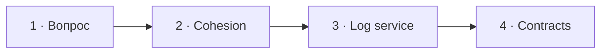

# Визуальный план вопроса 23 — «Как выделять модули из монолита и как разделять их работу между собой?»

Статус: `APPROVED`  
Сложность: `L`  
Бюджет реализации: `45–60 минут`  
Shorts: `да, но только состояния 2–4`

## Источники и границы

- `questions.txt`, пункты 33–34 — в интервью один составной вопрос.
- `transcription.txt`, `50:14–52:42` source-time (`34:43–37:11` review-time).
- [Martin Fowler — Bounded Context](https://martinfowler.com/bliki/BoundedContext.html).
- [Martin Fowler — Monolith First](https://martinfowler.com/bliki/MonolithFirst.html).

## Аудит содержания

Кандидат верно идёт от связанных use cases, endpoints и данных. После просмотра
он уточнил, что под отдельным сервисом логов имел в виду реальный сервис из
своих проектов: другие сервисы отправляли туда логи по REST/JSON-RPC, данные
попадали в Elasticsearch, Kafka или ClickHouse, а сервис предоставлял поиск,
фильтры и другие endpoints. Добавляем явные контракты между модулями.

### Намеренно не показываем

- Таблицы или endpoints как единственный источник границ.
- Distributed transaction, saga и полный набор context-map relationships.
- Внутреннюю архитектуру компании за пределами сказанного в интервью.

## Задача визуализации

Показать путь от связных бизнес-изменений к модулю и от модуля к явному
контракту, не приравнивая это к немедленному микросервису.

## Состояния

| № | Таймкод | Функция |
|---|---|---|
| 1 | `50:14–50:34` source / `34:43–35:03` review | удержать составной вопрос |
| 2 | `50:34–51:01` | критерии границы |
| 3 | `51:01–51:32` | уточнить реальный опыт с отдельным сервисом логов |
| 4 | `51:32–52:42` | контракт между модулями и modular monolith |



## Состояние 1 — три в одном

```text
┌──────────────────────────────────────────────────────────────┐
│ 23/32  Как выделять модули из монолита и                    │
│        как разделять их работу между собой?                 │
├──────────────────────────────────────────────────────────────┤
│ 1. Где провести границы?                                    │
│ 2. Как модулям взаимодействовать?                           │
│ 3. Когда выносить модуль в отдельный сервис?                │
├──────────────────────────────────────────────────────────────┤
│ Михаил · думает                         Интервьюер · слушает │
└──────────────────────────────────────────────────────────────┘
```

В 9:16 три строки занимают центральную безопасную область.

## Состояние 2 — cohesion внутри, coupling снаружи

```text
┌──────────────────────────────────────────────────────────────┐
│ 23/32  Граница следует за бизнес-языком и изменениями        │
├─────────────────────────────┬────────────────────────────────┤
│ PAYMENTS                    │ NOTIFICATIONS                  │
│ authorize · capture · refund│ template · channel · delivery │
│ свои правила и модель       │ свои правила и модель         │
├─────────────────────────────┴────────────────────────────────┤
│ Часто меняется вместе → внутри · независимо → через границу │
└──────────────────────────────────────────────────────────────┘
```

Вертикально сначала Payments, затем Notifications, между ними явный seam.

## Состояние 3 — что имелось в виду под сервисом логов

```text
┌──────────────────────────────────────────────────────────────┐
│ 23/32  УТОЧНЕНИЕ ОТВЕТА                                     │
│ Что я имел в виду под отдельным сервисом логов               │
├──────────────────┬──────────────────┬────────────────────────┤
│ Другие сервисы   │ Log service      │ Хранилища              │
│ REST · JSON-RPC  │ приём и чтение   │ Elastic · Kafka · CH   │
├──────────────────┴──────────────────┴────────────────────────┤
│ Поисковые endpoints · фильтры · выдача логов                │
└──────────────────────────────────────────────────────────────┘
```

В 9:16 три звена идут сверху вниз, функции чтения остаются нижней строкой.

## Состояние 4 — modular monolith

```text
┌──────────────────────────────────────────────────────────────┐
│ 23/32  Взаимодействие только через явный контракт            │
├──────────────────────────────────────────────────────────────┤
│ Payments ── command/query/event ──→ Notifications           │
│    │                                         │               │
│ private model                           private model         │
│ private tables                          private tables        │
├──────────────────────────────────────────────────────────────┤
│ Сегодня: один deployment · завтра: контракт можно вынести   │
└──────────────────────────────────────────────────────────────┘
```

Вертикально два модуля соединены одним подписанным портом, без сетки мелких
таблиц.

## Финальный экранный текст

| Элемент | Текст |
|---|---|
| Boundary | `Высокая cohesion внутри · низкая coupling снаружи` |
| Уточнение | `Module ≠ microservice` |
| Interaction | `Command · Query · Event` |
| Практика | `Сначала modular monolith, затем решение о deployment` |

## Анимация

- Связанные use cases собираются внутрь контекста; случайные cross-links
  исчезают и заменяются одним контрактом.

## Shorts

- Хук: `Модуль — ещё не микросервис`.

## Материалы и производство

- Нужны context cards и contract-arrow из существующих primitives.
- Изображения, досъёмка и синтетическая озвучка не нужны.

## Ревью

- [ ] Два учебных пункта соответствуют одному вопросу в интервью.
- [ ] Оговорка про logging/microservice уточнена без передёргивания.
- [ ] Взаимодействие показано через контракт, не shared internals.
- [ ] Четыре состояния не перегружены.
- [ ] Пользователь принял план.
