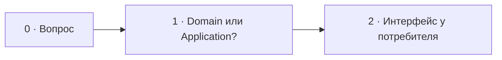

# Визуальный план вопроса 24 — «Где хранить интерфейс репозитория?»

Статус: `APPROVED`  
Сложность: `M`  
Бюджет реализации: `25–35 минут`  
Shorts: `да`

## Источники и границы

- `questions.txt`, пункт 35.
- `transcription.txt`, `52:42–53:19`.
- [Robert C. Martin — The Clean Architecture](https://blog.cleancoder.com/uncle-bob/2012/08/13/the-clean-architecture.html).
- [Martin Fowler — Presentation/Domain/Data Layering](https://martinfowler.com/bliki/PresentationDomainDataLayering.html).

## Аудит содержания

В разговоре звучат два ответа — application и domain. Универсального имени
папки нет: интерфейс принадлежит внутреннему потребителю, реализация зависит
от Doctrine/SQL и остаётся снаружи. Показываем ownership, а не спор о каталоге.

### Намеренно не показываем

- `Domain/Repository` или `Application/Port` как единственно верный path.
- Doctrine repository base class и конкретную DI-конфигурацию.

## Задача визуализации

Перевести спор о папке в архитектурный вопрос ownership и направления
зависимости.

## Состояния

| № | Таймкод | Функция |
|---|---|---|
| 0 | source `52:48–52:57` · review `37:17–37:26` | обычная карточка вопроса, интервал принят пользователем |
| 1 | source `52:57–53:01` · review `37:26–37:30` | две возможные внутренние зоны |
| 2 | `53:01–53:19` | показать dependency inversion и вывод |



## Состояние 0 — карточка вопроса

Принято пользователем: обычная карточка `24/30` с текстом
`Где хранить интерфейс репозитория?` на review `37:17–37:26`.
Существующие пояснения не удаляются: прежний `24-question` становится
`24-location` и появляется после карточки. На source `52:42–52:48`
остаётся базовая сцена без преждевременного ответа. Звук и монтаж не меняются.

16:9: счётчик над крупным вопросом по центру. 9:16: тот же стандартный
question-компонент с вертикальной компоновкой и переносами текста.

## Состояние 1 — вопрос не про папку

```text
┌──────────────────────────────────────────────────────────────┐
│ 24/30  Где должен жить Repository interface?                │
├─────────────────────────────┬────────────────────────────────┤
│ Domain                      │ Application                    │
│ доменной модели нужен поиск │ use case нужен read/write port│
│ → интерфейс рядом           │ → интерфейс рядом             │
├─────────────────────────────┴────────────────────────────────┤
│ Сначала определить потребителя                              │
└──────────────────────────────────────────────────────────────┘
```

В 9:16 две ситуации идут одна под другой.

## Состояние 2 — зависимость внутрь

```text
┌──────────────────────────────────────────────────────────────┐
│ 24/30  Интерфейс принадлежит внутренней стороне              │
├──────────────────────────────────────────────────────────────┤
│ Domain / Application → OrderRepository (port)               │
│                               ↑ implements                   │
│ Infrastructure → DoctrineOrderRepository                    │
├──────────────────────────────────────────────────────────────┤
│ УТОЧНЕНИЕ: точная папка зависит от места использования      │
└──────────────────────────────────────────────────────────────┘
```

В 9:16 внутренний port располагается сверху, инфраструктурная реализация —
снизу, стрелка зависимости указывает к port.

## Финальный экранный текст

| Элемент | Текст |
|---|---|
| Port | `Рядом с внутренним потребителем` |
| Adapter | `Infrastructure implements port` |
| Уточнение | `Точная папка зависит от места использования` |

## Анимация

- Doctrine сначала находится рядом с реализацией; затем стрелка зависимости
  разворачивается к внутреннему интерфейсу.

## Shorts

- Хук: `Repository interface принадлежит не Doctrine, а своему потребителю`.

## Материалы и производство

- Использовать dependency-arrow и two-layer layout.
- Новые изображения и досъёмка не нужны.

## Ревью

- [ ] Ownership интерфейса понятен без названий папок.
- [ ] Стрелка implementation/dependency направлена корректно.
- [ ] Уточнение не объявляет domain и application взаимозаменяемыми всегда.
- [ ] Таймкоды сверены.
- [x] Пользователь принял план.
