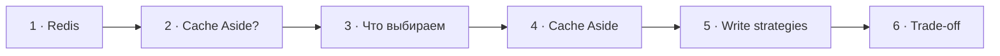

# Визуальный план вопроса 25 — «Redis и стратегии наполнения кэша»

Статус: `APPROVED`  
Сложность: `L`  
Бюджет реализации: `45–60 минут`  
Shorts: `да`

## Источники и границы

- `questions.txt`, пункты 36–37 — в интервью единый разговор.
- `transcription.txt`, `53:35–55:21`.
- Вопрос про Cache Aside: source-time `53:43–53:48`, review-time `38:12–38:17`.
- Переход `53:19–53:35` остаётся на базовой сцене с аватарами.
- [Microsoft Azure — Cache-Aside Pattern](https://learn.microsoft.com/en-us/azure/architecture/patterns/cache-aside).
- [Microsoft Azure — Caching Guidance](https://learn.microsoft.com/en-us/azure/architecture/best-practices/caching).

## Аудит содержания

| Прозвучало | Оценка | Действие |
|---|---|---|
| Названы четыре «стратегии наполнения» | корректное ядро, неточная классификация | показать четыре распространённых паттерна как две разные оси |
| Cache Aside = сначала записать в БД, потом в кэш | неверное определение | исправить через read miss и invalidate-on-write |
| Write-through обновляет store и cache | корректное ядро | показать как отдельную стратегию |
| Write-behind повышает риск потери/рассогласования | корректно | показать асинхронную запись и trade-off |

Eviction policies (`LRU`, `LFU`, TTL) не раскрываем: в реплике они только
упомянуты, а экран уже насыщен.

### Намеренно не показываем

- Redis как обязательный компонент каждой стратегии.
- Все варианты write-around, refresh-ahead и детали distributed locking.
- Cache и database как две равноправные копии истины.

## Задача визуализации

Исправить определение Cache Aside и показать, что выбор write-path всегда
балансирует freshness, latency и восстановление после сбоя.

## Состояния

| № | Таймкод | Функция |
|---|---|---|
| 1 | `53:35–53:41` source / `38:04–38:10` review | показать вопрос «С редисом, с кэшом работал?» |
| 2 | `53:43–53:48` source / `38:12–38:17` review | удержать вопрос «Что такое Cache Aside?» |
| 3 | `53:48–54:09` source / `38:17–38:38` review | разделить два класса стратегий, держать до Cache Aside |
| 4 | `54:09–54:14` source / `38:38–38:43` review | исправить Cache Aside; начало сдвинуто по просьбе пользователя, конец сохранён |
| 5 | `54:14–54:50` | сравнить write-through и write-behind |
| 6 | `54:50–55:21` | показать consistency/reliability trade-off |



## Состояние 1 — вопрос

```text
┌──────────────────────────────────────────────────────────────┐
│                         ВОПРОС 25 ИЗ 30                     │
│                                                              │
│                С редисом, с кэшом работал?                  │
└──────────────────────────────────────────────────────────────┘
```

## Состояние 2 — вопрос про Cache Aside

```text
┌──────────────────────────────────────────────────────────────┐
│                         ВОПРОС 25 ИЗ 30                     │
│                                                              │
│                    Что такое Cache Aside?                   │
└──────────────────────────────────────────────────────────────┘
```

## Состояние 3 — четыре паттерна, две оси

```text
┌──────────────────────────────────────────────────────────────┐
│ 25/30  Четыре паттерна — два разных вопроса                  │
├─────────────────────────────┬────────────────────────────────┤
│ READ MISS                  │ WRITE PATH                     │
│ Cache Aside · Read Through │ Write Through · Write Behind   │
│ кто загружает cache        │ когда запись попадает в DB     │
├─────────────────────────────┴────────────────────────────────┤
│ Паттерны можно комбинировать · список не исчерпывающий      │
└──────────────────────────────────────────────────────────────┘
```

В 9:16 две карточки вертикально; правая/нижняя приглушена после появления.

## Состояние 4 — Cache Aside

```text
┌──────────────────────────────────────────────────────────────┐
│ 25/30  ИСПРАВЛЕНИЕ: Cache Aside — загрузка по требованию     │
├───────────────────────────────────┬──────────────────────────┤
│ $value = $cache->get($key);       │ EXECUTION TRACE          │
│ if ($value === null) {            │ 1 CACHE · GET → MISS     │
│   $value = $products->find($id);  │ 2 DATABASE · SELECT      │
│   $cache->set($key, $value);      │ 3 CACHE · SET            │
│ }                                 │                          │
├─────────────────────────────┴────────────────────────────────┤
│ При записи: DB update → cache delete                        │
└──────────────────────────────────────────────────────────────┘
```

Код остаётся видимым целиком. Три шага execution trace раскрываются с `38:38`
до `38:42`; соответствующая строка кода подсвечивается цветом шага и затем
возвращается к нейтральному фону. Последняя секунда удерживает собранный экран.
В 9:16 код располагается над trace без уменьшения до нечитаемого размера.

## Состояние 5 — две write-стратегии

Принятая визуальная правка: преимущества и компромиссы показываются отдельными
строками с цветом, знаком и левой полосой, в общем стиле проекта.
Зелёный `+`: «После успеха данные свежие», «Ниже write latency».
Жёлтый `−`: «Выше write latency», «Сложнее failure recovery».
Текст, порядок строк и тайминги сохранены; правило применяется в обоих форматах.

```text
┌──────────────────────────────────────────────────────────────┐
│ 25/30  Кто отвечает за запись в system of record?           │
├─────────────────────────────┬────────────────────────────────┤
│ WRITE-THROUGH               │ WRITE-BEHIND                   │
│ app → coordinator           │ app → cache/queue             │
│     → DB + cache            │     ⇢ async → DB              │
│ свежесть после success      │ меньше latency, сложнее сбой  │
├─────────────────────────────┴────────────────────────────────┤
│ База остаётся источником истины                             │
└──────────────────────────────────────────────────────────────┘
```

Вертикально стратегии показываются последовательно, без уменьшения текста.

## Состояние 6 — выбор по требованиям

```text
┌──────────────────────────────────────────────────────────────┐
│ 25/30  Выбор стратегии — баланс трёх требований              │
├──────────────────────────────────────────────────────────────┤
│                          Freshness                           │
│                     stale допустим?                          │
│                            ╱  ╲                              │
│     sync write            ╱    ╲          async write        │
│  свежее · медленнее      ╱ ВЫБОР ╲   быстрее · сложнее сбой │
│                         ╱ strategy╲                           │
│                        ╱___________╲                          │
│                 Recovery           Visibility latency        │
│           частичный сбой?          когда видна запись?       │
│                    invalidate · stale window                 │
└──────────────────────────────────────────────────────────────┘
```

Треугольник показывает три независимые оси выбора, а не правило «выбери два».
В центре — `Caching strategy`; на рёбрах — последствия `sync write`,
`async write` и `invalidate`. В 9:16 сохраняется треугольная схема, но вершины
и подписи перестраиваются под вертикальную безопасную область.

## Финальный экранный текст

| Элемент | Текст |
|---|---|
| Cache Aside read | `miss → DB → cache SET` |
| Cache Aside write | `DB update → invalidate` |
| Write-through | `DB + cache до success` |
| Write-behind | `быстрый write · асинхронный persistence` |

## Анимация

- В Cache Aside путь `miss → DB → set` рисуется строго по речи.

## Shorts

- Хук: `Cache Aside — это не «записать в БД, потом в кэш»`.

## Материалы и производство

- Использовать read/write pipeline и trade-off cards.
- Отдельная Redis-картинка не нужна; досъёмка не планируется.

## Ревью

- [ ] Cache Aside определён через load-on-demand и invalidation.
- [ ] System of record не перепутан с cache.
- [ ] Три write trade-offs читаются на ноутбуке.
- [ ] 9:16 не перегружен параллельными стрелками.
- [ ] Пользователь принял план.
