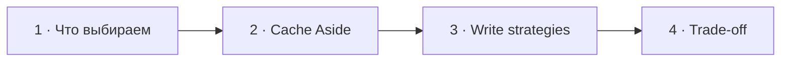

# Визуальный план вопроса 25 — «Redis и стратегии наполнения кэша»

Статус: `APPROVED`  
Сложность: `L`  
Бюджет реализации: `45–60 минут`  
Shorts: `да`

## Источники и границы

- `questions.txt`, пункты 36–37 — в интервью единый разговор.
- `transcription.txt`, `53:35–55:21`.
- Переход `53:19–53:35` остаётся на базовой сцене с аватарами.
- [Microsoft Azure — Cache-Aside Pattern](https://learn.microsoft.com/en-us/azure/architecture/patterns/cache-aside).
- [Microsoft Azure — Caching Guidance](https://learn.microsoft.com/en-us/azure/architecture/best-practices/caching).

## Аудит содержания

| Прозвучало | Оценка | Действие |
|---|---|---|
| Есть стратегии наполнения и вытеснения | корректно | не смешивать их на одной схеме |
| Cache Aside = сначала записать в БД, потом в кэш | неверное определение | исправить через read miss и invalidate-on-write |
| Write-through обновляет store и cache | корректное ядро | показать как отдельную стратегию |
| Write-behind повышает риск потери/рассогласования | корректно | показать асинхронную запись и trade-off |

Eviction policies (`LRU`, `LFU`, TTL) не раскрываем: в реплике они только
упомянуты, а экран уже насыщен.

### Намеренно не показываем

- Redis как обязательный компонент каждой стратегии.
- Все варианты write-around/read-through и детали distributed locking.
- Cache и database как две равноправные копии истины.

## Задача визуализации

Исправить определение Cache Aside и показать, что выбор write-path всегда
балансирует freshness, latency и восстановление после сбоя.

## Состояния

| № | Таймкод | Функция |
|---|---|---|
| 1 | `53:35–53:59` | разделить два класса стратегий |
| 2 | `53:59–54:14` | исправить Cache Aside |
| 3 | `54:14–54:50` | сравнить write-through и write-behind |
| 4 | `54:50–55:21` | показать consistency/reliability trade-off |



## Состояние 1 — не смешивать стратегии

```text
┌──────────────────────────────────────────────────────────────┐
│ 25/32  У кэша два разных вопроса                             │
├─────────────────────────────┬────────────────────────────────┤
│ КАК НАПОЛНЯЕМ              │ ЧТО ВЫТЕСНЯЕМ                  │
│ cache-aside                │ TTL · LRU · LFU                │
│ write-through / behind     │ лимит памяти                   │
├─────────────────────────────┴────────────────────────────────┤
│ Сейчас обсуждаем наполнение и согласованность               │
└──────────────────────────────────────────────────────────────┘
```

В 9:16 две карточки вертикально; правая/нижняя приглушена после появления.

## Состояние 2 — Cache Aside

```text
┌──────────────────────────────────────────────────────────────┐
│ 25/32  ИСПРАВЛЕНИЕ: Cache Aside — загрузка по требованию     │
├─────────────────────────────┬────────────────────────────────┤
│ READ                        │ WRITE                          │
│ cache GET → miss            │ DB update                     │
│ DB read → cache SET → value │ cache DEL / invalidate        │
├─────────────────────────────┴────────────────────────────────┤
│ Следующий read снова наполнит cache                         │
└──────────────────────────────────────────────────────────────┘
```

В 9:16 сначала read-flow, затем write-flow; обе схемы по 3–4 крупных шага.

## Состояние 3 — две write-стратегии

```text
┌──────────────────────────────────────────────────────────────┐
│ 25/32  Кто отвечает за запись в system of record?           │
├─────────────────────────────┬────────────────────────────────┤
│ WRITE-THROUGH               │ WRITE-BEHIND                   │
│ app → coordinator           │ app → cache/queue             │
│     → DB + cache            │     ⇢ async → DB              │
│ свежесть после success      │ меньше latency, сложнее сбой  │
├─────────────────────────────┴────────────────────────────────┤
│ База остаётся источником истины                             │
└──────────────────────────────────────────────────────────────┘
```

Вертикально стратегии показываются последовательно, без уменьшения текста.

## Состояние 4 — выбор по требованиям

```text
┌──────────────────────────────────────────────────────────────┐
│ 25/32  Кэш всегда создаёт trade-off                          │
├────────────────────┬────────────────────┬────────────────────┤
│ Freshness          │ Write latency      │ Failure recovery   │
│ stale допустим?    │ ждать два слоя?    │ что чинит разрыв?   │
├────────────────────┴────────────────────┴────────────────────┤
│ Не хранить критичные данные только в Redis                  │
└──────────────────────────────────────────────────────────────┘
```

В 9:16 три вопроса идут списком; нижний вывод остаётся зелёно-жёлтым, не
сливается с карточками.

## Финальный экранный текст

| Элемент | Текст |
|---|---|
| Cache Aside read | `miss → DB → cache SET` |
| Cache Aside write | `DB update → invalidate` |
| Write-through | `DB + cache до success` |
| Write-behind | `быстрый write · асинхронный persistence` |

## Анимация

- В Cache Aside путь `miss → DB → set` рисуется строго по речи.

## Shorts

- Хук: `Cache Aside — это не «записать в БД, потом в кэш»`.

## Материалы и производство

- Использовать read/write pipeline и trade-off cards.
- Отдельная Redis-картинка не нужна; досъёмка не планируется.

## Ревью

- [ ] Cache Aside определён через load-on-demand и invalidation.
- [ ] System of record не перепутан с cache.
- [ ] Три write trade-offs читаются на ноутбуке.
- [ ] 9:16 не перегружен параллельными стрелками.
- [ ] Пользователь принял план.
