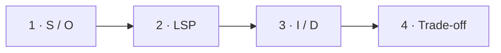

# Визуальный план вопроса 29 — «SOLID: пять принципов и границы применения»

Статус: `APPROVED`  
Сложность: `L`  
Бюджет реализации: `50–60 минут`  
Shorts: `да, отдельный монтаж из состояний 1–4`

## Источники и границы

- `questions.txt`, пункты 41–46 и 51 — в интервью это один rapid-fire.
- `transcription.txt`, `58:03–1:00:41`.
- [PHP Manual — Covariance and Contravariance](https://www.php.net/manual/en/language.oop5.variance.php).
- [Robert C. Martin — The Clean Architecture](https://blog.cleancoder.com/uncle-bob/2012/08/13/the-clean-architecture.html).

## Аудит содержания

| Прозвучало | Оценка | Действие |
|---|---|---|
| SOLID — «набор правил, как надо программировать» | слишком нормативно | назвать эвристиками проектирования |
| SRP — одна причина изменения | корректная краткая формула | показать axis of change |
| OCP — открыт расширению, закрыт изменению | корректно, но абстрактно | показать новый handler без правки dispatch |
| LSP — подтип не ломает код | корректное ядро | оставить как главную формулу |
| Сигнатура не должна меняться | неверно буквально | показать безопасную variance в PHP |
| SOLID не всегда обязателен | корректно | финальный trade-off |

### Намеренно не показываем

- SOLID как формальную проверку качества или обязательный checklist.
- Большие class diagrams для каждого принципа.
- Полную теорию behavioral subtyping, preconditions и postconditions.

## Задача визуализации

Удержать быстрые определения, исправить буквальную ошибку про неизменность
сигнатуры и завершить разговор практическим trade-off.

## Состояния

| № | Таймкод | Функция |
|---|---|---|
| 1 | `58:03–58:48` | SOLID + SRP/OCP |
| 2 | `58:48–59:31` | LSP и исправление про сигнатуру |
| 3 | `59:31–1:00:04` | ISP/DIP без лишней лекции |
| 4 | `1:00:04–1:00:41` | принципы не являются обязательным ритуалом |



## Состояние 1 — S и O

```text
┌──────────────────────────────────────────────────────────────┐
│ 29/32  SOLID · эвристики управления изменениями              │
├─────────────────────────────┬────────────────────────────────┤
│ S · Single Responsibility   │ O · Open/Closed               │
│ одна ось изменения          │ новый способ оплаты           │
│ InvoiceFormatter ≠ Sender   │ + CryptoHandler               │
│                             │ dispatch не меняем             │
└──────────────────────────────────────────────────────────────┘
```

В 9:16 сначала S, затем O; обе карточки используют крупный пример.

## Состояние 2 — LSP

```text
┌──────────────────────────────────────────────────────────────┐
│ 29/32  L · Подтип сохраняет обещания базового типа           │
├──────────────────────────────────────────────────────────────┤
│ function ship(Carrier $c) { $c->deliver($parcel); }         │
│ DHLCarrier вместо Carrier → клиентский код не ломается      │
├─────────────────────────────┬────────────────────────────────┤
│ Параметр может быть шире    │ Return type может быть уже     │
│ contravariance              │ covariance                     │
├─────────────────────────────┴────────────────────────────────┤
│ ИСПРАВЛЕНИЕ: сигнатура может безопасно варьироваться         │
└──────────────────────────────────────────────────────────────┘
```

В 9:16 сначала substitutability, ниже одной строкой две variance; не давать
полные объявления классов.

## Состояние 3 — I и D

```text
┌──────────────────────────────────────────────────────────────┐
│ 29/32  I / D                                                 │
├─────────────────────────────┬────────────────────────────────┤
│ I · Interface Segregation   │ D · Dependency Inversion      │
│ маленький контракт клиента  │ policy → PaymentGateway       │
│ Printer не обязан scan/fax  │ StripeAdapter → interface     │
├─────────────────────────────┴────────────────────────────────┤
│ Зависим от нужного поведения, не от случайной реализации    │
└──────────────────────────────────────────────────────────────┘
```

В 9:16 I и D идут отдельными экранами внутри одного состояния, если речь не
позволяет прочитать две карточки сразу.

## Состояние 4 — не чеклист

```text
┌──────────────────────────────────────────────────────────────┐
│ 29/32  SOLID не обязателен «на максимум»                     │
├─────────────────────────────┬────────────────────────────────┤
│ ПОЛЬЗА                      │ ЦЕНА                           │
│ легче менять и тестировать  │ больше типов и переходов       │
│ ясные зависимости           │ сложнее читать простой код     │
├─────────────────────────────┴────────────────────────────────┤
│ Применять под реальные изменения, а не ради соответствия    │
└──────────────────────────────────────────────────────────────┘
```

В 9:16 польза/цена последовательно, итог остаётся в нижней safe zone.

## Финальный экранный текст

| Элемент | Текст |
|---|---|
| S | `Одна ось изменения` |
| O | `Расширяем без правки стабильного dispatch` |
| L | `Подтип сохраняет обещания` |
| I / D | `Контракт клиента · зависимость от abstraction` |
| Итог | `Эвристики, не обязательный ритуал` |

## Анимация

- Буквы не вылетают декоративно: подсвечивается принцип, который произносится.

## Shorts

- Хук: `LSP не требует буквально одинаковой сигнатуры в PHP`.
- Для отдельного Shorts начать с состояния LSP; общий обзор потребует более
  длинной нарезки.

## Материалы и производство

- Использовать principle cards, code strip и trade-off comparison.
- Новые изображения и досъёмка не нужны.

## Ревью

- [ ] Все пять букв присутствуют, но экран не перегружен.
- [ ] Variance сформулирована корректно для PHP.
- [ ] Пропуски STT не приняты за основание для монтажа.
- [ ] Четыре состояния читаются и в 9:16.
- [ ] Пользователь принял план.
