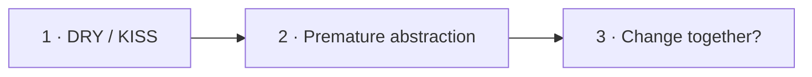

# Визуальный план вопроса 30 — «DRY против KISS»

Статус: `APPROVED`  
Сложность: `M`  
Бюджет реализации: `30–40 минут`  
Shorts: `да`

## Источники и границы

- `questions.txt`, пункты 47–48 и 52 — один вопрос с подводкой.
- `transcription.txt`, `1:00:41–1:02:13`.
- [The Pragmatic Programmer — DRY](https://media.pragprog.com/articles/jan_02_enbug.pdf).
- [Martin Fowler — BeckDesignRules](https://martinfowler.com/bliki/BeckDesignRules.html).

## Аудит содержания

Разговор правильно попадает в риск преждевременной абстракции. Уточняем, что
DRY относится к дублированию знания, а не к любым одинаковым строкам. KISS не
запрещает abstraction — он требует соразмерности текущей задаче.

### Намеренно не показываем

- «Rule of three» как обязательный закон.
- Любое повторение кода как дефект.
- KISS как оправдание отсутствия дизайна.

## Задача визуализации

Показать, почему преждевременное объединение независимых правил нарушает KISS,
хотя формально уменьшает число одинаковых строк.

## Состояния

| № | Таймкод | Функция |
|---|---|---|
| 1 | `1:00:41–1:01:08` | определить два принципа |
| 2 | `1:01:08–1:01:48` | показать ложное объединение похожего кода |
| 3 | `1:01:48–1:02:13` | дать критерий выбора |



## Состояние 1 — не настоящие противники

```text
┌──────────────────────────────────────────────────────────────┐
│ 30/32  DRY и KISS отвечают на разные риски                   │
├─────────────────────────────┬────────────────────────────────┤
│ DRY                         │ KISS                           │
│ одно знание — одно место    │ минимальная нужная сложность   │
│ риск: рассинхронизация      │ риск: лишние конструкции       │
└──────────────────────────────────────────────────────────────┘
```

В 9:16 две карточки располагаются вертикально.

## Состояние 2 — одинаковые строки, разные причины

```text
┌──────────────────────────────────────────────────────────────┐
│ 30/32  Похожий код ещё не означает общую abstraction        │
├─────────────────────────────┬────────────────────────────────┤
│ Invoice: total + tax        │ Cart: total + discount        │
│ сегодня строки похожи       │ меняются по разным причинам    │
├─────────────────────────────┴────────────────────────────────┤
│ преждевременная FactoryFactory → связала независимые правила │
└──────────────────────────────────────────────────────────────┘
```

В 9:16 примеры идут друг под другом; «FactoryFactory» — короткая ироничная
плашка, не отдельная схема.

## Состояние 3 — критерий

```text
┌──────────────────────────────────────────────────────────────┐
│ 30/32  Что делать с повтором?                                │
├──────────────────────────────────────────────────────────────┤
│ Это одно знание и меняется вместе?                          │
│        ДА → выделить общее                                  │
│        НЕТ / НЕЯСНО → оставить локально и просто            │
├──────────────────────────────────────────────────────────────┤
│ Абстракцию легче добавить после появления устойчивого паттерна│
└──────────────────────────────────────────────────────────────┘
```

В 9:16 вопрос сверху, две ветви решения крупными строками ниже.

## Финальный экранный текст

| Элемент | Текст |
|---|---|
| DRY | `Одно знание — одно место` |
| KISS | `Минимальная нужная сложность` |
| Критерий | `Это меняется вместе?` |

## Анимация

- Два похожих фрагмента сначала сходятся, затем расходятся после разных change
  arrows — так визуально объясняется ложная общность.

## Shorts

- Хук: `DRY — не запрет повторять строки кода`.

## Материалы и производство

- Нужны comparison и binary-decision компоненты.
- Изображения, досъёмка и исправление исходного ответа не нужны.

## Ревью

- [ ] DRY сформулирован через knowledge, а не text duplication.
- [ ] Ироничный пример не конкурирует с главным тезисом.
- [ ] Decision question читается без предыдущего состояния.
- [ ] Таймкоды сверены.
- [ ] Пользователь принял план.
