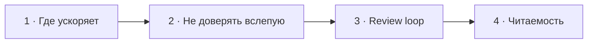

# Визуальный план вопроса 32 — «Как использовать AI в разработке?»

Статус: `APPROVED`  
Сложность: `L`  
Бюджет реализации: `40–55 минут`  
Shorts: `да`

## Источники и границы

- `questions.txt`, пункт 49.
- `transcription.txt`, `1:18:04–1:20:59`.
- `1:20:59–1:21:47` — вопрос о сроке выхода и прощание: базовый экран с
  аватарами, без учебной графики.

## Аудит содержания

Это обмен личным опытом, а не сравнительный тест инструментов. Не выводим на
экран цену подписки, версии моделей и спор «какой AI лучше»: такие детали быстро
устаревают и не несут главной мысли. Полезное ядро — ускорение механической
работы, обязательное ревью и защита читаемости/модульности кода.

### Намеренно не показываем

- Цена подписки, рейтинги и названия актуальных моделей.
- MCP/skills как объективно полезные или бесполезные для всех.
- AI как самостоятельного автора, который несёт ответственность за merge.

## Задача визуализации

Перевести обмен мнениями в устойчивый рабочий принцип: AI ускоряет итерацию,
а проверка scope, поведения и архитектуры остаётся у разработчика.

## Состояния

| № | Таймкод | Функция |
|---|---|---|
| 1 | `1:18:04–1:18:41` | вопрос и личный режим использования |
| 2 | `1:18:41–1:19:20` | код AI нельзя принимать без проверки |
| 3 | `1:19:20–1:20:06` | показать короткий review loop |
| 4 | `1:20:06–1:20:59` | readable code против overengineering |



## Состояние 1 — инструмент, не тема ролика

```text
┌──────────────────────────────────────────────────────────────┐
│ 32/58  Как ты используешь AI в разработке?                  │
├──────────────────────────────────────────────────────────────┤
│ искать контекст · набросать код · механически изменить      │
│                          ↓                                   │
│                    быстрее итерация                          │
├──────────────────────────────────────────────────────────────┤
│ Эффект зависит от задачи и рабочего процесса                │
└──────────────────────────────────────────────────────────────┘
```

В 9:16 три применения идут коротким списком, без логотипов продуктов.

## Состояние 2 — типичный риск

```text
┌──────────────────────────────────────────────────────────────┐
│ 32/58  Сгенерированный код — ещё не принятый код             │
├─────────────────────────────┬────────────────────────────────┤
│ PROMPT                      │ OUTPUT                         │
│ «исправь ошибку»            │ изменено 14 файлов            │
│ локальная задача            │ giant class · лишние правки   │
├─────────────────────────────┴────────────────────────────────┤
│ Проверять scope, архитектуру и побочные изменения           │
└──────────────────────────────────────────────────────────────┘
```

В 9:16 request и oversized diff располагаются сверху вниз.

## Состояние 3 — рабочий цикл

```text
┌──────────────────────────────────────────────────────────────┐
│ 32/58  AI-assisted ≠ AI-approved                             │
├──────────────────────────────────────────────────────────────┤
│ контекст → маленькая задача → diff → tests/static analysis │
│                                      ↓                       │
│                              human review                    │
│                           accept ↺ исправить                 │
├──────────────────────────────────────────────────────────────┤
│ Ответственность за изменение остаётся у разработчика        │
└──────────────────────────────────────────────────────────────┘
```

В 9:16 loop укладывается в вертикальный цикл из пяти крупных шагов.

## Состояние 4 — читаемость важнее ритуала

```text
┌──────────────────────────────────────────────────────────────┐
│ 32/58  Хороший результат должен быть понятен человеку        │
├─────────────────────────────┬────────────────────────────────┤
│ ЯСНО                       │ «SOLID НА МАКСИМУМ»             │
│ доменные имена             │ 12 interfaces                  │
│ локальные изменения        │ 8 factories                    │
│ очевидный поток            │ смысл размазан                 │
├─────────────────────────────┴────────────────────────────────┤
│ Архитектура помогает изменениям, а не демонстрирует паттерны│
└──────────────────────────────────────────────────────────────┘
```

В 9:16 сначала хороший пример, затем перегруженный; итог в safe zone.

## Финальный экранный текст

| Элемент | Текст |
|---|---|
| Польза | `Быстрее собрать первую итерацию` |
| Риск | `Лишний scope · giant class · скрытые правки` |
| Процесс | `diff → tests → static analysis → human review` |
| Вывод | `AI-assisted ≠ AI-approved` |

## Анимация

- Diff растёт только в состоянии риска; review loop движется по смыслу.
- Не использовать футуристические роботы, мозги и декоративный AI-art.

## Shorts

- Хук: `AI ускоряет написание кода, но не принимает архитектурные решения за тебя`.

## Материалы и производство

- Использовать diff, loop и comparison-компоненты.
- Новые изображения, досъёмка и синтетическая озвучка не нужны.

## Ревью

- [ ] Личный опыт не выдан за benchmark инструментов.
- [ ] Версии, цены и рейтинги моделей отсутствуют.
- [ ] Финальное прощание покрыто base scene после `1:20:59`.
- [ ] Вертикальный review loop читается без мелкого текста.
- [ ] Пользователь принял план.
