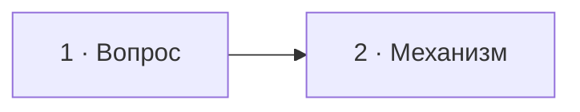

# Визуальный план вопроса NN — «Формулировка»

Статус: `DRAFT`  
Сложность: `S / M / L`  
Бюджет: `15 / 40 / 60 минут`  
Shorts: `да / нет / кандидат — финальную нарезку определяет монтажёр`

## Источники и границы

- Вопрос: `questions.txt`, пункт NN.
- Транскрипт: `transcription.txt`.
- Фрагмент: `00:00–00:00`.
- Говорящие: `...`.
- Технические источники: `...`.
- Исходный разговор сохраняется непрерывно; участки без полезной графики
  остаются на базовом экране с аватарами.

## Аудит содержания

| Факт или тезис | Где прозвучал | Оценка | Действие на экране |
|---|---|---|---|
| … | 00:00 | корректно / неточно / отсутствует | показать / дополнить / исправить / не показывать |

### Намеренно не показываем

- `...` — причина.

Этот раздел обязателен: он отличает осознанный выбор экранного слоя от
случайной потери полезного содержания. Речь и исходный видеоряд при этом не
вырезаются.

## Задача визуализации

Одно предложение: `Что зритель поймёт лучше благодаря экрану?`

Если убедительного ответа нет, используется только базовый экран вопроса.

## Состояния и тайминг

| Состояние | Таймкод | Что звучит | Функция экрана | Паттерн |
|---|---|---|---|---|
| 1 | 00:00–00:00 | … | удержать вопрос | Question |
| 2 | 00:00–00:00 | … | показать механизм | CodeWithTakeaways |



Mermaid показывает порядок состояний, но не расположение элементов внутри
кадра.

## Состояние 1 — название

Польза: `...`  
Экранный текст: `...`  
Дополняет речь: `...`  
Не дублируем: `...`

### Wireframe 16:9

```text
┌──────────────────────────────────────────────────────────────┐
│  01/NN  Вопрос                                               │
├──────────────────────────────────────────────────────────────┤
│                                                              │
│                   ГЛАВНЫЙ СМЫСЛОВОЙ БЛОК                    │
│                                                              │
├──────────────────────────────┬───────────────────────────────┤
│ МИХАИЛ · говорит             │ ИНТЕРВЬЮЕР · слушает          │
└──────────────────────────────┴───────────────────────────────┘
```

### Wireframe 9:16

```text
┌──────────────────────────────┐
│ 01/NN                        │
│ Вопрос                       │
├──────────────────────────────┤
│                              │
│ ГЛАВНЫЙ СМЫСЛОВОЙ БЛОК      │
│                              │
├──────────────────────────────┤
│ Михаил        Интервьюер     │
└──────────────────────────────┘
```

Для каждого следующего состояния копируются этот раздел и оба wireframe.
Внутри рамок указываются реальные блоки: код, названия карточек, стрелки и
результаты. Границы связанных элементов должны быть видны уже в wireframe.

## Финальный экранный текст

| Элемент | Текст | Ограничение |
|---|---|---|
| Заголовок | … | одна строка, если возможно |
| Карточка 1 | … | заголовок 2–5 слов, пояснение 8–14 слов |
| Код | … | только обсуждаемые строки |

## Анимация

- Что появляется или меняется: `...`.
- К какой реплике привязано: `00:00`.
- Почему движение помогает смыслу: `...`.

Если на третий пункт нет ответа, анимация не добавляется.

## Shorts

- Хук или формулировка вопроса: `...`.
- Вертикальная последовательность блоков: `...`.
- Что можно убрать без потери смысла: `...`.
- Элементы, которые должны остаться вне UI-зон Shorts: `...`.

## Материалы и производство

- Нужен новый компонент: `нет / да — почему`.
- Код: `...`.
- SVG/схема: `...`.
- Изображение и лицензия: `...`.
- Исправление или уточнение на экране: `нет / да — текст и источник`.
- Досъёмка, переозвучка и синтетическая замена ответа: `не планируются`.

## Ревью

- [ ] Таймкоды сверены с транскриптом.
- [ ] Технические дополнения проверены.
- [ ] Экран не пересказывает речь абзацем.
- [ ] Нет ненужных подписей и декоративных элементов.
- [ ] Все ряды используют одну понятную сетку.
- [ ] Семантические цвета не конфликтуют.
- [ ] Основной и вторичный текст будут читаемы на ноутбуке.
- [ ] 16:9 и 9:16 понятны без реализации дизайна.
- [ ] Нет монтажных сокращений, предложенных только по STT.
- [ ] Ошибка или недосказанность исправлена помеченным экранным слоем, без
      замены исходной реплики.
- [ ] Принято пользователем до начала кода.
